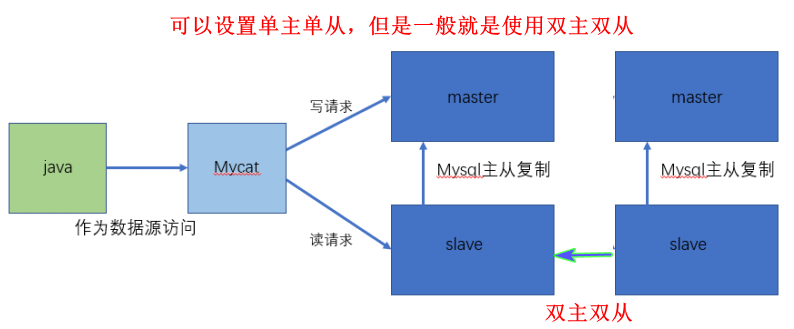
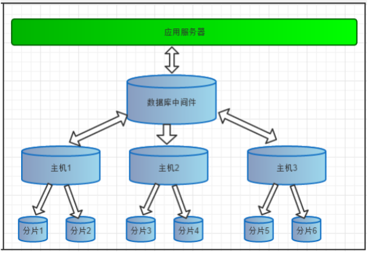
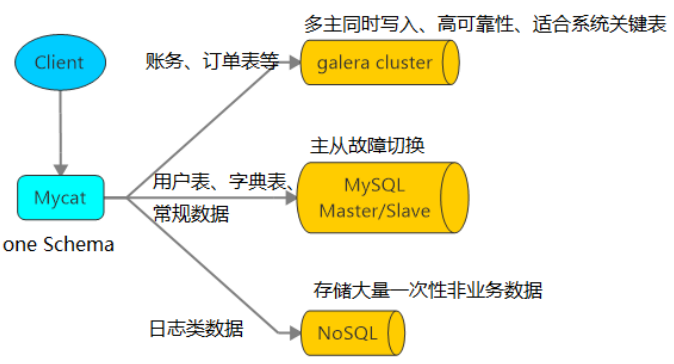
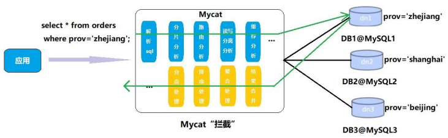

## 注意

```java
https://www.cnblogs.com/xing1/p/14021518.html

看之前现总结以下
```


## 介绍


## 作用

* 读写分离

    * 一个数据库用来进行读请求
    * 一个数据库用来进行写请求

    

* 数据切片

    * 垂直拆分（分库）：
        * 每个库拆分为多个模块，每个模块有多个表，然后分不到多台主机上
    * 水平拆分（分表）
        * 表中数据达到千万，将其分为多表，放在不同数据库
    * 垂直+水平拆分（分库分表）

    

* 多数据源整合

    

## 原理

```java
“拦截”，它拦截了用户发送过来的 SQL 语句，
    首先对 SQL 语句做了一些特定的分析：如分片分析、路由分析、读写分离分析、缓存分析等，
    然后将此 SQL 发往后端的真实数据库，并将返回的结果做适当的处理，
    最终再返回给用户
```



