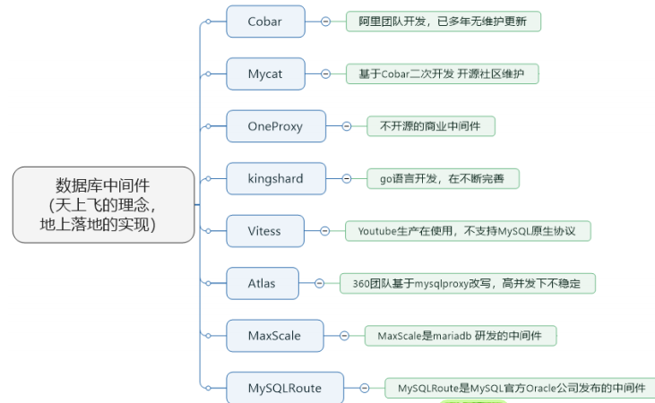

## 介绍

* 中间件
    * 是一类连接软件组件和应用的计算机软件，以便于软件各部件之间的沟通
    * 一种理念
* 数据库中间件：
    * 连接java应用程序和数据库


## 常见中间件



```java
Cobar
     属于阿里B2B事业群，始于2008年，在阿里服役3年多，接管3000+个MySQL数据库的schema,
	集群日处理在线SQL请求50亿次以上。由于Cobar发起人的离职，Cobar停止维护。
Mycat
        是开源社区在阿里cobar基础上进行二次开发，解决了cobar存在的问题，并且加入了许多新的功能在其中。
        青出于蓝而胜于蓝。
OneProxy
        基于MySQL官方的proxy思想利用c进行开发的，OneProxy是一款商业收费的中间件。
        舍弃了一些功能，专注在性能和稳定性上。
kingshard
        由小团队用go语言开发，还需要发展，需要不断完善。 
Vitess
        是Youtube生产在使用，架构很复杂。不支持MySQL原生协议，使用需要大量改造成本。 
Atlas
        是360团队基于mysql proxy改写，功能还需完善，高并发下不稳定。 
MaxScale
        是mariadb（MySQL原作者维护的一个版本） 研发的中间件
MySQLRoute
        是MySQL官方Oracle公司发布的中间件
```


