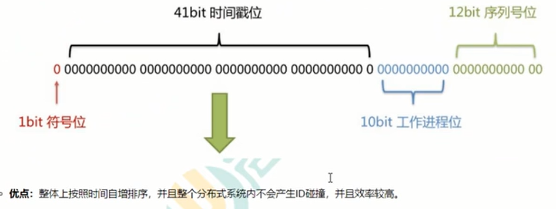

## 介绍

```java
多活数据库
单活数据库
    
```


## 主键自增

### 介绍

```java
介绍
	利用数据库，全数据库唯一。
    
复杂点
    分段大小的选取
    太小：后会导致切分后子表数量过多，增加维护复杂度
    太大：单表依然有性能问题
    
建议
    100万 - 200万
优点
	字ID天然排序，对分页或者需要排序的结果很有帮助。
    随着数据的增加平滑扩充新表
    方便、快捷
缺点
	1 不同数据库语法和实现不同，数据库迁移的时候或多数据库版本支持的时候需要处理。
	2 在单个数据库或读写分离或一主多从的情况下，只有一个主库可以生成。有单点故障的风险。
	3 在性能达不到要求的情况下，比较难于扩展。
	4 如果遇见多个系统需要合并或者涉及到数据迁移会相当痛苦。
	5 分表分库的时候会有麻烦。
```

### 改善

```java
1）针对主库单点，
    如果有多个Master库，则每个Master库设置的起始数字不一样，步长一样，可以是Master的个数。
    比如：
    	Master1 生成的是 1，4，7，10，
   		Master2生成的是2,5,8,11 
    	Master3生成的是 3,6,9,12。
    	这样就可以有效生成集群中的唯一ID，也可以大大降低ID生成数据库操作的负载。
```

## hash

```java
复杂点:
	初始表数量的选取。表数量太多维护比较麻烦,表数量太少又可能导致单表性能存在问题。
优点:
	表分布比较均匀。
缺点:
	扩充新的表很麻烦，所有数据都要重分布。

```


## UUID

### 介绍

```java
介绍
    可以利用数据库也可以利用程序生成，一般来说全球唯一
优点
    全球唯一，在遇见数据迁移，系统数据合并，或者数据库变更等情况下，可以从容应对
    生成ID性能非常好，基本不会有性能问题
缺点
    1）没有排序，无法保证趋势递增。
    2）UUID往往是使用字符串存储，查询的效率比较低。
    3）存储空间比较大，如果是海量数据库，就需要考虑存储量的问题。
    4）传输数据量大
    5）不可读。
```

## UUID to Int64

### 介绍

```java
介绍
    1. 解决UUID不可读，
    2. 了解决UUID无序的问题
```

## Redis生成ID

### 介绍

```java
介绍
    当使用数据库来生成ID性能不够要求的时候，我们可以尝试使用Redis来生成ID。
    这主要依赖于Redis是单线程的，所以也可以用生成全局唯一的ID。
    可以用Redis的原子操作 INCR和INCRBY来实现。
    
优点：
    1）不依赖于数据库，灵活方便，且性能优于数据库。
    2）数字ID天然排序，对分页或者需要排序的结果很有帮助。

缺点：
    1）如果系统中没有Redis，还需要引入新的组件，增加系统复杂度。
    2）需要编码和配置的工作量比较大。    
```

## snowflake算法 - Twitter

### 介绍

### 核心

```java
长度共64bit (-个long型) .
    首先是一个符号位，1bit标识， 由于long基本类型在Java中是带符号的，
    最高位是符号位，正数是0,负数是1,所以id-般是正数，最高位是0。
    41bit时间截(亳秒级),存储的是时间截的差值(当前时间截-开始时间截)，结果约等于69.73年。
    10bit作为机器的ID (5个bit是数据中心， 5个bit的机器ID, 可以部署在1024个节点)。
    12bit作为毫秒内的流水号(意味着每个节点在每毫秒可以产生4096个ID)。

```




## left 分布式主键 - 美团