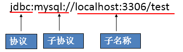
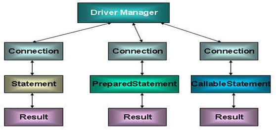

## 快速入门

### 导包

```java
导入驱动 jar 包
	mysql-connector-java-5.1.7-binjar

```

### java

```java

	// --------- 数据库连接
    2. 注册驱动
        class.forName("com.mysql.jdbc.Driver");
        注意： mysql5+ 不用进行数据库注册了, 但是最好加上
    3. 连接数据库
        // 获取数据库连接对象 Connnection
        Connection conn = DriverManager.getConnection("jdbc:mysql://localhost:3306/db3",账号，密码)
            
            
	// ---------curd            
    4. 定义 sql 
            String sql = "update account set balance = 100 where id =0"
    5. 获取执行 sql 语句的对象 Statement
            Statement stmt = comm.createStatement();
    6. 执行 sql , 接收返回结果
            int count = stamt.execuuteUpdate(sql);
    7. 处理结果

    8. 释放资源
            stmt.close();
            conn.close();
```


## 连接数据库

### jdbc对象

#### DriverManager

```java
介绍
   java.sql.Driver 接口是所有 JDBC 驱动程序需要实现的接口。
    这个接口是提供给数据库厂商使用的，不同数据库厂商提供不同的实现 
数据库驱动
    // 由驱动程序管理器类(java.sql.DriverManager)去调用这些Driver实现
    Oracle的驱动：oracle.jdbc.driver.OracleDriver
	mySql的驱动： com.mysql.jdbc.Driver
方法
    // 注册驱动, 注册与给定的驱动程序 DriverManager 。
    DriverManager.registerDriver(Driver driver)  
    // 获取数据库有连接,  尝试建立与给定数据库URL的连接。 
    DriverManager.getConnection(String url, String user, String password)
    URL :jdbc:mysql://ip地址：端口号/数据库名称 ， 
		如果默认端口号为 3306 ，则默认的 url 简写成 jdbc:mysql:///数据库名称
```


#### Connection

```java
介绍
    数据库连接对象， 
    获取执行 sql 对象
方法
    // 获取执行 sql 的对象
    createStatement() 创建一个 Statement对象，用于将SQL语句发送到数据库
    prepareStatement(String sql) 创建一个 PreparedStatement对象，用于将参数化的SQL语句发送到数据库
    
    // 管理事务
    // 开启
    setAutoCommit(boolean autoCommit) 将此连接的自动提交模式设置为给定状态。 默认为false开启事务
    // 提交
    commit() 
		使自上次提交/回滚以来所做的所有更改都将永久性，并释放此 Connection对象当前持有的任何数据库锁
    // 回滚
    rollback() 
   		 撤消在当前事务中所做的所有更改，并释放此 Connection对象当前持有的任何数据库锁。
```


### jdbc URL

#### 介绍

```java
基础
    标识一个被注册的驱动程序，驱动程序管理器通过这个 URL 选择正确的驱动程序，从而建立到数据库的连接。
组成   
    // jdbc:子协议:子名称
	协议 ：JDBC URL中的协议总是jdbc 
	子协议：子协议用于标识一个数据库驱动程序
	子名称：一种标识数据库的方法。
    	子名称可以依不同的子协议而变化，
    	子名称的目的是为了**定位数据库**提供足够的信息。
    	包含：主机名**(对应服务端的ip地址)**，端口号，数据库名
```



#### 常用URL

```java
// MySQL的连接URL编写方式：
    jdbc:mysql://主机名称:mysql服务端口号/数据库名称?参数=值&参数=值
    jdbc:mysql://localhost:3306/atguigu
    jdbc:mysql://localhost:3306/atguigu**?useUnicode=true&characterEncoding=utf8**（如果JDBC程序与服务器端的字符集不一致，会导致乱码，那么可以通过参数指定服务器端的字符集）
    jdbc:mysql://localhost:3306/atguigu?user=root&password=123456

// Oracle 9i的连接URL编写方式：
    jdbc:oracle:thin:@主机名称:oracle服务端口号:数据库名称
    jdbc:oracle:thin:@localhost:1521:atguigu

// SQLServer的连接URL编写方式：
    jdbc:sqlserver://主机名称:sqlserver服务端口号:DatabaseName=数据库名称
    jdbc:sqlserver://localhost:1433:DatabaseName=atguigu
```


### Driver接口实现类

#### 2.1.2 加载与注册JDBC驱动

- 加载驱动：加载 JDBC 驱动需调用 Class 类的静态方法 forName()，向其传递要加载的 JDBC 驱动的类名

    - **Class.forName(“com.mysql.jdbc.Driver”);**

- 注册驱动：DriverManager 类是驱动程序管理器类，负责管理驱动程序

    - **使用DriverManager.registerDriver(com.mysql.jdbc.Driver)来注册驱动**

    - 通常不用显式调用 DriverManager 类的 registerDriver() 方法来注册驱动程序类的实例，因为 Driver 接口的驱动程序类**都**包含了静态代码块，在这个静态代码块中，会调用 DriverManager.registerDriver() 方法来注册自身的一个实例。下图是MySQL的Driver实现类的源码：

        


### 连接方式

#### Driver

##### 基础

```java
介绍
    说明：上述代码中显式出现了第三方数据库的API
代码实例    
	@Test
    public void testConnection1() {
        try {
            //1.提供java.sql.Driver接口实现类的对象
            Driver driver = null;
            driver = new com.mysql.jdbc.Driver();

            //2.提供url，指明具体操作的数据
            String url = "jdbc:mysql://localhost:3306/test";

            //3.提供Properties的对象，指明用户名和密码
            Properties info = new Properties();
            info.setProperty("user", "root");
            info.setProperty("password", "abc123");

            //4.调用driver的connect()，获取连接
            Connection conn = driver.connect(url, info);
            System.out.println(conn);
        } catch (SQLException e) {
            e.printStackTrace();
        }
    }
```

##### 反射

```java
介绍
    使用反射实例化Driver，不在代码中体现第三方数据库的API。体现了面向接口编程思想。
代码实例    
	@Test
    public void testConnection2() {
        try {
            //1.实例化Driver
            String className = "com.mysql.jdbc.Driver";
            Class clazz = Class.forName(className);
            Driver driver = (Driver) clazz.newInstance();

            //2.提供url，指明具体操作的数据
            String url = "jdbc:mysql://localhost:3306/test";

            //3.提供Properties的对象，指明用户名和密码
            Properties info = new Properties();
            info.setProperty("user", "root");
            info.setProperty("password", "abc123");

            //4.调用driver的connect()，获取连接
            Connection conn = driver.connect(url, info);
            System.out.println(conn);

        } catch (Exception e) {
            e.printStackTrace();
        }
    }
```

#### DriverManager

##### 基础

```java
	@Test
    public void testConnection3() {
        try {
            //1.数据库连接的4个基本要素：
            String url = "jdbc:mysql://localhost:3306/test";
            String user = "root";
            String password = "abc123";
            String driverName = "com.mysql.jdbc.Driver";

            //2.实例化Driver
            Class clazz = Class.forName(driverName);
            Driver driver = (Driver) clazz.newInstance();
            //3.注册驱动
            DriverManager.registerDriver(driver);
            //4.获取连接
            Connection conn = DriverManager.getConnection(url, user, password);
            System.out.println(conn);
        } catch (Exception e) {
            e.printStackTrace();
        }

    }
```

> 说明：使用DriverManager实现数据库的连接。体会获取连接必要的4个基本要素。

##### 静态驱动注册

```java
介绍
    不必显式的注册驱动了。
    因为在DriverManager的源码中已经存在静态代码块，实现了驱动的注册
代码实例    
	@Test
    public void testConnection4() {
        try {
            //1.数据库连接的4个基本要素：
            String url = "jdbc:mysql://localhost:3306/test";
            String user = "root";
            String password = "abc123";
            String driverName = "com.mysql.jdbc.Driver";

            //2.加载驱动 （①实例化Driver ②注册驱动）
            Class.forName(driverName);
		   //3.获取连接
            Connection conn = DriverManager.getConnection(url, user, password);
            System.out.println(conn);

        } catch (Exception e) {
            e.printStackTrace();
        }

    }

原因
             //Driver driver = (Driver) clazz.newInstance();
            //3.注册驱动
            //DriverManager.registerDriver(driver);
            /*
            可以注释掉上述代码的原因，是因为在mysql的Driver类中声明有：
            static {
                try {
                    DriverManager.registerDriver(new Driver());
                } catch (SQLException var1) {
                    throw new RuntimeException("Can't register driver!");
                }
            }

             */
```

##### 外部配置文件（通用）

```java
介绍
    使用配置文件的方式保存配置信息，在代码中加载配置文件
    
优势
     实现了代码和数据的分离，如果需要修改配置信息，直接在配置文件中修改，不需要深入代码
	 如果修改了配置信息，省去重新编译的过程。
代码实例
    
	@Test
    public  void testConnection5() throws Exception {
    	//1.加载配置文件
        InputStream is = ConnectionTest.class.getClassLoader().getResourceAsStream("jdbc.properties");
        Properties pros = new Properties();
        pros.load(is);
        
        //2.读取配置信息
        String user = pros.getProperty("user");
        String password = pros.getProperty("password");
        String url = pros.getProperty("url");
        String driverClass = pros.getProperty("driverClass");

        //3.加载驱动
        Class.forName(driverClass);

        //4.获取连接
        Connection conn = DriverManager.getConnection(url,user,password);
        System.out.println(conn);

    }

// 配置文件， 放置在项目 classpath 中
// IDEA 的 sources
// jdbc.properties
    user=root
    password=abc123
    url=jdbc:mysql://localhost:3306/test
    driverClass=com.mysql.jdbc.Driver
```


## 数据库操作

### jdbc对象

#### Statement（不使用）

```java
介绍
    用于执行静态 SQL 语句并返回它所生成结果的对象。 
    
弊端
    问题一：存在拼串操作，繁琐
	问题二：存在SQL注入问题
    // 这个会变成 两个 or 语句
    SELECT user,password FROM user_table WHERE USER = '1' or ' AND PASSWORD = '='1' or '1' = '1';
方法
    // 创建
    调用 Connection 对象的 createStatement() 方法创建该对象
    // 执行方法
    execute(String sql) 执行给定的SQL语句，这可能会返回多个结果。 
    executeUpdate(String sql) 
		执行给定的SQL语句，这可能是 INSERT ， UPDATE ，或 DELETE语句，或者不返回任何内容，
    	如SQL DML 语句的SQL语句。（很少用  DDL ）
    	// 通过影响的行数，来判断是否执行成功
    executeQuery(String sql) 
		执行给定的SQL语句，该语句返回单个 ResultSet对象。 DQL（select）
```

#### PreparedStatement

```java
介绍
    PreparedStatement 接口是 Statement 的子接口，它表示一条预编译过的 SQL 语句
    SQL 语句被预编译并存储在此对象中，可以使用此对象多次高效地执行该语句。
sql 注入
    在拼接sql时，有一些 sql 的特殊关键字参与字符串连接， 会造成安全性问题
预编译的 sql
    使用 ？ 作为占位符

参数设置
    占位符
    	SQL 语句中的参数用问号(?)来表示
    参数设置
    	
    	 setXxx() 方法来设置这些参数
    	
    String sql = "select * from user username = ? password = ? "
    // 这几个问号的下标是从 1 开始的
    String sql = "select * from user(name, password)values(?,?)"；
    PreparedStatement pstmt = conn.prepareStatement(sql);
	// setString setDate 具体看设置
	// 第一个参数是要设置的 SQL 语句中的参数的索引(从 1 开始)，第二个是设置的 SQL 语句中的参数的值
	pstmt.set(1,username);
	pstmt.set(2,password);

api
    // 创建对象
   		 Connection.preparedStatement(String sql)
    
特点
    效率高
    防止 sql 注入
    后期使用
```

#### CallableStatement

```java
：用于执行 SQL 存储过程
```



### CURD

#### 介绍

```java
增删改
查    
```

#### preparedStated

##### 增删改

```java
	//通用的增、删、改操作（体现一：增、删、改 ； 体现二：针对于不同的表）
	String sql = "insert ..."
	public void update(String sql,Object ... args){
		Connection conn = null;
		PreparedStatement ps = null;
		try {
			//1.获取数据库的连接
			conn = JDBCUtils.getConnection();
			
			//2.获取PreparedStatement的实例 (或：预编译sql语句)
			ps = conn.prepareStatement(sql);
			//3.填充占位符
			for(int i = 0;i < args.length;i++){
				ps.setObject(i + 1, args[i]);
			}
			
			//4.执行sql语句
			ps.execute();
		} catch (Exception e) {
			e.printStackTrace();
		}finally{
			//5.关闭资源
			JDBCUtils.closeResource(conn, ps);
			
		}
	}
```

### 模板抽取

```java
// 重复代码抽取

public class JDBCUtils {

    private static String url;
    private static String user;
    private static String password;
    private static String driver;


    static {
        try {
            Properties pro = new Properties();

            // 获取 src 文件目录目录下的方式 -- ClassLoaser 类加载器
            // 动态获取 src 文件目录下的文件路径
            ClassLoader classLoader = JDBCUtls.class.getClassLoader();
            URL res = classLoader.getResource("jdbc.properties");
            String path = res.getPath();


            // 
             pro.load(new FileReader(path));

            // 获取数据
            url = pro.getProperty("url");
            user = pro.getProperty("user");
            password = pro.getProperty("password");
            driver = pro.getProperty("driver");
        } catch(IOException e) {
            e.printStackTrace();
        } catch(ClassNotFound e){
            e.printStackTrace();
        }
    }

    public static Connection getConnection(){
        // 配置文件，方便参数处理
        // 将 url user password driver 写到 jdbc.propertise 文件中
            return DriverManager.getConnection(url,user,password,)
    }
    public static void close(Statement stmt, Connection conn){
        if (stmt != null) {
            try {
                stmt.close();
            } catch(SQLEXcption e){
                e.printStackTrace();
            }
        }

        if (conn != null) {
            try {
                stmt.close();
            } catch(SQLEXcption e){
                e.printStackTrace();
            }
        }
    }
    public static void close(ResuktSet res, Statement stmt, Connection conn){
            if (stmt != null) {
                try {
                    stmt.close();
                } catch(SQLEXcption e){
                    e.printStackTrace();
                }
            }

            if (conn != null) {
                try {
                    stmt.close();
                } catch(SQLEXcption e){
                    e.printStackTrace();
                }
            }

            if (res != null) {
                try {
                    stmt.close();
                } catch(SQLEXcption e){
                    e.printStackTrace();
                }
            }
        }
}
```


## 对象

```jaba
DriverManager  驱动管理对象
Connection		数据库连接对象
Statement		执行 sql 的对象
Resultset		结果集对象
PreparedStatement	执行 sql 对象
```


### resultSet

```java
介绍
    封装查询结果
方法
    next() 游标向下移动一行， 默认表头，不是第一行
    getXXX() XXX 是数据类型， 获取数据
    	参数 ： Int 表示列的名称，从1开始   String 表示列的名称
结果处理
    将结果封装到 map 集合中
```


