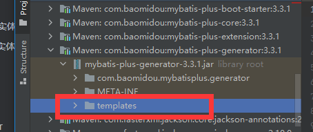

## 建表语句

```java
SET NAMES utf8mb4;
SET FOREIGN_KEY_CHECKS = 0;
 
-- ----------------------------
-- Table structure for shop_order
-- ----------------------------
DROP TABLE IF EXISTS `shop_order`;
CREATE TABLE `shop_order`  (
  `id` int(11) NOT NULL,
  `mount` decimal(20, 0) NULL DEFAULT NULL COMMENT '金额',
  `status` tinyint(1) NOT NULL COMMENT '状态 0：未支付 1：已经支付',
  `importance` tinyint(5) UNSIGNED NULL DEFAULT 0 COMMENT '排序字段',
  `creator` varchar(50) CHARACTER SET utf8 COLLATE utf8_general_ci NULL DEFAULT NULL COMMENT '创建人',
  `modifier` varchar(50) CHARACTER SET utf8 COLLATE utf8_general_ci NULL DEFAULT NULL COMMENT '修改人',
  `gmt_create` datetime(0) NULL DEFAULT NULL COMMENT '创建时间',
  `gmt_modified` datetime(0) NULL DEFAULT NULL COMMENT '修改时间',
  `is_deleted` tinyint(1) UNSIGNED NULL DEFAULT 0 COMMENT '是否被删除 1：数据无效（被删除） 0：数据有效',
  PRIMARY KEY (`id`) USING BTREE
) ENGINE = InnoDB CHARACTER SET = utf8mb4 COLLATE = utf8mb4_general_ci ROW_FORMAT = Dynamic;
 
SET FOREIGN_KEY_CHECKS = 1;

```

## BaseDo 实体

```java
package com.study.common.entity;
 
import com.baomidou.mybatisplus.annotation.*;
import io.swagger.annotations.ApiModel;
import io.swagger.annotations.ApiModelProperty;
import lombok.Data;
 
import java.io.Serializable;
import java.util.Date;
 
/**
 * @Package: com.study.common.entity
 * @Description: <基础实体类>
 * @Author: milla
 * @CreateDate: 2020/11/06 14:56
 * @UpdateUser: milla
 * @UpdateDate: 2020/11/06 14:56
 * @UpdateRemark: <>
 * @Version: 1.0
 */
@ApiModel(value = "基础实体")
@Data
public abstract class BaseDO implements Serializable {
 
    /**
     * 序列化时候使用
     */
    private static final long serialVersionUID = 1L;
    /**
     * 排序字段
     */
    @ApiModelProperty(value = "排序字段", notes = "默认按照记录id正序输出")
    @TableField(fill = FieldFill.INSERT_UPDATE, update = "12")
    private Integer importance;
    /**
     * 创建人
     */
    @ApiModelProperty(value = "创建人", notes = "")
    private String creator;
    /**
     * 修改人
     */
    @ApiModelProperty(value = "修改人", notes = "")
    private String modifier;
    /**
     * 数据创建时间
     */
    @ApiModelProperty(value = "数据创建时间", notes = "")
    @TableField(fill = FieldFill.INSERT)
    private Date gmtCreate;
    /**
     * 数据被修改时间
     */
    @ApiModelProperty(value = "数据被修改时间", notes = "")
    @TableField(fill = FieldFill.INSERT_UPDATE)
    private Date gmtModified;
 
    @TableLogic
    /**
     * 数据是否被删除
     */
    @ApiModelProperty(value = "数据是否被删除", notes = "逻辑删除字段")
    protected Integer isDeleted;
 
    @TableId(value = "id", type = IdType.AUTO)
    /**
     *主键自增
     */
    @ApiModelProperty(value = "主键自增", notes = "")
    protected Long id;
}

```

## queryBo实体

```java
package com.study.common.entity.bo;
 
import com.baomidou.mybatisplus.core.conditions.query.QueryWrapper;
import com.baomidou.mybatisplus.extension.plugins.pagination.Page;
import io.swagger.annotations.ApiModel;
import io.swagger.annotations.ApiModelProperty;
import lombok.Data;
 
/**
 * @Package: com.study.common.entity.bo
 * @Description: <查询实体类>
 * @Author: milla
 * @CreateDate: 2020/11/06 14:56
 * @UpdateUser: milla
 * @UpdateDate: 2020/11/06 14:56
 * @UpdateRemark: <>
 * @Version: 1.0
 */
@Data
@ApiModel(value = "查询实体类")
public class QueryBO<T> {
 
    @ApiModelProperty(value = "分页实体", notes = "包含分页参数")
    private Page<T> page;
 
    @ApiModelProperty(value = "实体参数", notes = "")
    private T entity;
 
    public QueryWrapper initQueryWrapper() {
        QueryWrapper wrapper = new QueryWrapper<>();
        wrapper.setEntity(entity);
        return wrapper;
    }
}

```

## 常量类

### 表格和数据库信息

```java
// 主要用于配置表格和数据库信息

package com.study.generator;
 
import com.baomidou.mybatisplus.annotation.DbType;
 
/**
 * @Package: com.study.generator
 * @Description: <表格和数据源配置项>
 * @Author: milla
 * @CreateDate: 2020/11/12 17:48
 * @UpdateUser: milla
 * @UpdateDate: 2020/11/12 17:48
 * @UpdateRemark: <>
 * @Version: 1.0
 */
public final class BasicConstant {
    /**
     * 作者
     */
    public static String AUTHOR = "milla" ;
    /**
     * 生成的实体类忽略表前缀: 不需要则置空
     */
    public static String ENTITY_IGNORE_PREFIX = "settings_" ;
    /**
     * 表名
     */
    public static String[] TABLES = {
            "shop_order"
    };
 
    /**
     * 实体类的父类Entity
     */
    public static String SUPER_ENTITY_CLASS = "com.aimsphm.nuclear.common.entity.BaseDO" ;
 
    /**
     * 基础父类继承字段
     */
    public static String[] SUPER_ENTITY_COLUMNS = {
            "id", "creator", "modifier", "gmt_modified", "gmt_create", "is_deleted", "importance"
    };
 
    /**
     * 数据库
     */
    public static String username = "root" ;
    public static String password = "aims2016" ;
    public static String url = "jdbc:mysql://192.168.16.28:3306/nuclear_tw?useAffectedRows=true&allowMultiQueries=true&characterEncoding=utf8&useUnicode=true&useSSL=false&serverTimezone=Asia/Shanghai&autoReconnect=true&failOverReadOnly=false&maxReconnects=10" ;
    public static DbType DB_TYPE = DbType.MYSQL;
    public static String driverClassName = "com.mysql.cj.jdbc.Driver" ;

```

### 文件生成路径及java类的包路径

```java
// 主要用来配置文件生成路径及java类的包路径

package com.study.generator;
 
import java.io.File;
 
/**
 * @Package: com.study.generator
 * @Description: <自定义生成的文件路径和包路径>
 * @Author: milla
 * @CreateDate: 2020/11/12 17:47
 * @UpdateUser: milla
 * @UpdateDate: 2020/11/12 17:47
 * @UpdateRemark: <>
 * @Version: 1.0
 */
public final class PackageInfoConstant {
    //------------------------------可能需要修改的配置---------------------------------------------
 
    /**
     * ------------------------------controller层单独配置--------------------------
     */
    public static String CONTROLLER_OUTPUT_ROOT_PATH = "/com/study/" ;
    /**
     * controller根目录
     */
    public static String ROOT_PROJECT_CONTROLLER_PATH = "/core" ;
    /**
     * 包路径(基础包路径)
     */
    public static String PACKAGE_ROOT = "com.study" ;
    /**
     * Controller模块(笔者的controller和service,dao,entity不在同一个项目中)
     */
    public static String CONTROLLER_MODULE_NAME = "core" ;
 
    /**
     * controller的包路径
     */
    public static String PACKAGE_CONTROLLER = PACKAGE_ROOT + "." + CONTROLLER_MODULE_NAME + ".controller" ;
 
    /**
     * ------------------------------controller以外的其他配置--------------------------
     */
    /**
     * 根路径
     */
    public static String ROOT_PROJECT_PATH = "/common" ;
    /**
     * 输出基础包
     */
    public static String OUTPUT_ROOT_PATH = "/com/study/" ;
    /**
     * 配置你包路径下的子模块(例如：com.study.common)
     * (例如：com.study.ext)
     */
    public static String MODULE_NAME = "common" ;
    /**
     * 扩展模块
     */
    public static String EXT_MODULE_NAME = "ext" ;
 
    public static String PACKAGE_PARENT = PACKAGE_ROOT + "." + MODULE_NAME;
    /**
     * 扩展基础包路径
     */
    public static String PACKAGE_PARENT_EXT = PACKAGE_ROOT + "." + EXT_MODULE_NAME;
 
    //---------------------------------------------------------------------------
    /**
     * 扩展的实体名称
     */
    public static String EXT_ClASS_NAME = "Ext" ;
    /**
     * 扩展实现类名称
     */
    public static String EXT_SERVICE_CLASSNAME_IMPL = "ExtImpl" ;
 
    /**
     * 生成文件路径、Dao、XML、Service、Controller
     * 父包名路径(文件输出路径,也是导包的路径)
     */
    public static String ENTITY_PATH = "/entity/" ;
    public static String MAPPER_PATH = "/mapper/" ;
    public static String XML_PATH = "/resources/mapper/" ;
    public static String XML_PATH_EXT = "/resources/mapper/ext/" ;
    public static String SERVICE_PATH = "/service/" ;
    public static String SERVICE_IMPL_PATH = "/service/impl/" ;
 
    public static String CONTROLLER_PATH = "/controller/" ;
 
    public static String MAIN_ROOT = "/src/main/" ;
    public static String JAVA_ROOT = MAIN_ROOT + "/java/" ;
 
 
    /**
     * 包路径中的mapper,service,impl等常量
     */
    public static String PACKAGE_NAME_MAPPER = "mapper" ;
    public static String PACKAGE_NAME_SERVICE = "service" ;
    public static String PACKAGE_NAME_IMPL = "impl" ;
    /**
     * mapper.xml输出模块路径(需要注意放置的位置:默认从模块/src/main下开始)
     */
    public static String XML_OUTPUT_MODULE = File.separator + MODULE_NAME;
    public static String XML_OUTPUT_PATH = ROOT_PROJECT_PATH + MAIN_ROOT + XML_PATH;
    /**
     * IService.java, serviceImpl.java输出模块路径
     */
    public static String SERVICE_OUTPUT_MODULE = File.separator + MODULE_NAME;
    public static String SERVICE_OUTPUT_PATH = ROOT_PROJECT_PATH + JAVA_ROOT + OUTPUT_ROOT_PATH + SERVICE_OUTPUT_MODULE + SERVICE_PATH;
    public static String SERVICE_IMPL_OUTPUT_PATH = ROOT_PROJECT_PATH + JAVA_ROOT + OUTPUT_ROOT_PATH + SERVICE_OUTPUT_MODULE + SERVICE_IMPL_PATH;
    /**
     * Entity.java, Mapper.java, Mapper.xml输出模块路径
     */
    public static String DAO_OUTPUT_MODULE = File.separator + MODULE_NAME;
    public static String ENTITY_OUTPUT_PATH = ROOT_PROJECT_PATH + JAVA_ROOT + OUTPUT_ROOT_PATH + DAO_OUTPUT_MODULE + ENTITY_PATH;
    public static String MAPPER_OUTPUT_PATH = ROOT_PROJECT_PATH + JAVA_ROOT + OUTPUT_ROOT_PATH + DAO_OUTPUT_MODULE + MAPPER_PATH;
    /**
     * ----------------------------------------EXT_CONFIG----------------------------------------------------
     */
    /**
     * mapper.xml输出模块路径(需要注意放置的位置:默认从模块/src/main下开始)
     */
    public static String XML_OUTPUT_PATH_EXT = ROOT_PROJECT_PATH + MAIN_ROOT + XML_PATH_EXT;
    /**
     * IService.java, serviceImpl.java输出模块路径
     */
    public static String SERVICE_OUTPUT_MODULE_EXT = File.separator + EXT_MODULE_NAME;
    public static String SERVICE_OUTPUT_PATH_EXT = ROOT_PROJECT_PATH + JAVA_ROOT + OUTPUT_ROOT_PATH + SERVICE_OUTPUT_MODULE_EXT + SERVICE_PATH;
    public static String SERVICE_IMPL_OUTPUT_PATH_EXT = ROOT_PROJECT_PATH + JAVA_ROOT + OUTPUT_ROOT_PATH + SERVICE_OUTPUT_MODULE_EXT + SERVICE_IMPL_PATH;
    /**
     * Entity.java, Mapper.java, Mapper.xml输出模块路径
     */
    public static String DAO_OUTPUT_MODULE_EXT = File.separator + EXT_MODULE_NAME;
    public static String MAPPER_OUTPUT_PATH_EXT = ROOT_PROJECT_PATH + JAVA_ROOT + OUTPUT_ROOT_PATH + DAO_OUTPUT_MODULE_EXT + MAPPER_PATH;
 
    /**
     * ----------------------------------------EXT_CONFIG----------------------------------------------------
     */
 
    /**
     * Controller.java输出模块路径
     */
    public static String CONTROLLER_OUTPUT_MODULE = File.separator + CONTROLLER_MODULE_NAME;
    public static String CONTROLLER_OUTPUT_PATH = ROOT_PROJECT_CONTROLLER_PATH + JAVA_ROOT + CONTROLLER_OUTPUT_ROOT_PATH + CONTROLLER_OUTPUT_MODULE + CONTROLLER_PATH;
}
————————————————
版权声明：本文为CSDN博主「涟漪海洋」的原创文章，遵循CC 4.0 BY-SA版权协议，转载请附上原文出处链接及本声明。
原文链接：https://blog.csdn.net/hu10131013/article/details/109690919
```

### 装配模板

```java
- 主要用来配置模版位置
    
package com.study.generator;
 
/**
 * @Package: com.study.generator
 * @Description: <模版位置配置类>
 * @Author: milla
 * @CreateDate: 2020/11/12 18:09
 * @UpdateUser: milla
 * @UpdateDate: 2020/11/12 18:09
 * @UpdateRemark: <>
 * @Version: 1.0
 */
public final class TemplateConstant {
 
    /**
     * entity输出模板
     */
    public static String ENTITY_TEMPLATE = "templates/entity.java.vm" ;
    /**
     * mapper.xml输出模板
     */
    public static String XML_TEMPLATE = "templates/mapper.xml.vm" ;
    /**
     * mapper.java输出模板
     */
    public static String MAPPER_TEMPLATE = "templates/mapper.java.vm" ;
    /**
     * service输出模板
     */
    public static String SERVICE_TEMPLATE = "templates/service.java.vm" ;
    /**
     * serviceImpl输出模板
     */
    public static String SERVICE_IMPL_TEMPLATE = "templates/serviceImpl.java.vm" ;
 
    /**
     * mapperExt.xml输出模板
     */
    public static String XML_TEMPLATE_EXT = "templates/mapperExt.xml.vm" ;
    /**
     * mapperExt.java输出模板
     */
    public static String MAPPER_TEMPLATE_EXT = "templates/mapperExt.java.vm" ;
    /**
     * serviceExt输出模板
     */
    public static String SERVICE_TEMPLATE_EXT = "templates/serviceExt.java.vm" ;
    /**
     * serviceExtImpl输出模板
     */
    public static String SERVICE_IMPL_TEMPLATE_EXT = "templates/serviceExtImpl.java.vm" ;
 
    /**
     * controller输出模板
     */
    public static String CONTROLLER_TEMPLATE = "templates/controller.java.vm" ;
}
```

## 模版配置



```java
// 多个模版
entity，
mapper，mapperExt，mapper.xml，mapperExt.xml，
service，serviceExt，serviceImpl，serviceIExtmpl，
controller
    
这个在包中都能找得到    
```

###  entity

#### entity.java.vm

```java
package ${package.Entity};
 
    #foreach($pkg in ${table.importPackages})
import ${pkg};
    #end
import lombok.Data;
import io.swagger.annotations.ApiModel;
import io.swagger.annotations.ApiModelProperty;
 
/**
 * @Package: ${package.Entity}
 * @Description: <$!{table.comment}实体>
 * @Author: ${author}
 * @CreateDate: ${date}
 * @UpdateUser: ${author}
 * @UpdateDate: ${date}
 * @UpdateRemark: <>
 * @Version: 1.0
 */
@Data
#if(${cfg.customerTableName})
@TableName("${table.name}")
#end
#if(${swagger2})
@ApiModel(value = "$!{table.comment}实体")
#end
#if(${superEntityClass})
public class ${entity} extends ${superEntityClass}#if(${activeRecord})<${entity}>#end {
#else
public class ${entity} implements Serializable{
#end
    /**
     * 序列化时候使用
     */
    private static final long serialVersionUID = ${cfg.get(${table.name})}L;
 
## ----------  BEGIN 字段循环遍历  ----------
#foreach($field in ${table.fields})
#if(${field.keyFlag})
    #set($keyPropertyName=${field.propertyName})
#end
###if("$!field.comment" != "")
##    /**
##     * ${field.comment}
##     */
###end
#if(${field.keyFlag})
    ## 主键
    #if(${field.keyIdentityFlag})
    @TableId(value = "${field.name}", type = IdType.AUTO)
    #elseif(${field.convert})
    @TableId("${field.name}")
    #end
#end
## 乐观锁注解
#if(${versionFieldName}==${field.name})
    @Version
#end
## 逻辑删除注解
#if(${logicDeleteFieldName}==${field.name})
    @TableLogic
#end
##    生成swagg实体描述
#if(${swagger2})
    #set($comment=${field.comment})
    #set($blankIndex=$comment.indexOf(" "))
    #set($hasBlank=$comment.indexOf(" ")!=-1)
    #if($hasBlank)
    @ApiModelProperty(value = "$comment.substring(0,$blankIndex)", notes = "$comment.substring($blankIndex).trim()")
    #end
    #if(!$hasBlank)
    @ApiModelProperty(value = "$comment", notes = "")
    #end
#end
    private ${field.propertyType} ${field.propertyName};
 
#end
}
————————————————
版权声明：本文为CSDN博主「涟漪海洋」的原创文章，遵循CC 4.0 BY-SA版权协议，转载请附上原文出处链接及本声明。
原文链接：https://blog.csdn.net/hu10131013/article/details/109690919
```

###  mapper

#### mapper.java.vm

```java
	 
import ${package.Entity}.${entity};
import ${superMapperClassPackage};
 
/**
 * @Package: ${package.Mapper}
 * @Description: <$!{table.comment}Mapper接口>
 * @Author: ${author}
 * @CreateDate: ${date}
 * @UpdateUser: ${author}
 * @UpdateDate: ${date}
 * @UpdateRemark: <>
 * @Version: 1.0
 */
#if(${kotlin})
interface ${table.mapperName} : ${superMapperClass}<${entity}>
#else
public interface ${table.mapperName} extends ${superMapperClass}<${entity}> {
 
}
#end
————————————————
版权声明：本文为CSDN博主「涟漪海洋」的原创文章，遵循CC 4.0 BY-SA版权协议，转载请附上原文出处链接及本声明。
原文链接：https://blog.csdn.net/hu10131013/article/details/109690919
```

#### mapperExt.java.vm

```java
package ${cfg.extPackagePre}.${cfg.mapper};
 
import ${package.Mapper}.${table.mapperName};
 
/**
 * @Package: ${cfg.extPackagePre}.${cfg.mapper}
 * @Description: <$!{table.comment}MapperExt接口>
 * @Author: ${author}
 * @CreateDate: ${date}
 * @UpdateUser: ${author}
 * @UpdateDate: ${date}
 * @UpdateRemark: <>
 * @Version: 1.0
 */
#if(${kotlin})
interface ${table.mapperName}${cfg.classNameExt} : ${superMapperClass}<${entity}>
#else
public interface ${table.mapperName}${cfg.classNameExt} extends ${table.mapperName} {
 
}
#end
————————————————
版权声明：本文为CSDN博主「涟漪海洋」的原创文章，遵循CC 4.0 BY-SA版权协议，转载请附上原文出处链接及本声明。
原文链接：https://blog.csdn.net/hu10131013/article/details/109690919
```

####  mapper.xml.vm

```java
<?xml version="1.0" encoding="UTF-8"?>
<!DOCTYPE mapper PUBLIC "-//mybatis.org//DTD Mapper 3.0//EN" "http://mybatis.org/dtd/mybatis-3-mapper.dtd">
<mapper namespace="${package.Mapper}.${table.mapperName}">
 
#if(${enableCache})
    <!-- 开启二级缓存 -->
    <cache type="org.mybatis.caches.ehcache.LoggingEhcache"/>
 
#end
#if(${baseResultMap})
    <!-- 通用查询映射结果 -->
    <resultMap id="BaseResultMap" type="${package.Entity}.${entity}">
#foreach($field in ${table.fields})
#if(${field.keyFlag})##生成主键排在第一位
        <id column="${field.name}" property="${field.propertyName}"/>
#end
#end
#foreach($field in ${table.commonFields})##生成公共字段
        <result column="${field.name}" property="${field.propertyName}"/>
#end
#foreach($field in ${table.fields})
#if(!${field.keyFlag})##生成普通字段
        <result column="${field.name}" property="${field.propertyName}"/>
#end
#end
    </resultMap>
 
#end
#if(${baseColumnList})
    <!-- 通用查询结果列 -->
    <sql id="Base_Column_List">
#foreach($field in ${table.commonFields})
        ${field.columnName},
#end
        ${table.fieldNames}
    </sql>
 
#end
</mapper>
————————————————
版权声明：本文为CSDN博主「涟漪海洋」的原创文章，遵循CC 4.0 BY-SA版权协议，转载请附上原文出处链接及本声明。
原文链接：https://blog.csdn.net/hu10131013/article/details/109690919
```

#### mapperExt.xml.vm

```java
<?xml version="1.0" encoding="UTF-8"?>
<!DOCTYPE mapper PUBLIC "-//mybatis.org//DTD Mapper 3.0//EN" "http://mybatis.org/dtd/mybatis-3-mapper.dtd">
<mapper namespace="${cfg.extPackagePre}.${cfg.mapper}.${table.mapperName}${cfg.classNameExt}">
 
#if(${enableCache})
    <!-- 开启二级缓存 -->
    <cache type="org.mybatis.caches.ehcache.LoggingEhcache"/>
 
#end
#if(${baseResultMap})
    <!-- 扩展查询映射结果 -->
    <resultMap id="BaseResultMap${cfg.classNameExt}" type="${package.Entity}.${entity}"
               extends="${package.Mapper}.${table.mapperName}.BaseResultMap">
    </resultMap>
 
#end
#if(${baseColumnList})
    <!-- 通用查询结果列 -->
    <sql id="Base_Column_List">
#foreach($field in ${table.commonFields})
        ${field.columnName},
#end
        ${table.fieldNames}
    </sql>
 
#end
</mapper>
————————————————
版权声明：本文为CSDN博主「涟漪海洋」的原创文章，遵循CC 4.0 BY-SA版权协议，转载请附上原文出处链接及本声明。
原文链接：https://blog.csdn.net/hu10131013/article/details/109690919
```

### service

#### service.java.vm

```java
package ${package.Service};
 
import ${package.Entity}.${entity};
import ${superServiceClassPackage};
 
/**
 * @Package: ${package.Service}
 * @Description: <$!{table.comment}服务类>
 * @Author: ${author}
 * @CreateDate: ${date}
 * @UpdateUser: ${author}
 * @UpdateDate: ${date}
 * @UpdateRemark: <>
 * @Version: 1.0
 */
#if(${kotlin})
interface ${table.serviceName} : ${superServiceClass}<${entity}>
#else
public interface ${table.serviceName} extends ${superServiceClass}<${entity}> {
 
}
#end
————————————————
版权声明：本文为CSDN博主「涟漪海洋」的原创文章，遵循CC 4.0 BY-SA版权协议，转载请附上原文出处链接及本声明。
原文链接：https://blog.csdn.net/hu10131013/article/details/109690919
```

####  serviceExt.java.vm

```java
package ${cfg.extPackagePre}.${cfg.service};
 
import ${package.Service}.${table.serviceName};
 
/**
 * @Package: ${cfg.extPackagePre}.${cfg.service}
 * @Description: <$!{table.comment}扩展服务类>
 * @Author: ${author}
 * @CreateDate: ${date}
 * @UpdateUser: ${author}
 * @UpdateDate: ${date}
 * @UpdateRemark: <>
 * @Version: 1.0
 */
#if(${kotlin})
interface ${table.serviceName}${cfg.classNameExt} : ${table.serviceName}
#else
public interface ${table.serviceName}${cfg.classNameExt} extends ${table.serviceName} {
 
}
#end
```

#### serviceImpl.java.vm

```java
package ${package.ServiceImpl};
 
import ${package.Entity}.${entity};
import ${package.Mapper}.${table.mapperName};
import ${package.Service}.${table.serviceName};
import ${superServiceImplClassPackage};
import org.springframework.stereotype.Service;
import org.springframework.boot.autoconfigure.condition.ConditionalOnProperty;
 
/**
 * @Package: ${package.ServiceImpl}
 * @Description: <$!{table.comment}服务实现类>
 * @Author: ${author}
 * @CreateDate: ${date}
 * @UpdateUser: ${author}
 * @UpdateDate: ${date}
 * @UpdateRemark: <>
 * @Version: 1.0
 */
##@Service
#if(${kotlin})
open class ${table.serviceImplName} : ${superServiceImplClass}<${table.mapperName}, ${entity}>(), ${table.serviceName} {
 
}
#else
##@ConditionalOnProperty(prefix = "spring.config-service", name = "enable", havingValue = "true", matchIfMissing = false)
public class ${table.serviceImplName} extends ${superServiceImplClass}<${table.mapperName}, ${entity}> implements ${table.serviceName} {
 
}
#end
```

#### serviceExtImpl.java.vm

```java
 
import ${cfg.extPackagePre}.${cfg.service}.${table.serviceName}${cfg.classNameExt};
import ${package.ServiceImpl}.${table.serviceImplName};
import org.springframework.stereotype.Service;
import org.springframework.boot.autoconfigure.condition.ConditionalOnProperty;
 
/**
 * @Package: ${cfg.extPackagePre}.${cfg.service}.${cfg.serviceImpl}
 * @Description: <$!{table.comment}扩展服务实现类>
 * @Author: ${author}
 * @CreateDate: ${date}
 * @UpdateUser: ${author}
 * @UpdateDate: ${date}
 * @UpdateRemark: <>
 * @Version: 1.0
 */
@Service
#if(${kotlin})
open class ${table.serviceImplName} : ${superServiceImplClass}<${table.mapperName}, ${entity}>(), ${table.serviceName} {
 
}
#else
@ConditionalOnProperty(prefix = "spring.config-service", name = "enable", havingValue = "true")
public class ${table.serviceName}${cfg.serviceImplNameFix} extends ${table.serviceImplName} implements ${table.serviceName}${cfg.classNameExt} {
 
}
#end
————————————————
版权声明：本文为CSDN博主「涟漪海洋」的原创文章，遵循CC 4.0 BY-SA版权协议，转载请附上原文出处链接及本声明。
原文链接：https://blog.csdn.net/hu10131013/article/details/109690919
```

###  controller

#### controller.java.vm

```java
package ${cfg.controllerPackage};
 
import ${package.Entity}.${entity};
##import ${package.Service}.${table.serviceName};
import ${package.Entity}.bo.QueryBO;
import ${cfg.extPackagePre}.${cfg.service}.${table.serviceName}${cfg.classNameExt};
import com.baomidou.mybatisplus.extension.plugins.pagination.Page;
import io.swagger.annotations.Api;
import io.swagger.annotations.ApiOperation;
import org.springframework.beans.factory.annotation.Autowired;
import org.springframework.http.MediaType;
import org.springframework.web.bind.annotation.*;
 
import java.util.List;
 
/**
 * @Package: ${cfg.controllerPackage}
 * @Description: <$!{table.comment}前端控制器>
 * @Author: ${author}
 * @CreateDate: ${date}
 * @UpdateUser: ${author}
 * @UpdateDate: ${date}
 * @UpdateRemark: <>
 * @Version: 1.0
 */
#set($path=${table.name})
#set($path=$path.concat("path"))
@RestController
@Api(tags = "$!{table.comment}-相关接口")
@RequestMapping(value = "${cfg.get($path)}", produces = MediaType.APPLICATION_JSON_VALUE)
public class ${table.controllerName} {
##    @Autowired
##    private ${table.serviceName} i${table.serviceName};
    @Autowired
    private ${table.serviceName}${cfg.classNameExt} i${table.serviceName}${cfg.classNameExt};
 
    @GetMapping("list")
    @ApiOperation(value = "$!{table.comment}分页查询")
    public Page<${entity}> list${table.serviceName}ByPage(QueryBO<${entity}> query) {
        return i${table.serviceName}${cfg.classNameExt}.page(query.getPage() == null ? new Page() : query.getPage(), query.initQueryWrapper());
    }
 
    @GetMapping("{id}")
    @ApiOperation(value = "$!{table.comment}获取某一实体")
    public ${entity} get${table.serviceName}Details(@PathVariable Long id) {
        return i${table.serviceName}${cfg.classNameExt}.getById(id);
    }
 
    @PostMapping
    @ApiOperation(value = "$!{table.comment}新增数据")
    public boolean save${table.serviceName}(@RequestBody ${entity} dto) {
        return i${table.serviceName}${cfg.classNameExt}.save(dto);
    }
 
    @PutMapping("{id}")
    @ApiOperation(value = "$!{table.comment}修改数据")
    public boolean modify${table.serviceName}(@RequestBody ${entity} dto, @PathVariable Long id) {
        dto.setId(id);
        return i${table.serviceName}${cfg.classNameExt}.updateById(dto);
    }
 
    @DeleteMapping("batch")
    @ApiOperation(value = "$!{table.comment}批量删除数据")
    public boolean batchRemove${table.serviceName}(@RequestParam(value = "ids") List<Long> ids) {
        return i${table.serviceName}${cfg.classNameExt}.removeByIds(ids);
    }
 
    @DeleteMapping("{id}")
    @ApiOperation(value = "$!{table.comment}删除数据")
    public boolean remove${table.serviceName}(@PathVariable Long id) {
        return i${table.serviceName}${cfg.classNameExt}.removeById(id);
    }
}
```

###  自定义输出路径

```java
/**
     * 自定义配置
     *
     * @param isCreateExt
     */
    private static InjectionConfig injectionConfig(boolean isCreateExt) {
        return new InjectionConfig() {
            @Override
            public void initMap() {
                // 注入配置
                Map<String, Object> map = new HashMap<>(16);
                //指定表格的名称
                map.put("customerTableName", true);
                //需要生成扩展的时候执行
                if (isCreateExt) {
                    //扩展的表名
                    map.put("extPackagePre", PACKAGE_PARENT_EXT);
                    //controller包路径
                    map.put("controllerPackage", PACKAGE_CONTROLLER);
                    //service包名
                    map.put("service", PACKAGE_NAME_SERVICE);
                    //实现类包名
                    map.put("serviceImpl", PACKAGE_NAME_IMPL);
                    //mapper包名
                    map.put("mapper", PACKAGE_NAME_MAPPER);
                    //实现后缀
                    map.put("serviceImplNameFix", EXT_SERVICE_CLASSNAME_IMPL);
                    //类名扩展后缀
                    map.put("classNameExt", EXT_ClASS_NAME);
                }
                for (String tableName : TABLES) {
                    //指定每个类的serialVersionUID
                    long serialVersionUID = UUID.nameUUIDFromBytes(tableName.getBytes()).getLeastSignificantBits();
                    map.put(tableName, Math.abs(serialVersionUID));
                    //计算controller的路径
                    StringBuilder sb = new StringBuilder();
                    if (StringUtils.contains(tableName, UNDERSCORE)) {
                        sb.append(SLASH + tableName.substring(0, tableName.indexOf(UNDERSCORE)));
                        String url = tableName.substring(tableName.indexOf(UNDERSCORE) + 1);
                        sb.append(SLASH + CaseFormat.LOWER_UNDERSCORE.to(CaseFormat.LOWER_CAMEL, url));
                        map.put(tableName + "path", sb.toString());
                        continue;
                    }
                    sb.append(SLASH + CaseFormat.LOWER_UNDERSCORE.to(CaseFormat.LOWER_CAMEL, url));
                    map.put(tableName + "path", sb.toString());
                }
                this.setMap(map);
            }
        }
                // 判断是否创建文件
                .setFileCreate((configBuilder, fileType, filePath) -> {
                    // 检查文件目录，不存在自动递归创建
                    File file = new File(filePath);
                    boolean exist = file.exists();
                    if (!exist) {
                        file.getParentFile().mkdirs();
                    }
                    return true;
                })
                // 自定义输出文件
                .setFileOutConfigList(fileOutConfigList(isCreateExt));
    }
 
 /**
     * 自定义输出路径
     *
     * @param isCreateExt
     * @return
     */
    private static List<FileOutConfig> fileOutConfigList(boolean isCreateExt) {
        List<FileOutConfig> list = new ArrayList<>();
        // 当前项目路径
        String projectPath = System.getProperty("user.dir");
 
        // 实体类文件输出
        list.add(new FileOutConfig(ENTITY_TEMPLATE) {
            @Override
            public String outputFile(TableInfo tableInfo) {
                return projectPath + ENTITY_OUTPUT_PATH + tableInfo.getEntityName() + StringPool.DOT_JAVA;
            }
        });
        // mapper xml文件输出
        list.add(new FileOutConfig(XML_TEMPLATE) {
            @Override
            public String outputFile(TableInfo tableInfo) {
                return projectPath + XML_OUTPUT_PATH + tableInfo.getMapperName() + StringPool.DOT_XML;
            }
        });
        // mapper文件输出
        list.add(new FileOutConfig(MAPPER_TEMPLATE) {
            @Override
            public String outputFile(TableInfo tableInfo) {
                return projectPath + MAPPER_OUTPUT_PATH + tableInfo.getMapperName() + StringPool.DOT_JAVA;
            }
        });
        // service文件输出
        list.add(new FileOutConfig(SERVICE_TEMPLATE) {
            @Override
            public String outputFile(TableInfo tableInfo) {
                return projectPath + SERVICE_OUTPUT_PATH + tableInfo.getServiceName() + StringPool.DOT_JAVA;
            }
        });
        // service impl文件输出
        list.add(new FileOutConfig(SERVICE_IMPL_TEMPLATE) {
            @Override
            public String outputFile(TableInfo tableInfo) {
                return projectPath + SERVICE_IMPL_OUTPUT_PATH + tableInfo.getServiceImplName() + StringPool.DOT_JAVA;
            }
        });
        //----------------------------------------------是否需要生成扩展------------------------------------------------------
        if (isCreateExt) {
            // mapperExt xml文件输出
            list.add(new FileOutConfig(XML_TEMPLATE_EXT) {
                @Override
                public String outputFile(TableInfo tableInfo) {
                    return projectPath + XML_OUTPUT_PATH_EXT + tableInfo.getMapperName() + EXT_ClASS_NAME + StringPool.DOT_XML;
                }
            });
            // mapperExt文件输出
            list.add(new FileOutConfig(MAPPER_TEMPLATE_EXT) {
                @Override
                public String outputFile(TableInfo tableInfo) {
                    return projectPath + MAPPER_OUTPUT_PATH_EXT + tableInfo.getMapperName() + EXT_ClASS_NAME + StringPool.DOT_JAVA;
                }
            });
            // serviceExt文件输出
            list.add(new FileOutConfig(SERVICE_TEMPLATE_EXT) {
                @Override
                public String outputFile(TableInfo tableInfo) {
                    return projectPath + SERVICE_OUTPUT_PATH_EXT + tableInfo.getServiceName() + EXT_ClASS_NAME + StringPool.DOT_JAVA;
                }
            });
            // serviceExt impl文件输出
            list.add(new FileOutConfig(SERVICE_IMPL_TEMPLATE_EXT) {
                @Override
                public String outputFile(TableInfo tableInfo) {
                    return projectPath + SERVICE_IMPL_OUTPUT_PATH_EXT + tableInfo.getServiceName() + EXT_SERVICE_CLASSNAME_IMPL + StringPool.DOT_JAVA;
                }
            });
            //----------------------------------------------------------------------------------------------------
        }
 
        // controller文件输出
        list.add(new FileOutConfig(CONTROLLER_TEMPLATE) {
            @Override
            public String outputFile(TableInfo tableInfo) {
                return projectPath + CONTROLLER_OUTPUT_PATH + tableInfo.getControllerName() + StringPool.DOT_JAVA;
            }
        });
        return list;
    }
```

## 生成程序

```java
  public static void main(String[] args) {
        boolean isCreateExt = true;
        builder(isCreateExt);
    }
 
    /**
     * 执行自动代码生成程序
     *
     * @param isCreateExt
     */
    private static void builder(boolean isCreateExt) {
        new AutoGenerator() //1
            	.setGlobalConfig(globalConfig()) // 2
                .setDataSource(dataSourceConfig()) // 3
                .setStrategy(strategyConfig()) // 4
                .setCfg(injectionConfig(isCreateExt)) // 5
                .setPackageInfo(
                        new PackageConfig().setParent(PACKAGE_PARENT)
                )
                .execute(); // 6
    }
```

## //== 官方配置 ==

## 1. 创建生成器

```java
// 1、创建代码生成器
AutoGenerator mpg = new AutoGenerator();
```


## 2. 全局配置

### 源码

```java


/**
 * 全局配置
 *
 * @author hubin
 * @since 2016-12-02
 */
@Data
@Accessors(chain = true)
public class GlobalConfig {

    /**
     * 生成文件的输出目录【默认 D 盘根目录】
     */
    private String outputDir = "D://";

    /**
     * 是否覆盖已有文件
     */
    private boolean fileOverride = false;

    /**
     * 是否打开输出目录
     */
    private boolean open = true;

    /**
     * 是否在xml中添加二级缓存配置
     */
    private boolean enableCache = false;

    /**
     * 开发人员
     */
    private String author;

    /**
     * 开启 Kotlin 模式
     */
    private boolean kotlin = false;

    /**
     * 开启 swagger2 模式
     */
    private boolean swagger2 = false;

    /**
     * 开启 ActiveRecord 模式
     */
    private boolean activeRecord = false;

    /**
     * 开启 BaseResultMap
     */
    private boolean baseResultMap = false;

    /**
     * 时间类型对应策略
     */
    private DateType dateType = DateType.TIME_PACK;

    /**
     * 开启 baseColumnList
     */
    private boolean baseColumnList = false;
    /**
     * 各层文件名称方式，例如： %sAction 生成 UserAction
     * %s 为占位符
     */
    private String entityName;
    private String mapperName;
    private String xmlName;
    private String serviceName;
    private String serviceImplName;
    private String controllerName;
    /**
     * 指定生成的主键的ID类型
     */
    private IdType idType;
}

```

### 使用例子

```java
介绍
    这个可以看 GlobalConfig 的源码
    源码里面有什么类型的需要标注
        

	private static GlobalConfig globalConfig() {
        return new GlobalConfig()

            	// 文件输出路径
       			.setOutputDir(System.getProperty("user.dir") + "/src/main/java");
            
                // 生成后是否打开资源管理器
                .setOpen(false)
                // 重新生成时文件是否覆盖
                .setFileOverride(false)

                // swagger注解; 须添加swagger依赖
                .setSwagger2(true)
                // 作者
                .setAuthor("AUTHOR")
 			   //主键策略                    
                .setIdType(IdType.ASSIGN_ID); 
    			//定义生成的实体类中日期类型
       		    .setDateType(DateType.ONLY_DATE);
            	
    		    // 这里有很多类，也可以自定义类
                // 设置实体类名称
                .setEntityName("%sDO")
                //设置服务类名称, 去掉Service接口的首字母I
                .setServiceName("%sService")
                ;
    }
```

## 3. 数据源配置 -- 数据库连接

### 源码

```java

package com.baomidou.mybatisplus.generator.config;

import com.baomidou.mybatisplus.annotation.DbType;
import com.baomidou.mybatisplus.core.toolkit.ExceptionUtils;
import com.baomidou.mybatisplus.generator.config.converts.TypeConvertRegistry;
import com.baomidou.mybatisplus.generator.config.querys.DbQueryRegistry;
import lombok.Data;
import lombok.experimental.Accessors;

import java.sql.Connection;
import java.sql.DriverManager;
import java.sql.SQLException;
import java.util.Optional;

/**
 * 数据库配置
 *
 * @author YangHu
 * @since 2016/8/30
 */
@Data
@Accessors(chain = true)
public class DataSourceConfig {

    /**
     * 数据库信息查询
     */
    private IDbQuery dbQuery;
    /**
     * 数据库类型
     */
    private DbType dbType;
    /**
     * PostgreSQL schemaName
     */
    private String schemaName;
    /**
     * 类型转换
     */
    private ITypeConvert typeConvert;
    /**
     * 驱动连接的URL
     */
    private String url;
    /**
     * 驱动名称
     */
    private String driverName;
    /**
     * 数据库连接用户名
     */
    private String username;
    /**
     * 数据库连接密码
     */
    private String password;

    public IDbQuery getDbQuery() {
        if (null == dbQuery) {
            DbType dbType = getDbType();
            DbQueryRegistry dbQueryRegistry = new DbQueryRegistry();
            // 默认 MYSQL
            dbQuery = Optional.ofNullable(dbQueryRegistry.getDbQuery(dbType)).orElseGet(() -> dbQueryRegistry.getDbQuery(DbType.MYSQL));
        }
        return dbQuery;
    }

    /**
     * 判断数据库类型
     *
     * @return 类型枚举值
     */
    public DbType getDbType() {
        if (null == this.dbType) {
            this.dbType = this.getDbType(this.driverName);
            if (null == this.dbType) {
                this.dbType = this.getDbType(this.url.toLowerCase());
                if (null == this.dbType) {
                    throw ExceptionUtils.mpe("Unknown type of database!");
                }
            }
        }

        return this.dbType;
    }

    /**
     * 判断数据库类型
     *
     * @param str 用于寻找特征的字符串，可以是 driverName 或小写后的 url
     * @return 类型枚举值，如果没找到，则返回 null
     */
    private DbType getDbType(String str) {
        if (str.contains("mysql")) {
            return DbType.MYSQL;
        } else if (str.contains("oracle")) {
            return DbType.ORACLE;
        } else if (str.contains("postgresql")) {
            return DbType.POSTGRE_SQL;
        } else if (str.contains("sqlserver")) {
            return DbType.SQL_SERVER;
        } else if (str.contains("db2")) {
            return DbType.DB2;
        } else if (str.contains("mariadb")) {
            return DbType.MARIADB;
        } else if (str.contains("sqlite")) {
            return DbType.MARIADB;
        } else if (str.contains("h2")) {
            return DbType.H2;
        } else if (str.contains("kingbase") || str.contains("kingbase8")) {
            return DbType.KINGBASE_ES;
        } else {
            return null;
        }
    }

    public ITypeConvert getTypeConvert() {
        if (null == typeConvert) {
            DbType dbType = getDbType();
            TypeConvertRegistry typeConvertRegistry = new TypeConvertRegistry();
            // 默认 MYSQL
            typeConvert = Optional.ofNullable(typeConvertRegistry.getTypeConvert(dbType)).orElseGet(() -> typeConvertRegistry.getTypeConvert(DbType.MYSQL));
        }
        return typeConvert;
    }

    /**
     * 创建数据库连接对象
     *
     * @return Connection
     */
    public Connection getConn() {
        Connection conn;
        try {
            Class.forName(driverName);
            conn = DriverManager.getConnection(url, username, password);
        } catch (ClassNotFoundException | SQLException e) {
            throw new RuntimeException(e);
        }
        return conn;
    }
}

```


### 使用例子

```java
    private static DataSourceConfig dataSourceConfig() {
        return new DataSourceConfig()
          .setDbType(DbType.MYSQL);
         /*
         	"jdbc:mysql://localhost:3306/" + prefix + "guli_" + moduleName + "?	
         	 serverTimezone=GMT%2B8"
         */
        .setUrl("");
        .setDriverName("com.mysql.cj.jdbc.Driver");
        .setUsername("root");
        .setPassword("root");
                // 数据库类型
                .setDbType(DB_TYPE)

    }

```

## 4. 配置文件策略

### 源码

```java

package com.baomidou.mybatisplus.generator.config;

import com.baomidou.mybatisplus.core.metadata.TableInfoHelper;
import com.baomidou.mybatisplus.core.toolkit.StringUtils;
import com.baomidou.mybatisplus.generator.config.po.LikeTable;
import com.baomidou.mybatisplus.generator.config.po.TableFill;
import com.baomidou.mybatisplus.generator.config.rules.NamingStrategy;
import lombok.AccessLevel;
import lombok.Data;
import lombok.Setter;
import lombok.experimental.Accessors;

import java.lang.reflect.Field;
import java.util.Arrays;
import java.util.List;

/**
 * 策略配置项
 *
 * @author YangHu, tangguo, hubin
 * @since 2016/8/30
 */
@Data
@Accessors(chain = true)
public class StrategyConfig {
    /**
     * 是否大写命名
     */
    private boolean isCapitalMode = false;
    /**
     * 是否跳过视图
     */
    private boolean skipView = false;
    /**
     * 名称转换
     */
    private INameConvert nameConvert;
    /**
     * 数据库表映射到实体的命名策略
     */
    private NamingStrategy naming = NamingStrategy.no_change;
    /**
     * 数据库表字段映射到实体的命名策略
     * <p>未指定按照 naming 执行</p>
     */
    private NamingStrategy columnNaming = null;
    /**
     * 表前缀
     */
    @Setter(AccessLevel.NONE)
    private String[] tablePrefix;
    /**
     * 字段前缀
     */
    @Setter(AccessLevel.NONE)
    private String[] fieldPrefix;
    /**
     * 自定义继承的Entity类全称，带包名
     */
    @Setter(AccessLevel.NONE)
    private String superEntityClass;
    /**
     * 自定义基础的Entity类，公共字段
     */
    @Setter(AccessLevel.NONE)
    private String[] superEntityColumns;
    /**
     * 自定义继承的Mapper类全称，带包名
     */
    private String superMapperClass = ConstVal.SUPER_MAPPER_CLASS;
    /**
     * 自定义继承的Service类全称，带包名
     */
    private String superServiceClass = ConstVal.SUPER_SERVICE_CLASS;
    /**
     * 自定义继承的ServiceImpl类全称，带包名
     */
    private String superServiceImplClass = ConstVal.SUPER_SERVICE_IMPL_CLASS;
    /**
     * 自定义继承的Controller类全称，带包名
     */
    private String superControllerClass;
    /**
     * 需要包含的表名（与exclude二选一配置）
     * @since 3.3.0 正则匹配不再支持,请使用{@link #setLikeTable(LikeTable)}}
     */
    @Setter(AccessLevel.NONE)
    private String[] include = null;
    /**
     * 需要排除的表名
     * @since 3.3.0 正则匹配不再支持,请使用{@link #setNotLikeTable(LikeTable)}}
     */
    @Setter(AccessLevel.NONE)
    private String[] exclude = null;
    /**
     * 实体是否生成 serialVersionUID
     */
    private boolean entitySerialVersionUID = true;
    /**
     * 【实体】是否生成字段常量（默认 false）<br>
     * -----------------------------------<br>
     * public static final String ID = "test_id";
     */
    private boolean entityColumnConstant = false;
    /**
     * 【实体】是否为构建者模型（默认 false）<br>
     * -----------------------------------<br>
     * public User setName(String name) { this.name = name; return this; }
     */
    private boolean entityBuilderModel = false;
    /**
     * 【实体】是否为lombok模型（默认 false）<br>
     * <a href="https://projectlombok.org/">document</a>
     */
    private boolean entityLombokModel = false;
    /**
     * Boolean类型字段是否移除is前缀（默认 false）<br>
     * 比如 : 数据库字段名称 : 'is_xxx',类型为 : tinyint. 在映射实体的时候则会去掉is,在实体类中映射最终结果为 xxx
     */
    private boolean entityBooleanColumnRemoveIsPrefix = false;
    /**
     * 生成 <code>@RestController</code> 控制器
     * <pre>
     *      <code>@Controller</code> -> <code>@RestController</code>
     * </pre>
     */
    private boolean restControllerStyle = false;
    /**
     * 驼峰转连字符
     * <pre>
     *      <code>@RequestMapping("/managerUserActionHistory")</code> -> <code>@RequestMapping("/manager-user-action-history")</code>
     * </pre>
     */
    private boolean controllerMappingHyphenStyle = false;
    /**
     * 是否生成实体时，生成字段注解
     */
    private boolean entityTableFieldAnnotationEnable = false;
    /**
     * 乐观锁属性名称
     */
    private String versionFieldName;
    /**
     * 逻辑删除属性名称
     */
    private String logicDeleteFieldName;
    /**
     * 表填充字段
     */
    private List<TableFill> tableFillList = null;
    /**
     * 启用sql过滤
     * 语法不能支持使用sql过滤表的话，可以考虑关闭此开关.
     * 目前所知微软系需要关闭，其他数据库等待反馈，sql可能要改动一下才能支持，没数据库环境搞，请手动关闭使用内存过滤的方式。
     *
     * @since 3.3.1
     */
    private boolean enableSqlFilter = true;
    /**
     * 包含表名
     *
     * @since 3.3.0
     */
    private LikeTable likeTable;
    /**
     * 不包含表名
     *
     * @since 3.3.0
     */
    private LikeTable notLikeTable;

    /**
     * 大写命名、字段符合大写字母数字下划线命名
     *
     * @param word 待判断字符串
     */
    public boolean isCapitalModeNaming(String word) {
        return isCapitalMode && StringUtils.isCapitalMode(word);
    }

    /**
     * 表名称包含指定前缀
     *
     * @param tableName 表名称
     */
    public boolean containsTablePrefix(String tableName) {
        if (null != tableName) {
            String[] tps = getTablePrefix();
            if (null != tps) {
                return Arrays.stream(tps).anyMatch(tableName::contains);
            }
        }
        return false;
    }

    public NamingStrategy getColumnNaming() {
        if (null == columnNaming) {
            // 未指定以 naming 策略为准
            return naming;
        }
        return columnNaming;
    }

    public StrategyConfig setTablePrefix(String... tablePrefix) {
        this.tablePrefix = tablePrefix;
        return this;
    }

    public boolean includeSuperEntityColumns(String fieldName) {
        if (null != superEntityColumns) {
            // 公共字段判断忽略大小写【 部分数据库大小写不敏感 】
            return Arrays.stream(superEntityColumns).anyMatch(e -> e.equalsIgnoreCase(fieldName));
        }
        return false;
    }

    public StrategyConfig setSuperEntityColumns(String... superEntityColumns) {
        this.superEntityColumns = superEntityColumns;
        return this;
    }

    public StrategyConfig setInclude(String... include) {
        this.include = include;
        return this;
    }

    public StrategyConfig setExclude(String... exclude) {
        this.exclude = exclude;
        return this;
    }

    public StrategyConfig setFieldPrefix(String... fieldPrefixs) {
        this.fieldPrefix = fieldPrefixs;
        return this;
    }

    public StrategyConfig setSuperEntityClass(String superEntityClass) {
        this.superEntityClass = superEntityClass;
        return this;
    }


    /**
     * <p>
     * 设置实体父类，该设置自动识别公共字段<br/>
     * 属性 superEntityColumns 改配置无需再次配置
     * </p>
     * <p>
     * 注意！！字段策略要在设置实体父类之前有效
     * </p>
     *
     * @param clazz 实体父类 Class
     * @return
     */
    public StrategyConfig setSuperEntityClass(Class<?> clazz) {
        return setSuperEntityClass(clazz, null);
    }

    /**
     * <p>
     * 设置实体父类，该设置自动识别公共字段<br/>
     * 属性 superEntityColumns 改配置无需再次配置
     * </p>
     *
     * @param clazz        实体父类 Class
     * @param columnNaming 字段命名策略
     * @return
     */
    public StrategyConfig setSuperEntityClass(Class<?> clazz, NamingStrategy columnNaming) {
        if (null != columnNaming) {
            this.columnNaming = columnNaming;
        }
        this.superEntityClass = clazz.getName();
        convertSuperEntityColumns(clazz);
        return this;
    }

    public StrategyConfig setSuperControllerClass(Class<?> clazz) {
        this.superControllerClass = clazz.getName();
        return this;
    }

    public StrategyConfig setSuperControllerClass(String superControllerClass) {
        this.superControllerClass = superControllerClass;
        return this;
    }

    /**
     * <p>
     * 父类 Class 反射属性转换为公共字段
     * </p>
     *
     * @param clazz 实体父类 Class
     */
    protected void convertSuperEntityColumns(Class<?> clazz) {
        List<Field> fields = TableInfoHelper.getAllFields(clazz);
        this.superEntityColumns = fields.stream().map(field -> {
            if (null == columnNaming || columnNaming == NamingStrategy.no_change) {
                return field.getName();
            }
            return StringUtils.camelToUnderline(field.getName());
        }).distinct().toArray(String[]::new);
    }

    /**
     * @deprecated please use `setEntityTableFieldAnnotationEnable`
     */
    @Deprecated
    public StrategyConfig entityTableFieldAnnotationEnable(boolean isEnableAnnotation) {
        entityTableFieldAnnotationEnable = isEnableAnnotation;
        return this;
    }
}

```


### 使用例子

```java
  /**
     * 设置表格/字段等生成策略配置
     *
     * @return
     */
    private static StrategyConfig strategyConfig() {
        StrategyConfig strategyConfig = new StrategyConfig()
                // 表名生成策略：下划线连转驼峰
                .setNaming(NamingStrategy.underline_to_camel)
                // 表字段生成策略：下划线连转驼峰
                .setColumnNaming(NamingStrategy.underline_to_camel)
                // 需要生成的表
                .setInclude(TABLES)
                // 生成controller
                .setRestControllerStyle(true)
                // 去除表前缀
                .setTablePrefix(ENTITY_IGNORE_PREFIX)
                // controller映射地址：驼峰转连字符
                .setControllerMappingHyphenStyle(false)
                // 是否启用builder 模式
                .setChainModel(true)
                // 是否为lombok模型; 需要lombok依赖
                .setEntityLombokModel(true)
                // 生成实体类字段注解
                .setEntityTableFieldAnnotationEnable(true)
                // 乐观锁、逻辑删除、表填充
//                .setVersionFieldName("version")
                .setLogicDeleteFieldName("is_deleted")
            	// 表填充
                .setTableFillList(Arrays.asList(
                        new TableFill("gmt_modified", FieldFill.UPDATE),
                        new TableFill("gmt_create", FieldFill.INSERT)
                ))
                // 生成类的时候排除的字符串(因为这些字段已经在父类中，子类无需再生成)
                .setSuperEntityColumns(
                        SUPER_ENTITY_COLUMNS
                );
        //配置父类
        if (Objects.nonNull(SUPER_ENTITY_CLASS) && SUPER_ENTITY_CLASS.length() > 0) {
            strategyConfig.setSuperEntityClass(SUPER_ENTITY_CLASS);
        }
        return strategyConfig;
    }


// 例子
        // 5、策略配置
        StrategyConfig strategy = new StrategyConfig();
        strategy.setNaming(NamingStrategy.underline_to_camel);//数据库表映射到实体的命名策略
        strategy.setTablePrefix(moduleName + "_");//设置表前缀不生成

        strategy.setColumnNaming(NamingStrategy.underline_to_camel);//数据库表字段映射到实体的命名策略
        strategy.setEntityLombokModel(true); // lombok 模型 @Accessors(chain = true) setter链式操作

        strategy.setLogicDeleteFieldName("is_deleted");//逻辑删除字段名
        strategy.setEntityBooleanColumnRemoveIsPrefix(true);//去掉布尔值的is_前缀

        //自动填充
        TableFill gmtCreate = new TableFill("gmt_create", FieldFill.INSERT);
        TableFill gmtModified = new TableFill("gmt_modified", FieldFill.INSERT_UPDATE);
        ArrayList<TableFill> tableFills = new ArrayList<>();
        tableFills.add(gmtCreate);
        tableFills.add(gmtModified);
        strategy.setTableFillList(tableFills);

        strategy.setRestControllerStyle(true); //restful api风格控制器
        strategy.setControllerMappingHyphenStyle(true); //url中驼峰转连字符
        mpg.setStrategy(strategy);

	        //设置BaseEntity
        strategy.setSuperEntityClass("com.atguigu.guli.service.base.model.BaseEntity");
        // 填写BaseEntity中的公共字段
        strategy.setSuperEntityColumns("id", "gmt_create", "gmt_modified");
```

## 5. 包配置

### 源码

```java
/*
 * Copyright (c) 2011-2020, baomidou (jobob@qq.com).
 * <p>
 * Licensed under the Apache License, Version 2.0 (the "License"); you may not
 * use this file except in compliance with the License. You may obtain a copy of
 * the License at
 * <p>
 * https://www.apache.org/licenses/LICENSE-2.0
 * <p>
 * Unless required by applicable law or agreed to in writing, software
 * distributed under the License is distributed on an "AS IS" BASIS, WITHOUT
 * WARRANTIES OR CONDITIONS OF ANY KIND, either express or implied. See the
 * License for the specific language governing permissions and limitations under
 * the License.
 */
package com.baomidou.mybatisplus.generator.config;


import com.baomidou.mybatisplus.core.toolkit.StringPool;
import com.baomidou.mybatisplus.core.toolkit.StringUtils;
import lombok.Data;
import lombok.experimental.Accessors;

import java.util.Map;

/**
 * 跟包相关的配置项
 *
 * @author YangHu, tangguo, hubin
 * @since 2016-08-30
 */

@Data
@Accessors(chain = true)
public class PackageConfig {

    /**
     * 父包名。如果为空，将下面子包名必须写全部， 否则就只需写子包名
     */
    private String parent = "com.baomidou";
    /**
     * 父包模块名
     */
    private String moduleName = null;
    /**
     * Entity包名
     */
    private String entity = "entity";
    /**
     * Service包名
     */
    private String service = "service";
    /**
     * Service Impl包名
     */
    private String serviceImpl = "service.impl";
    /**
     * Mapper包名
     */
    private String mapper = "mapper";
    /**
     * Mapper XML包名
     */
    private String xml = "mapper.xml";
    /**
     * Controller包名
     */
    private String controller = "controller";
    /**
     * 路径配置信息
     */
    private Map<String, String> pathInfo;

    /**
     * 父包名
     */
    public String getParent() {
        if (StringUtils.isNotBlank(moduleName)) {
            return parent + StringPool.DOT + moduleName;
        }
        return parent;
    }
}

```


### 使用例子

```java
这个自定义配置
    参看 自定义输出路径
    
      // 4、包配置
        PackageConfig pc = new PackageConfig();
        pc.setModuleName(moduleName); //模块名
        pc.setParent("com.atguigu.guli.service");
        pc.setController("controller");
        pc.setEntity("entity");
        pc.setService("service");
        pc.setMapper("mapper");
        mpg.setPackageInfo(pc);    
```

## 6.运行

```java
        // 6、执行
        mpg.execute();
```


## // == 官方配置 ==

## 


