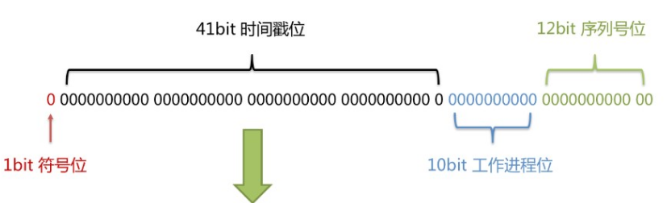

# 分表分库

## 介绍

*  数据库越来越大。需要进行数据库的扩展
    * 业务分库
    * 主从复制
    * 数据库分表
*  主从、主备 不是矛盾的，具体情况具体分析

## 方式

### 业务分库

```java
介绍
    按照业务模块将数据分散到不同的数据库服务器中
    比如：电商中按照数据的不同类型，分散到不同的数据库中
    	用户数据、商品数据、订单数据等不同的数据库
优点
    分散存储和访问压力，
缺点
    join 操作问题
        业务分库后,原本在同一个数据库中的表分散到不同数据库中，导致无法使用SQL的join查询。
    事务问题
        原本在同一个数据库中不同的表可以在同一个事务中修改，
        业务分库后，表分散到不同的数据库中，无法通过事务统-修改。
    成本问题
        业务分库同时也带来了成本的代价，
        本来1台服务器搞定的事情，现在要3台,如果考虑备份，那就是2台变成了6台。

```


### 主从复制和读写分离

```java
介绍
    数据库服务器搭建主从集群，一主已从、-主多从都可以。
    	主机： 负责读写操作  
    	从机： 
    		只负责读操作。
    数据库主机通过复制将数据同步到从机，每台数据库服务器都存储了所有的业务数据。
    业务服务器将写操作发给数据库主机，将读操作发给数据库从机。

```


### 数据库分表

# 全球唯一 id

## 介绍

```java
多活数据库
单活数据库
    
```


## 数据库自增长序列或字段 

### 介绍

```java
介绍
	利用数据库，全数据库唯一。
优点
	字ID天然排序，对分页或者需要排序的结果很有帮助。
    方便、快捷
缺点
	1 不同数据库语法和实现不同，数据库迁移的时候或多数据库版本支持的时候需要处理。
	2 在单个数据库或读写分离或一主多从的情况下，只有一个主库可以生成。有单点故障的风险。
	3 在性能达不到要求的情况下，比较难于扩展。
	4 如果遇见多个系统需要合并或者涉及到数据迁移会相当痛苦。
	5 分表分库的时候会有麻烦。
```

### 改善

```java
1）针对主库单点，
    如果有多个Master库，则每个Master库设置的起始数字不一样，步长一样，可以是Master的个数。
    比如：
    	Master1 生成的是 1，4，7，10，
   		Master2生成的是2,5,8,11 
    	Master3生成的是 3,6,9,12。
    	这样就可以有效生成集群中的唯一ID，也可以大大降低ID生成数据库操作的负载。
```

## UUID

### 介绍

```java
介绍
    可以利用数据库也可以利用程序生成，一般来说全球唯一
优点
    全球唯一，在遇见数据迁移，系统数据合并，或者数据库变更等情况下，可以从容应对
    生成ID性能非常好，基本不会有性能问题
缺点
    1）没有排序，无法保证趋势递增。
    2）UUID往往是使用字符串存储，查询的效率比较低。
    3）存储空间比较大，如果是海量数据库，就需要考虑存储量的问题。
    4）传输数据量大
    5）不可读。
```

## UUID to Int64

### 介绍

```java
介绍
    1. 解决UUID不可读，
    2. 了解决UUID无序的问题
```

## Redis生成ID

### 介绍

```java
介绍
    当使用数据库来生成ID性能不够要求的时候，我们可以尝试使用Redis来生成ID。
    这主要依赖于Redis是单线程的，所以也可以用生成全局唯一的ID。
    可以用Redis的原子操作 INCR和INCRBY来实现。
    
优点：
    1）不依赖于数据库，灵活方便，且性能优于数据库。
    2）数字ID天然排序，对分页或者需要排序的结果很有帮助。

缺点：
    1）如果系统中没有Redis，还需要引入新的组件，增加系统复杂度。
    2）需要编码和配置的工作量比较大。    
```

## snowflake算法 - Twitter

```java
// 分布式ID生成器
长度共64bit（一个long型）。
首先是一个符号位，1bit标识，由于long基本类型在Java中是带符号的，最高位是符号位，正数是0，负数是1，所以id一般是正数，最高位是0。
41bit时间截(毫秒级)，存储的是时间截的差值（当前时间截 - 开始时间截)，结果约等于69.73年。
10bit作为机器的ID（5个bit是数据中心，5个bit的机器ID，可以部署在1024个节点）。
12bit作为毫秒内的流水号（意味着每个节点在每毫秒可以产生 4096 个 ID）。
优点
    整体上按照时间自增排序，并且整个分布式系统内不会产生ID碰撞，并且效率较高。
```




## left 分布式主键 - 美团


# sql各种锁

## 总结

```java
mysql 中也有不同的锁种类
    需要百度  https://blog.csdn.net/cy973071263/article/details/105188519
	https://www.aneasystone.com/archives/2017/11/solving-dead-locks-two.html
```


## 分类

```java
按照对数据操作的锁粒度
    行级锁
    表级锁
    页级锁
    间隙锁
    
按照锁的共享策略
    共享锁 / 排他锁
    意向共享锁 / 意向排他锁

    
加锁策略上分：
    乐观锁 / 悲观锁

其他：
    自增锁

```

### 乐观锁/悲观锁

### 介绍

```java
// 悲观锁需要使用数据库的锁机制来实现，乐观锁是通过程序的手段来实现
悲观锁
    每次拿数据时都假设有别人会来修改，所以每次在拿数据的时候都会给数据加上锁,用这种方式来避免跟别人冲突
 	虽然很有效，但是可能会出现大量的锁冲突，导致性能低下
乐观锁
   每次去拿数据的时候都认为别人不会修改，所以不会上锁，但是在更新的时候会判断一下在此期间别人有没有改过这个数据
    可以使用版本号等机制来判断。
```

