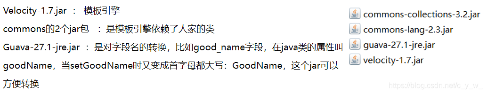

## 导包



## 代码生成

```java
package com.zq.code;
 
import java.io.PrintWriter;
import java.util.Properties;
 
import org.apache.velocity.Template;
import org.apache.velocity.VelocityContext;
import org.apache.velocity.app.Velocity;
import org.apache.velocity.app.VelocityEngine;
 
public class CodeBuilder {
 
	public static void main(String[] args) {
		//new一下他的模版引擎
		VelocityEngine ve = new VelocityEngine();
		//设置模版和输出的代码文件的编码方式
		Properties p = new Properties();
		p.setProperty(Velocity.ENCODING_DEFAULT, "UTF-8");
		p.setProperty(Velocity.INPUT_ENCODING, "UTF-8");
		p.setProperty(Velocity.OUTPUT_ENCODING, "UTF-8");
		ve.init(p);//引擎初始化
		
		//引入一个模版，通过模版路径
		Template serviceVm = ve.getTemplate("/WebContent/WEB-INF/vm/service.vm");
		
		//定义占位符变量，给个值
		String modelClass = "Menu";
		String modelName = "menu";
		//生成的代码放置的目录==项目目录
		String rootPath = "C:/Users/Administrator/Desktop/shop/"; 
		
		//变量放到上下文对象里
		VelocityContext ctx = new VelocityContext();
		ctx.put("modelClass", modelClass);
		ctx.put("modelName", modelName);
				
		//将占位符数据和模版合并，输出代码文件
		CodeBuilder.merge(serviceVm, ctx, rootPath +"src/com/zq/service/" + modelClass +"Service.java");
		
		//service实现类的
		Template serviceImplVm = ve.getTemplate("/WebContent/WEB-INF/vm/serviceImpl.vm");
		CodeBuilder.merge(serviceImplVm, ctx, rootPath +"src/com/zq/service/" + modelClass +"ServiceImpl.java");
		
		//dao的
		Template daoVm = ve.getTemplate("/WebContent/WEB-INF/vm/dao.vm");
		CodeBuilder.merge(daoVm, ctx, rootPath +"src/com/zq/dao/" + modelClass +"Dao.java");
		
		System.out.println("成功");
	}
	
	private static void merge(Template template,VelocityContext ctx,String path){
		PrintWriter writer = null;
		try{
			writer = new PrintWriter(path);
			//合并数据和模版，输出文件
			template.merge(ctx, writer);
			writer.flush();
		}catch(Exception e){
			e.printStackTrace();
		}finally{
			writer.close();
		}
	}
}
————————————————
版权声明：本文为CSDN博主「-cywen-」的原创文章，遵循CC 4.0 BY-SA版权协议，转载请附上原文出处链接及本声明。
原文链接：https://blog.csdn.net/c_y_w_/article/details/89648019
```

## 模板

```java
ackage com.zq.service;
 
import java.util.List;
import com.github.pagehelper.PageInfo;
import com.zq.model.${modelClass};
 
public interface ${modelClass}Service {
	/**
	 * 带有分页的列表查询
	 * @param pageNum
	 * @param pageSize
	 * @param ${modelClass}
	 * @return
	 */
	public PageInfo<${modelClass}> list(Integer pageNum,Integer pageSize,${modelClass} ${modelName});
	
	/**
	 * 没有分页的列表查询
	 * @param pageNum
	 * @param pageSize
	 * @param ${modelClass}
	 * @return
	 */
	public List<${modelClass}> list(${modelClass} ${modelName});
	public void create(${modelClass} ${modelName});
	public void update(${modelClass} ${modelName});
	public void delete(Integer id);
	public ${modelClass} findById(Integer id);
}
————————————————
版权声明：本文为CSDN博主「-cywen-」的原创文章，遵循CC 4.0 BY-SA版权协议，转载请附上原文出处链接及本声明。
原文链接：https://blog.csdn.net/c_y_w_/article/details/89648019
```

