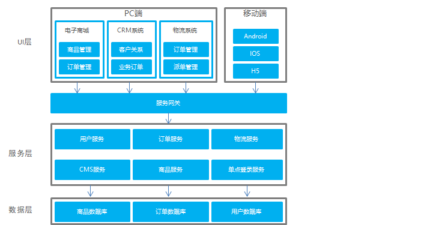

## 1. 软件架构的演进过程

软件架构的发展经历了由单体架构、垂直架构、SOA架构到微服务架构的演进过程，下面我们分别了解一下这几个架构。

### 1.1 单体架构


```java
架构说明：
      全部功能集中在一个项目内（All in one）。

架构优点：
      架构简单，前期开发成本低、开发周期短，适合小型项目。

架构缺点：
       全部功能集成在一个工程中，对于大型项目不易开发、扩展和维护。
       技术栈受限，只能使用一种语言开发。
       系统性能扩展只能通过扩展集群节点，成本高。
```


### 1.2 垂直架构


```JAVA
架构说明：       
     按照业务进行切割，形成小的单体项目。

架构优点：
      技术栈可扩展（不同的系统可以用不同的编程语言编写）。

架构缺点：
       功能集中在一个项目中，不利于开发、扩展、维护。
       系统扩张只能通过集群的方式。
       项目之间功能冗余、数据冗余、耦合性强。
```


### 1.3 SOA架构


```JAVA
介绍
    SOA全称为Service-Oriented Architecture
    即面向服务的架构。
    它可以根据需求通过网络对松散耦合的粗粒度应用组件（服务）进行分布式部署、组合和使用。
    一个服务通常以独立的形式存在于操作系统进程中
目的
    把原先固有的业务功能转变为通用的业务服务，实现业务逻辑的快速复用。
    站在功能的角度，把业务逻辑抽象成可复用的服务，通过服务的编排实现业务的快速再生
    
架构说明：
      将重复功能或模块抽取成组件的形式，对外提供服务，
      在项目与服务之间使用ESB（企业服务总线）的形式作为通信的桥梁。

架构优点：
       重复功能或模块抽取为服务，提高开发效率。
       可重用性高。
       可维护性高。

架构缺点：
       各系统之间业务不同，很难确认功能或模块是重复的。
       抽取服务的粒度大。
       系统和服务之间耦合度高    
```

### 1.4 服务架构



```JAVA
架构说明：
       将系统服务层完全独立出来，抽取为一个一个的微服务。
       抽取的粒度更细，遵循单一原则。
       采用轻量级框架协议传输。

架构优点：
       服务拆分粒度更细，有利于提高开发效率。 
       可以针对不同服务制定对应的优化方案。
       适用于互联网时代，产品迭代周期更短。

架构缺点：
      粒度太细导致服务太多，维护成本高。
      分布式系统开发的技术成本高，对团队的挑战大。
```

