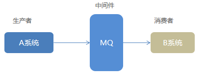
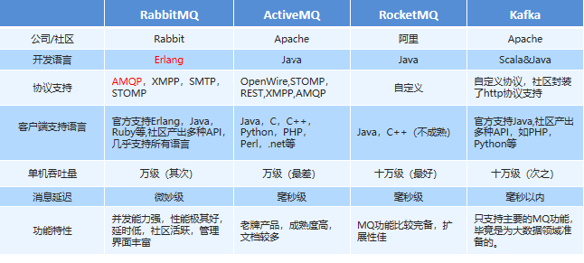

## 基础

### 介绍

*  Message Queue

* 消息队列

* 在消息的传输过程中保存消息的容器。多用于分布式系统之间进行通信。

* 分布式系统通信

    ```java
    分布式系统通信两种方式：
        直接远程调用 
        借助第三方 完成间接通信
    发送方称为生产者，接收方称为消费者 
    ```



### 优势

```java
应用解耦：提高系统容错性和可维护性
异步提速：提升用户体验和系统吞吐量
削峰填谷：提高系统稳定性

```

### 劣势

```java
系统可用性降低
	系统引入的外部依赖越多，系统稳定性越差。
    一旦 MQ 宕机，就会对业务造成影响。
    // 如何保证MQ的高可用？

系统复杂度提高
	MQ 的加入大大增加了系统的复杂度，
    以前系统间是同步的远程调用，现在是通过 MQ 进行异步调用。
    // 如何保证消息没有被重复消费？
    // 怎么处理消息丢失情况？那么保证消息传递的顺序性？

一致性问题
	A 系统处理完业务，通过 MQ 给B、C、D三个系统发消息数据，如果 B 系统、C 系统处理成功，D 系统处理失败。
    如何保证消息数据处理的一致性？


```

## 常见的消息队列

```java
ActiveMQ：基于JMS
ZeroMQ：基于C语言开发
RabbitMQ：基于AMQP协议，erlang语言开发，稳定性好
RocketMQ：基于JMS，阿里巴巴产品
Kafka：类似MQ的产品；分布式消息系统，高吞吐量
```



##  AMQP 和 JMS

MQ是消息通信的模型；实现MQ的大致有两种主流方式：AMQP、JMS。

### AMQP

#### 基础

```java
介绍
    // 协议
    AMQP   Advanced Message Queuing Protocol（高级消息队列协议）
    一个网络协议，一种binary wire-level protocol（链接协议）
    是应用层协议的一个开放标准，为面向消息的中间件设计。
    
作用
    基于此协议的客户端与消息中间件可传递消息，并不受客户端/中间件不同产品，不同的开发语言等条件的限制
    AMQP不从API层进行限定，而是直接定义网络交换的数据格式。
    
产生
    2006年，AMQP 规范发布
    
```


### JMS

#### 介绍

```java
介绍
    // api 规范接口
    JMS即Java消息服务（JavaMessage Service）应用程序接口
    是一个Java平台中关于面向消息中间件（MOM）的API
作用
    用于在两个应用程序之间，或分布式系统中发送消息，进行异步通信。


```

### 1.2.3. AMQP 与 JMS 区别

- JMS是定义了统一的接口，来对消息操作进行统一；AMQP是通过规定协议来统一数据交互的格式
- JMS限定了必须使用Java语言；AMQP只是协议，不规定实现方式，因此是跨语言的。
- JMS规定了两种消息模式；而AMQP的消息模式更加丰富