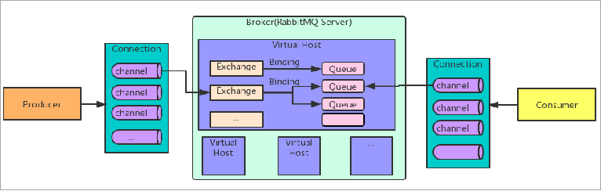
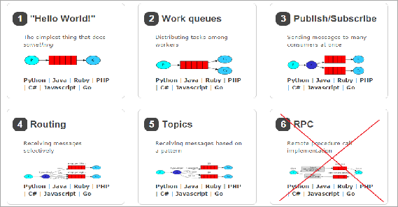

## 官网

```java
RabbitMQ官方地址：http://www.rabbitmq.com/
```


## 简介

```java
介绍
    RabbitMQ是由erlang语言开发，
    基于AMQP（Advanced Message Queue 高级消息队列协议）协议实现的消息队列，
    是一种应用程序之间的通信方法，消息队列在分布式系统开发中应用非常广泛。

```

## 基础架构

```java
Broker：
    接收和分发消息的应用，RabbitMQ Server就是 Message Broker
Virtual host：
    出于多租户和安全因素设计的，把 AMQP 的基本组件划分到一个虚拟的分组中，类似于网络中的 namespace 概念。
    当多个不同的用户使用同一个 RabbitMQ server 提供的服务时，可以划分出多个vhost，
    每个用户在自己的 vhost 创建 exchange／queue 等
Connection：
    publisher／consumer 和 broker 之间的 TCP 连接
Channel：
    如果每一次访问 RabbitMQ 都建立一个 Connection，
    在消息量大的时候建立 TCP Connection的开销将是巨大的，效率也较低。
    Channel 是在 connection 内部建立的逻辑连接，如果应用程序支持多线程，通常每个thread创建单独的 channel 进行通讯，AMQP method 包含了channel id 帮助客户端和message broker 识别 channel，所以 channel 之间是完全隔离的。
    Channel 作为轻量级的 Connection 极大减少了操作系统建立 TCP connection 的开销
Exchange：
    message 到达 broker 的第一站，根据分发规则，匹配查询表中的 routing key，分发消息到queue 中去。
    常用的类型有：direct (point-to-point), topic (publish-subscribe) and fanout (multicast)
Queue：
    消息最终被送到这里等待 consumer 取走
Binding：
    exchange 和 queue 之间的虚拟连接，binding 中可以包含 routing key。Binding 信息被保存到 exchange 中的查询表中，用于 message 的分发依据

```




## 工作模式

```java
介绍
	// 六种模式
    简单模式，
    work模式，
    Publish/Subscribe发布与订阅模式，
    Routing路由模式，
    Topics主题模式，
    RPC远程调用模式（远程调用，不太算MQ；暂不作介绍）；
```

