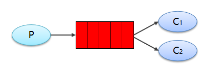
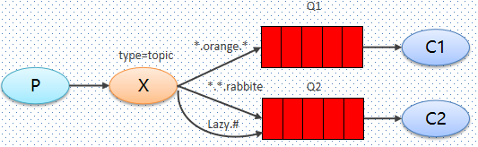
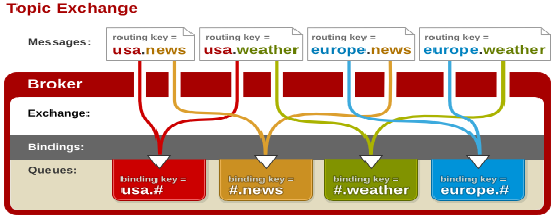

依赖配置 - pom.xml

```xml
    <dependencies>
        <!-- rabbitmq java 客户端 -->
        <dependency>
            <groupId>com.rabbitmq</groupId>
            <artifactId>amqp-client</artifactId>
            <version>5.6.0</version>
        </dependency>
    </dependencies>


    <build>
        <plugins>
            <!-- 编译插件 -->
            <plugin>
                <groupId>org.apache.maven.plugins</groupId>
                <artifactId>maven-compiler-plugin</artifactId>
                <version>3.8.0</version>
                <configuration>
                    <source>1.8</source>
                    <target>1.8</target>
                </configuration>
            </plugin>
        </plugins>
    </build>
```


## 简单模式

### 基础


在上图的模型中，有以下概念：

- P：生产者，也就是要发送消息的程序
- C：消费者：消息的接受者，会一直等待消息到来。
- queue：消息队列，图中红色部分。类似一个邮箱，可以缓存消息；生产者向其中投递消息，消费者从其中取出消息。

### 生产者

#### 工具类

```java

// com.itheima.rabbitmq.util.ConnectionUtil.java
package com.itheima.rabbitmq.util;

import com.rabbitmq.client.Connection;
import com.rabbitmq.client.ConnectionFactory;

public class ConnectionUtil {

    public static Connection getConnection() throws Exception {
        // 1. 创建连接工厂
        ConnectionFactory connectionFactory = new ConnectionFactory();
        // 2. 参数设置
        //主机地址;默认为 localhost
        connectionFactory.setHost("localhost");
        //连接端口;默认为 5672
        connectionFactory.setPort(5672);
        //虚拟主机名称;默认为 /
        connectionFactory.setVirtualHost("/itcast");
        //连接用户名；默认为guest
        connectionFactory.setUsername("heima");
        //连接密码；默认为guest
        connectionFactory.setPassword("heima");

        //3. 创建连接
        return connectionFactory.newConnection();
    }

}

```


#### 实现

```java
// com.itheima.rabbitmq.simple.Producer.java

package com.itheima.rabbitmq.simple;

import com.rabbitmq.client.Channel;
import com.rabbitmq.client.Connection;
import com.rabbitmq.client.ConnectionFactory;

public class Producer {

    static final String QUEUE_NAME = "simple_queue";

    public static void main(String[] args) throws Exception {
        // 3. 创建连接
        Connection connection = ConnectionUtil.getConnection();
        
        // 4. 创建频道
        Channel channel = connection.createChannel();

        // 5. 声明（创建）队列
        /**
         * 参数1：队列名称
         * 参数2：是否定义持久化队列, mq 重启后还在
         * 参数3：是否独占本次连接， 只能有一个消费者监听这个队列
         * 参数4：是否在不使用的时候自动删除队列
         * 参数5：队列其它参数
         */
        // 没有指定名字的队列， 就会创建该队列，否则不会创建
        channel.queueDeclare(QUEUE_NAME, true, false, false, null);

        // 6. 要发送的信息
        String message = "你好；小兔子！";
        /**
         * 参数1：交换机名称，如果没有指定则使用默认Default Exchage， 即 ""
         * 参数2：路由key,简单模式可以传递队列名称
         * 参数3：配置信息，消息其它属性
         * 参数4：发送的消息内容
         */
        channel.basicPublish("", QUEUE_NAME, null, message.getBytes());
        // System.out.println("已发送消息：" + message);

        // 7. 关闭资源
        channel.close();
        connection.close();
    }
}

```

### 消费者

#### 工具类

```java
// com.itheima.rabbitmq.util.ConnectionUtil.java
package com.itheima.rabbitmq.util;

import com.rabbitmq.client.Connection;
import com.rabbitmq.client.ConnectionFactory;

public class ConnectionUtil {

    public static Connection getConnection() throws Exception {
        // 1. 创建连接工厂
        ConnectionFactory connectionFactory = new ConnectionFactory();
        // 2. 参数设置
        //主机地址;默认为 localhost
        connectionFactory.setHost("localhost");
        //连接端口;默认为 5672
        connectionFactory.setPort(5672);
        //虚拟主机名称;默认为 /
        connectionFactory.setVirtualHost("/itcast");
        //连接用户名；默认为guest
        connectionFactory.setUsername("heima");
        //连接密码；默认为guest
        connectionFactory.setPassword("heima");

        //3. 创建连接
        return connectionFactory.newConnection();
    }

}

```

#### 实现

```java
// com.itheima.rabbitmq.simple.Consumer

package com.itheima.rabbitmq.simple;


public class Consumer {

    public static void main(String[] args) throws Exception {
        Connection connection = ConnectionUtil.getConnection();

        // 创建频道
        Channel channel = connection.createChannel();

        // 声明（创建）队列
        /**
         * 参数1：队列名称
         * 参数2：是否定义持久化队列
         * 参数3：是否独占本次连接
         * 参数4：是否在不使用的时候自动删除队列
         * 参数5：队列其它参数
         */
        channel.queueDeclare(Producer.QUEUE_NAME, true, false, false, null);

        // 创建消费者；并设置消息处理
        DefaultConsumer consumer = new DefaultConsumer(channel){
            @Override
            /**
             * consumerTag 消息者标签，在channel.basicConsume时候可以指定
             * envelope 消息包的内容，可从中获取消息id，消息routingkey，交换机，消息和重传标志(收到消息失败后是否需要重新发送)
             * properties 属性信息
             * body 消息
             */
            public void handleDelivery(String consumerTag, Envelope envelope, AMQP.BasicProperties properties, byte[] body) throws IOException {
                //路由key
                System.out.println("路由key为：" + envelope.getRoutingKey());
                //交换机
                System.out.println("交换机为：" + envelope.getExchange());
                //消息id
                System.out.println("消息id为：" + envelope.getDeliveryTag());
                //收到的消息
                System.out.println("接收到的消息为：" + new String(body, "utf-8"));
            }
        };
        //监听消息
        /**
         * 参数1：队列名称
         * 参数2：是否自动确认，设置为true为表示消息接收到自动向mq回复接收到了，mq接收到回复会删除消息，设置为false则需要手动确认
         * 参数3：消息接收到后回调
         */
        channel.basicConsume(Producer.QUEUE_NAME, true, consumer);

        //不关闭资源，应该一直监听消息
        //channel.close();
        //connection.close();
    }
}
```

### 模板

```java
生产者
// com.itheima.rabbitmq.simple.Producer.java
public class Producer {
    // 队列名
    public static void main(String[] args) throws Exception {
        // 3. 创建连接   
        // 4. 创建频道
        // 5. 声明（创建）队列
        // 6. 要发送的信息, 进行发送
        // 7. 关闭资源
    }
}


消费者
    
 // com.itheima.rabbitmq.simple.Consumer
package com.itheima.rabbitmq.simple;


public class Consumer {

    public static void main(String[] args) throws Exception {
        // 创建频道
        // 声明（创建）队列
        // 声明交换机   -------------- 使用默认的不用声明
        // 队列绑定交换机    ---------- 使用默认交换机则不用绑定
        // 创建消费者；并设置消息处理 new DefaultConsumer(channel)
        // 监听消息
        // 不关闭资源，应该一直监听消息
    }
}   
```


## 工作队列模式

### 基础



```java
图解
    前面2个案例中，只有3个角色：
        P：生产者，也就是要发送消息的程序
        C：消费者：消息的接受者，会一直等待消息到来。
        queue：消息队列，图中红色部分
介绍
    work queues
代码
    和简单模式差不多，只是消费者是处于竞争关系
```

### 生产者

```java
// com.itheima.rabbitmq.simple.Producer.java


// -----------
// com.itheima.rabbitmq.simple.Producer.java
public class Producer {
    // 队列名
    public static void main(String[] args) throws Exception {
        // 3. 创建连接   
        // 4. 创建频道
        // 5. 声明（创建）队列
        // 6. 要发送的信息, 进行发送
         for (int i = 1; i <= 30; i++) {
            // 发送的信息
            String message = "你好；小兔子！work模式--" + i;
            /**
             * 参数1：交换机名称，如果没有指定则使用默认Default Exchage
             * 参数2：路由key,简单模式可以传递队列名称
             * 参数3：消息其它属性
             * 参数4：消息内容
             */
            channel.basicPublish("", QUEUE_NAME, null, message.getBytes());
            System.out.println("已发送消息：" + message);
        }
        // 7. 关闭资源
    }
}
```

### 消费者

```java
多个消费者
   多个消费者绑定一个队列

 // com.itheima.rabbitmq.simple.Consumer

package com.itheima.rabbitmq.simple;


public class Consumer {

    public static void main(String[] args) throws Exception {
        // 3. 创建连接
        // 4. 创建频道
        // 5. 声明（创建）队列
        //一次只能接收并处理一个消息
        channel.basicQos(1);
        // 6. 创建消费者；并设置消息处理 new DefaultConsumer(channel)
        DefaultConsumer consumer = new DefaultConsumer(channel){
            @Override
    
            public void handleDelivery(String consumerTag, Envelope envelope, AMQP.BasicProperties properties, byte[] body) throws IOException {
                try {
                   //确认消息
                    channel.basicAck(envelope.getDeliveryTag(), false);
                } catch (InterruptedException e) {
                    e.printStackTrace();
                }
            }
        };
        // 监听消息
        // 不关闭资源，应该一直监听消息
    }
} 
```

### 测试

```jav
启动两个消费者，然后再启动生产者发送消息；到IDEA的两个消费者对应的控制台查看是否竞争性的接收到消息。
```

## 订阅者模式

### 介绍


```java
// 图解
 P：生产者
    	也就是要发送消息的程序，但是不再发送到队列中，而是发给X（交换机）
 C：消费者
    	消息的接受者，会一直等待消息到来。
 Queue：消息队列
    	接收消息、缓存消息。
 Exchange：交换机，
    图中的 X 。
    	一方面，接收生产者发送的消息。
    	另一方面，知道如何处理消息，
    // 例如递交给某个特别队列、递交给所有队列、或是将消息丢弃。到底如何操作，取决于Exchange的类型。
    常见以下3种类型：
         Fanout：广播，将消息交给所有绑定到交换机的队列
         Direct：定向，把消息交给符合指定routing key 的队列
         Topic：通配符，把消息交给符合routing pattern（路由模式） 的队列
    特点
    	只负责转发消息，不具备存储消息的能力
    	如果没有任何队列与Exchange绑定，或者没有符合路由规则的队列，那么消息会丢失！
     	// 交换机需要与队列进行绑定，绑定之后；一个消息可以被多个消费者都收到。


     
介绍
     Publish/Subscribe发布与订阅模式
     1、每个消费者监听自己的队列。
	2、生产者将消息发给broker，
     	由交换机将消息转发到绑定此交换机的每个队列，每个绑定交换机的队列都将接收到消息
```

### 生产者

```java
package com.itheima.rabbitmq.ps;


/**
 * 发布与订阅使用的交换机类型为：fanout
 * fanout、 扇形广播， 发送消息到每一个与之绑定的队列
 * topic、  通配符形式
 * direct、	定向
 * headers	参数匹配
 */


// com.itheima.rabbitmq.simple.Producer.java
public class Producer {
    //交换机名称
    static final String FANOUT_EXCHAGE = "fanout_exchange";
    // 队列名， 需要设置多个队列
    static final String FANOUT_QUEUE_1 = "fanout_queue_1";
    static final String FANOUT_QUEUE_2 = "fanout_queue_2";
    // public static void main(String[] args) throws Exception {
        // 3. 创建连接   
        // 4. 创建频道
    	// 声明交换机
            /**
             * 参数1：交换机名称
             * 参数2：交换机类型，fanout、topic、direct、headers、
             * 参数3： 是否持久化
             * 参数4： 自动删除
             * 参数5： 内部使用 一般为 false
             * 参数6： 参数列表， 没有的话设置为 null
             */
        channel.exchangeDeclare(FANOUT_EXCHAGE, BuiltinExchangeType.FANOUT);
        // 5. 声明（创建）队列,注意要创建多个
        // 队列绑定交换机
    	/**
          * 参数1：队列名称
          * 参数2：交换机名称
          * 参数3：路由键， 绑定规则，如果交换机的类型是 fanout , 要设置为 ""
          */
        channel.queueBind(FANOUT_QUEUE_1, FANOUT_EXCHAGE, "");
        channel.queueBind(FANOUT_QUEUE_2, FANOUT_EXCHAGE, "");
        // 6. 要发送的信息, 进行发送
    	for (int i = 1; i <= 10; i++) {
            // 发送信息
            String message = "你好；小兔子！发布订阅模式--" + i;
            /**
             * 参数1：交换机名称，如果没有指定则使用默认Default Exchage
             * 参数2：路由key,简单模式可以传递队列名称
             * 参数3：消息其它属性
             * 参数4：消息内容
             */
            channel.basicPublish(FANOUT_EXCHAGE, "", null, message.getBytes());
            System.out.println("已发送消息：" + message);
        }   
        // 7. 关闭资源
    }
}

```

### 消费者

```java
多个消费者
    每个消费者处理一个队列，多个队列就要设置多个队列
    消费者的区别就是类名字、对应的队列名字    
    
 // com.itheima.rabbitmq.simple.Consumer
package com.itheima.rabbitmq.simple;


public class Consumer {

    public static void main(String[] args) throws Exception {
        // 3. 创建连接
        // 创建频道
        // 声明（创建）队列
        // 声明交换机
        channel.exchangeDeclare(Producer.FANOUT_EXCHAGE, BuiltinExchangeType.FANOUT);
        // 队列绑定交换机, 
         一个交换机绑定多个队列
        channel.queueBind(Producer.FANOUT_QUEUE_1, Producer.FANOUT_EXCHAGE, "");
        // 创建消费者；并设置消息处理 new DefaultConsumer(channel)
        // 监听消息
        // 不关闭资源，应该一直监听消息
    }
}          
```

## Routing路由模式

### 基础


```java
图解
    P：生产者，
    	向 Exchange 发送消息，发送消息时，会指定一个routing key
    X：Exchange（交换机），
    	接收生产者的消息，然后把消息递交给与 routing key 完全匹配的队列
    C1：消费者，
    	其所在队列指定了需要 routing key 为 error 的消息
    C2：消费者，
    	其所在队列指定了需要 routing key 为 info、error、warning 的消息
    
介绍
    Routing 模式要求队列在绑定交换机时要指定 routing key，消息会转发到符合 routing key 的队列。

特点
    1. 队列与交换机的绑定，不能是任意绑定了，而是要指定一个 RoutingKey（路由key）
	2. 消息的发送方在向 Exchange 发送消息时，也必须指定消息的 RoutingKey
	3. Exchange 不再把消息交给每一个绑定的队列，而是根据消息的 Routing Key 进行判断，
    	只有队列的Routingkey 与消息的 Routing key 完全一致，才会接收到消息
区别
    在编码上与 `Publish/Subscribe发布与订阅模式` 的区别
    	交换机的类型为：Direct，
    	队列绑定交换机的时候需要指定routing key。
```

### 生产者

```java
package com.itheima.rabbitmq.routing;

/**
 * 路由模式的交换机类型为：direct
 */
public class Producer {

    //交换机名称
    static final String DIRECT_EXCHAGE = "direct_exchange";
    //队列名称, 多个队列

    public static void main(String[] args) throws Exception {

        // 创建连接
        // 创建频道
        // 声明交换机, 交换机类型 BuiltinExchangeType.DIRECT
        // 声明（创建）队列, 多个队列
        // 队列绑定交换机
        channel.queueBind(DIRECT_QUEUE_INSERT, DIRECT_EXCHAGE, "insert");
        channel.queueBind(DIRECT_QUEUE_UPDATE, DIRECT_EXCHAGE, "update");

        // 发送信息
        String message = "新增了商品。路由模式；routing key 为 insert " ;
        channel.basicPublish(DIRECT_EXCHAGE, "insert", null, message.getBytes());

        // 发送信息
        message = "修改了商品。路由模式；routing key 为 update" ;
        channel.basicPublish(DIRECT_EXCHAGE, "update", null, message.getBytes());

        // 关闭资源
    }
}

```

### 消费者

```java
多个消费者
    每个消费者处理一个队列，多个队列就要设置多个队列
    消费者的区别就是类名字、对应的队列名字

package com.itheima.rabbitmq.routing;

public class Consumer1 {

    public static void main(String[] args) throws Exception {
		// 3. 创建连接
        // 创建频道
        // 声明交换机 BuiltinExchangeType.DIRECT

        // 声明（创建）队列
        // 队列绑定交换机
        channel.queueBind(Producer.DIRECT_QUEUE_INSERT, Producer.DIRECT_EXCHAGE, "insert");
        //创建消费者；并设置消息处理
        //监听消息
  
    }
}

```

## Topics通配符模式

### 基础





```java
// 图解
	- 红色Queue：绑定的是`usa.#` ，因此凡是以 `usa.`开头的`routing key` 都会被匹配到
	- 黄色Queue：绑定的是`#.news` ，因此凡是以 `.news`结尾的 `routing key` 都会被匹配
        
特点
		
数量
	//  item.# ：能够匹配`item.insert.abc` 或者 `item.insert`
    //  item.* ：只能匹配`item.insert`        
	#：匹配一个或多个词
	*：匹配不多不少恰好1个词        	
        
区别
	`Topic`类型与`Direct`相比，
        相同
        	可以根据`RoutingKey`把消息路由到不同的队列。
        不同
        	`Topic`类型`Exchange`可以让队列在绑定`Routing key` 的时候使用通配符        
```

### 生产者

```java
/**
 * 通配符Topic的交换机类型为：topic
 * 发送消息的routing key有3种： `item.insert`、`item.update`、`item.delet
 */
public class Producer {

    //交换机名称
    static final String TOPIC_EXCHAGE = "topic_exchange";
    //队列名称, 设置多个
    static final String TOPIC_QUEUE_1 = "topic_queue_1";
        // 创建连接
        // 创建频道
	   // 声明交换机 TOPIC_EXCHAGE, BuiltinExchangeType.TOPIC

        // 发送信息
        String message = "新增了商品。Topic模式；routing key 为 item.insert " ;
        channel.basicPublish(TOPIC_EXCHAGE, "item.insert", null, message.getBytes());
        System.out.println("已发送消息：" + message);

        // 发送信息
        message = "修改了商品。Topic模式；routing key 为 item.update" ;
        channel.basicPublish(TOPIC_EXCHAGE, "item.update", null, message.getBytes());
        System.out.println("已发送消息：" + message);

        // 发送信息
        message = "删除了商品。Topic模式；routing key 为 item.delete" ;
        channel.basicPublish(TOPIC_EXCHAGE, "item.delete", null, message.getBytes());
        System.out.println("已发送消息：" + message);

        // 关闭资源
    }
}

```

### 消费者

```java
package com.itheima.rabbitmq.topic;

// 接收所有类型的消息：新增商品，更新商品和删除商品。

public class Consumer2 {

    public static void main(String[] args) throws Exception {
        
        // 创建连接
        // 创建频道
        // 声明交换机 		  Producer.TOPIC_EXCHAGE, BuiltinExchangeType.TOPIC
        // 声明（创建）队列 	Producer.TOPIC_QUEUE_2
        // 队列绑定交换机
        // 当使用其中一部分的时候，需下·下·要逐条进行绑定
       channel.queueBind(Producer.TOPIC_QUEUE_2, Producer.TOPIC_EXCHAGE, "item.*");
        //监听消息
    }
}

```

## 4.6. 模式总结

RabbitMQ工作模式：
**1、简单模式 HelloWorld**
一个生产者、一个消费者，不需要设置交换机（使用默认的交换机）

**2、工作队列模式 Work Queue**
一个生产者、多个消费者（竞争关系），不需要设置交换机（使用默认的交换机）

**3、发布订阅模式 Publish/subscribe**
需要设置类型为fanout的交换机，并且交换机和队列进行绑定，当发送消息到交换机后，交换机会将消息发送到绑定的队列

**4、路由模式 Routing**
需要设置类型为direct的交换机，交换机和队列进行绑定，并且指定routing key，当发送消息到交换机后，交换机会根据routing key将消息发送到对应的队列

**5、通配符模式 Topic**
需要设置类型为topic的交换机，交换机和队列进行绑定，并且指定通配符方式的routing key，当发送消息到交换机后，交换机会根据routing key将消息发送到对应的队列