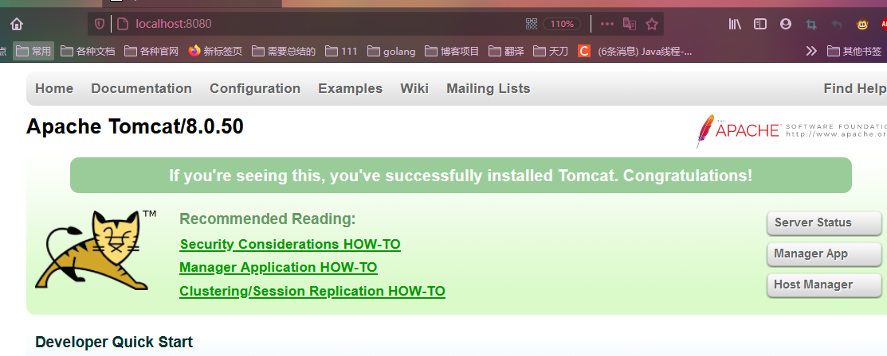

## 安装

* 找到你需要用的 Tomcat 版本对应的 zip 压缩包，
* 解压到需要安装的目录即可。

## 目录

```java
// 专门用来存放 Tomcat 服务器的
bin 	可执行程序 
conf 	配置文件 
lib  	jar 包 
logs 	运行时输出的日记信息 
temp  	运行时产生的临时数据 
webapps 存放部署的 Web 工程。
work 	是 Tomcat 工作时的目录，
        存放 Tomcat 运行时 jsp 翻译为 Servlet 的源码，
        和 Session 钝化（序列化）的目录。
```

## 启动

### 方式一

```java
bin 目录下的 startup.bat 文件，
双击，就可以启动 Tomcat 服务器。
    
    
测试
    // 打开浏览器，在浏览器地址栏中输入以下地址测试：
    1、http://localhost:8080 
	2、http//127.00.1:8080 
    3、http//真实ip;8080
成功

```

### 方拾二

```java
// cd 到 你的 Tomcat 的 bin 目录下
// cmd 输入命令
catalina run
```


### 成功标志



## 停止

```java
方式一
    点击 tomcat 服务器窗口的 x 关闭按钮
方拾二
    把 Tomcat 服务器窗口置为当前窗口，然后按快捷键 Ctrl+C 
方式三
    找到 Tomcat 的 bin 目录下的 shutdown.bat 双击，就可以停止
```

## 配置修改

### 端口号修改

```js
Tomcat 目录下的 conf 目录，找到 server.xml 配置文件。
	// 此处 port 更改就行， 注意格式， 记得重启

    <Connector port="8080" protocol="HTTP/1.1"
               connectionTimeout="20000"
               redirectPort="8443" />
```

