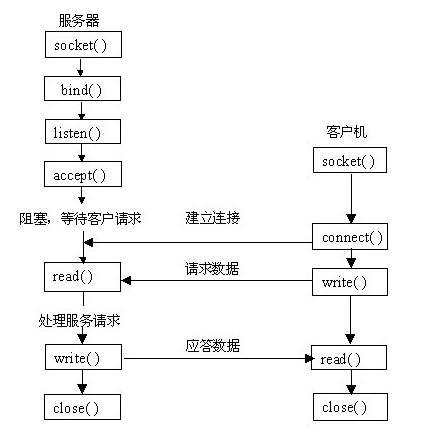

## 介绍

*   很多底层网络应用开发者的眼里一切编程都是Socket
*   现在的网络编程几乎都是用Socket来编程。


## 套接字

### 介绍

* 包含了 IP 和 端口号的网络单位， 其实就是一台计算机

## 操作

*    起 起源于 Unix , 一切皆文件源于 Unix , 一切皆文件

    ```go
    打开 Open  ->  读写  Write /read -> 关闭 open 模式操作
    
    服务器	 : open - read -- write -- close
    客户端  ：open - write -- read  -- close
    
    ```

## 类型

*   流式
    *   SOCKET_STREAM
    *   面向连接的，是面向连接的 TCP 服务
*   数据报式
    *   SOCKET_DGRAM
    *   无连接的，是面向无连接的 UDP 服务

## 两模型

### CS 模型

```go
client 客户端   --   主动请求服务 
server 服务端   --   被动提供服务
```


### BS 模型

```
brower  html  客户端  --  主动请求服务 
server         服务端  --  被动提供服务 
```


## 通信模型




## 使用

*   文件传输
*   聊天系统