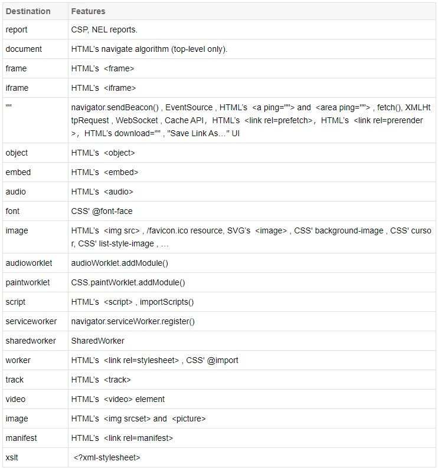
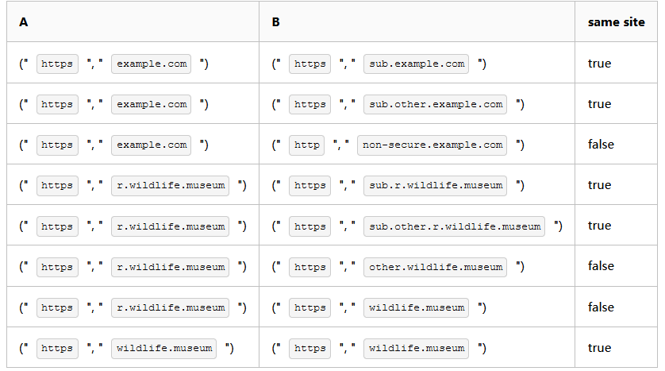

## Sec-Fetch-Dest



## Sec-Fetch-Mode

### 取值范围

```java
cors：跨域请求；
no-cors：
    限制请求只能使用请求方法(get/post/put)和请求头(accept/accept-language/content-language/content-type)；
same-origin：
    如果使用此模式向另外一个源发送请求，显而易见，结果会是一个错误。
    你可以设置该模式以确保请求总是向当前的源发起的；
navigate：
    表示这是一个浏览器的页面切换请求(request)。 
    navigate请求仅在浏览器切换页面时创建，该请求应该返回HTML；
websocket：
    建立websocket连接；
```

### 说明

```java
cors
    表示跨域请求，且要求后端需要设置cors响应头；
 no-cors
    并不是代表请求不跨域，而是服务端不设置cors响应头，
    什么情况下会是这种模式呢，
         图片/脚本/样式表这些请求是容许跨域且不用设置跨域响应头的，而no-cors也是默认的模式；
same-origin
    表示同源请求，这就限制了不能跨域，前面说的cors和no-cors是容许跨域的，
    只是要求服务端的设置不同而已，
    熟悉fetch接口的同学对mode属性应该不陌生，其实跟这里的含义是一样的，
    只是fetch的mode大家可以手动设置，而Sec-Fetch-Mode不能干预而已；
```

## Sec-Fetch-Site

```java
// 表示一个请求发起者的来源与目标资源来源之间的关系；
cross-site：跨域请求；
same-origin：发起和目标站点源完全一致；
same-site：有几种判定情况，详见说明；
none：如果用户直接触发页面导航，例如在浏览器地址栏中输入地址，点击书签跳转等，就会设置none；
    
// same-site有几种情况(A->B)：    
```

### 跨域



### 重定向

```java
// 参考
1.https://example.com/ 请求https://example.com/redirect，此时的Sec-Fetch-Site 是same-origin;
2.https://example.com/redirect重定向到https://subdomain.example.com/redirect，此时的Sec-Fetch-Site 是same-site （因为是一级请求二级域名）;
3.https://subdomain.example.com/redirect重定向到https://example.net/redirect，此时的Sec-Fetch-Site 是cross-site （因为https://example.net/和https://example.com&https://subdomain.example.com/是不同站点）;
4.https://example.net/redirect重定向到https://example.com/，此时的Sec-Fetch-Site 是cross-site（因为重定向地址链里包含了https://example.net/）;
```

## Sec-Fetch-User

```java
取值是一个Boolean类型的值，
    true(?1)表示导航请求由用户激活触发(鼠标点击/键盘)，
    false(?0)表示导航请求由用户激活以外的原因触发取值范围：
    ?0
    ?1
说明：
	请求头只会在导航请求情况下携带，
    导航请求包括document , embed , frame , iframe , or object ；


```

## 安全策略

```java
    
安全策略

了解了上面是个请求头的含义之后，我们就可以根据项目实际情况来制定安全策略了，例如google I/O提供的一个示例：

# Reject cross-origin requests to protect from CSRF, XSSI & other bugs
def allow_request(req):
 # Allow requests from browsers which don't send Fetch Metadata
 if not req['sec-fetch-site']:
 return True
 # Allow same-site and browser-initiated requests
 if req['sec-fetch-site'] in ('same-origin', 'same-site', 'none'):
 return True
 # Allow simple top-level navigations from anywhere
 if req['sec-fetch-mode'] == 'navigate' and req.method == 'GET':
 return True
 return False

1.浏览器不支持Sec-Fetch-*请求头，则不做处理；
2.容许sec-fetch-site为same-origin, same-site, none三种之一的请求；
3.容许sec-fetch-mode为navigate且get请求的方法；
4.容许部分跨域请求，可设置白名单进行匹配；
5.禁止其他非导航的跨域请求，确保由用户直接发起；

在使用Fetch Metadata Request Headers时，还需要注意Vary响应头的正确设置，Vary这个响应头是干嘛的呢，其实就是缓存的版本控制，当客户端请求头中的值包含在Vary中时，就会去匹配对应的缓存版本(如果失效就会同步资源)，因此针对不同的请求，能提供不同的缓存数据，可以理解为差异化服务，说明白了Vary响应头之后，就明白了Fetch Metadata Request Headers与Vary的影响关系了，因为要确保缓存能正确处理携带Sec-Fetch-*请求头的客户端响应，例如Vary: Accept-Encoding, Sec-Fetch-Site，因此有没有携带Sec-Fetch-Site将会对应两个缓存版本。
```

