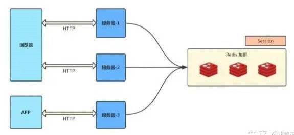

## 单一服务器


```java
用户/浏览器
	向服务器发送用户名和密码。
    
服务器
    //（进行登陆验证的服务器）    
    1. 验证账号密码
    2. 相关数据（如用户名，用户角色等）将保存在当前会话（session）中。
    	从数据库中查询
    3. 向用户返回session_id
    
用户    
    1. 通过 js 操作将 session信息都会写入到用户的Cookie。
    	保存到本地
    2. 用户的每个后续请求都将通过在Cookie中取出session_id传给服务器。


服务器收到session_id并对比之前保存的数据，确认用户的身份。
```


## 登陆验证


### 基于 session 的登陆

```java
浏览器登录发送账号密码，服务端查用户库,校验用户
服务端把用户登录状态存为Session,生成一个sessionId
通过登录接口返回,把sessionId set到cookie.上
此后浏览器再请求业务接口，sessionId 随cookie带上
服务端查sessionId校验 session
成功后正常做业务处理，返回结果
```


## 分布式登陆认证

### 介绍

```java
分布式架构下 session 共享方案
    
介绍
    通常服务端是集群，而用户请求过来会走一次负载均衡，不一定打到哪台机器上。
    那一旦用户后续接口请求到的机器和他登录请求的机器不一致，或者登录请求的机器宕机了，session 就失效了
    
解决
    一是从「存储」角度，把 session 集中存储。 // 通常采用
    	如果我们用独立的 Redis 或普通数据库，就可以把 session 都存到一个库里。
    
    // 二种相当于阉割了负载均衡，且仍没有解决「用户请求的机器宕机」的问题
	二是从「分布」角度，让相同 IP 的请求在负载均衡时都打到同一台机器上。
    	以 nginx 为例，可以配置 ip_hash 来实现。    
```


### tomcat 存储

#### session 复制

```java
介绍
    任何一个服务器上的 session 发生改变（增删改），
    该节点会把这个 session 的所有内容序列化，然后广播给所有其它节点，
    不管其他服务器需不需要 session ，以此来保证 session 同
    
优点：
    可容错，各个服务器间 session 能够实时响应。

缺点：
    
	1. Session 复制传输需要占用内网带宽。
    	会对网络负荷造成一定压力，
    	如果 session 量大(服务器数量过多)的话可能会造成网络堵塞，拖慢服务器性能。
	
	2. Tomcat 需要保存所有的 Session 数据，这个方案的 Session 存储在内存中，容易受到机器的总内存的限制。
    	我们没办法通过加机器的方式水平扩展，我们能做的方式就是加大机器内存。
    	但是机器内存越大，价格真的很贵！！！ 
 
    
例子
    如果此时 Tomcat1 Session 存在用户信息，而 Tomcat2 上没有存在。
	这时如果我们将 Tomcat1 的 Session 复制到 Tomcat2 上，后面 Nginx 将请求转发到 Tomcat2 上，
    由于 Tomcat2 存在 Session ，这时就不需要再重新登录了
```


###  前端保存 

#### cookie 保存

```java
介绍
    现在不存 Tomcat Session 里，我把信息拿出来，存到浏览器的 Cookie 中。
    每个用户浏览器存储自己的 Cookie 信息，服务端就不需要存储，这就解决了 Session 复制方案的缺陷了。
	接下来用户每次请求都把这个 Cookie 给我发过来，我判断 Cookie 里面用户信息不就好了
    
问题
    1. 加密问题， 用户信息可能被泄漏
    2. 每次请求都要携带 Cookie 传输，这会占用外网的带宽，如果 Cookie 过大，会增大网络的开销。
```


### nigx

#### 粘性 session /IP 绑定策略

```java
// 这个参看 ngnix 方案

介绍
    采用 Ngnix 中的 ip_hash 机制，将某个 ip的所有请求都定向到同一台服务器上，即将用户与服务器绑定。用户第一次请求时，负载均衡器将用户的请求转发到了 A 服务器上，如果负载均衡器设置了粘性 session 的话，那么用户以后的每次请求都会转发到 A 服务器上，相当于把用户和 A 服务器粘到了一块，这就是粘性 session 机制。
    
优点：简单，不需要对 session 做任何处理。


缺点：
    缺乏容错性，
    如果当前访问的服务器发生故障，用户被转移到第二个服务器上时，他的 session 信息都将失效。

适用场景：
    发生故障对客户产生的影响较小；
    服务器发生故障是低概率事件 。

实现方式：
    以 Nginx 为例，在 upstream 模块配置 ip_hash 属性即可实现粘性 session。    
```

### 后端存储 

#### session 共享（常用）

```java
介绍
    使用分布式缓存方案
    比如 Memcached 、Redis 来缓存 session，但是要求Memcached 或 Redis 必须是集群
    
特点
    把 session 放到 Redis 中存储，虽然架构上变得复杂，并且需要多访问一次 Redis ，
    
优势
    实现了 session 共享；
    可以水平扩展（增加 Redis 服务器）；
    服务器重启 session 不丢失（不过也要注意 session 在 Redis 中的刷新/失效机制）；
    不仅可以跨服务器 session 共享，甚至可以跨平台（例如网页端和 APP 端）
```



####  session 持久化

```java
介绍
	将 session 存储到数据库中，保证 session 的持久化
    
优点：
    服务器出现问题，session 不会丢失

缺点：
    如果网站的访问量很大，把 session 存储到数据库中，会对数据库造成很大压力，还需要增加额外的开销维护数据库。
```

