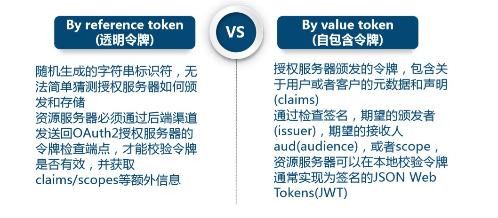
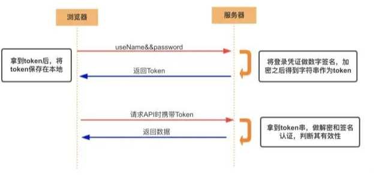
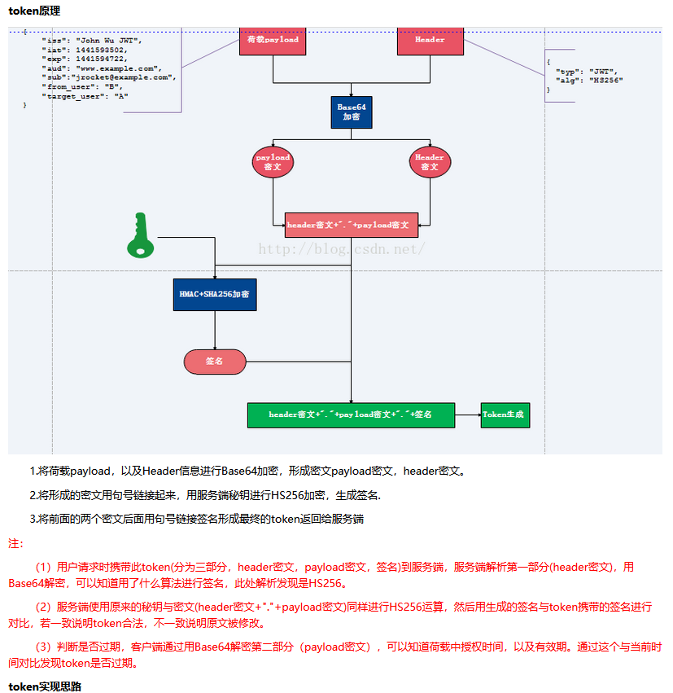
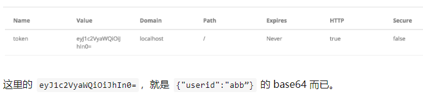
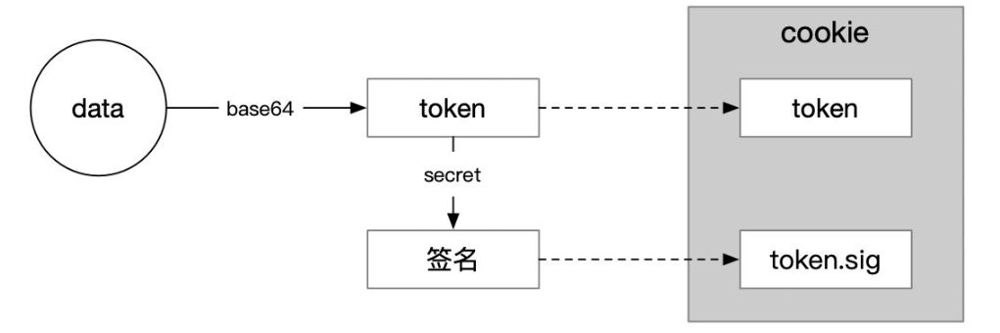
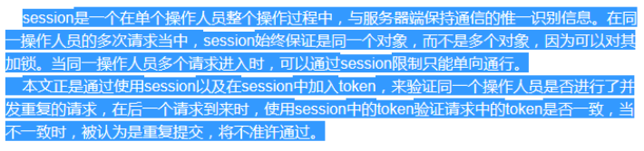
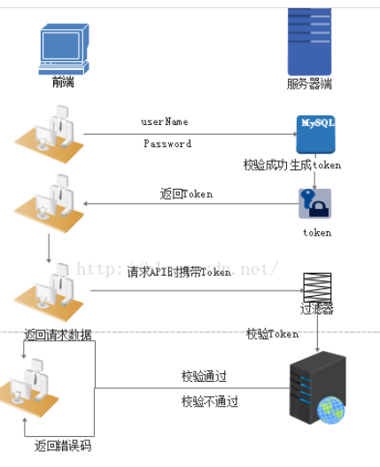

## 概述

```java

概述
    Token是服务端生成的一串字符串，以作客户端进行请求的一个令牌，

目的
    目的是为了减轻服务器的压力，减少频繁的查询数据库，使服务器更加健壮。
产生背景
    Token是在客户端频繁向服务端请求数据，
    服务端频繁的去数据库查询用户名和密码并进行对比,判断用户名和密码正确与否，并作出相应提示，
    在这样的背景下，Token便应运而生。
    
其他
    把传过来的Token放在上下文中啊 过来就先比较字符串嘛 相等了就等于登录成功嘛 不同再去查数据库
    
优势    
    Token 完全由应用管理，所以它可以避开同源策略
    Token 可以避免 CSRF 攻击(http://dwz.cn/7joLzx)
    Token 可以是无状态的，可以在多个服务间共享
```



## 分类

### 概述

```java
介绍
    不同的分类标准， 就得到不同的分类

种类
    无状态的 JWT，token 中包含 session 数据。 //  不适合做为 session 机制
    
    // 有状态的，即在服务端需要保存并记录相关属性
	有状态的 JWT，token 中仅有 session ID，session 数据还是存储在服务端 
    
分类
    Acesss Token
    	访问资源接口（API）时所需要的资源凭证
    Refresh Token
    	refresh token 是专用于刷新 access token 的 token
```

### acess token

```java
介绍
    访问资源接口（API）时所需要的资源凭证
特点：
    服务端无状态化、可扩展性好
    支持移动端设备
    安全
    支持跨程序调用 
身份验证流程： 
    客户端使用用户名跟密码请求登录
    服务端收到请求，去验证用户名与密码
    验证成功后，服务端会签发一个 token 并把这个 token 发送给客户端
    客户端收到 token 以后，会把它存储起来，比如放在 cookie 里或者 localStorage 里
    客户端每次向服务端请求资源的时候需要带着服务端签发的 token
    服务端收到请求，然后去验证客户端请求里面带着的 token ，如果验证成功，就向客户端返回请求的数据
    
注意
    每一次请求都需要携带 token，需要把 token 放到 HTTP 的 Header 里    
	基于 token 的用户认证是一种服务端无状态的认证方式，服务端不用存放 token 数据。
    用解析 token 的计算时间换取 session 的存储空间，从而减轻服务器的压力，减少频繁的查询数据库
	token 完全由应用管理，所以它可以避开同源策略
```



### refresh token

```java
介绍
    refresh token 是专用于刷新 access token 的 token。
    refresh token 
    	不存在：可以刷新，但是每次都需要用户输入用户名和密码，麻烦
    	存在 ： 客户端直接用 refresh token 去更新 access token，无需用户进行额外的操作。

```

.jpg)


## // ========


## 生命周期

### 产生s使用

```java
产生
    Token 是在服务端产生的
使用
    首次：登录后，
    	前端： 使用用户名/密码向服务端请求认证
    	后端： 认证成功，服务器生成一个Token便将此Token返回给客户端，
    以后：
    	前端可以在每次请求的时候带上 Token 证明自己的合法地位， 无需再次带上用户名和密码。    	
```

### 生命周期

```java
 Token 在服务端持久化（比如存入数据库），那它就是一个永久的身份令牌。
     
     
有效期
     Token 都需要设有效期，时间根据系统的安全需要，尽可能的短，但也不能太短
     登陆缓存： Token 的过期时保存在缓存或者内存中。
     refresh token:可以避免频繁的读写操作
        
设置
	「过期时间」和数据一起塞进去，验证时判断就好。         
```

## token原理



## token 实现

### 概述

```java
// 常见方法
1、用设备号/设备mac地址作为Token（推荐）
2、用session值作为Token  
```

### 1、用设备号/设备mac地址作为Token（推荐）

```java
客户端：
    客户端在登录的时候获取设备的设备号/mac地址，并将其作为参数传递到服务端
服务端：
    服务端接收到该参数后，便用一个变量来接收同时将其作为Token保存在数据库，并将该Token设置到session中，
    客户端每次请求的时候都要统一拦截，并将客户端传递的token和服务器端session中的token进行对比，
    	如果相同则放行，不同则拒绝。
分析
    此刻客户端和服务器端就统一了一个唯一的标识Token，而且保证了每一个设备拥有了一个唯一的会话
    优点
    	客户端不需重新登录，只要登录一次以后一直可以使用，至于超时的问题是有服务器这边来处理，
    	/*
    		服务器的Token超时后，服务器只需将客户端传递的Token向数据库中查询，
    		同时并赋值给变量Token，如此，Token的超时又重新计时。
    	*/
    缺点
    	客户端需要带设备号/mac地址作为参数传递，而且服务器端还需要保存
```

### 2、用session值作为Token

```java
客户端：
    客户端只需携带用户名和密码登陆即可。

服务端：
    接收到用户名和密码后并判断，
    如果正确了就将本地获取sessionID作为Token返回给客户端，客户端以后只需带上请求数据即可。

分析：
    优点
    	这种方式使用的好处是方便，不用存储数据，
    缺点
    	当session过期后，客户端必须重新登录才能进行访问数据。

```

## 存储方式

```java
cookie 并不是客户端存储凭证的唯一方式。
token 因为它的「无状态性」，有效期、使用限制都包在 token 内容里，对 cookie 的管理能力依赖较小，客户端存起来就显得更自由。
但 web 应用的主流方式仍是放在 cookie 里，毕竟少操心。
```

## token 安全

### 防篡改

```java
介绍
    编码的方式丰俭由人
    
防篡改
// 问题
    如果用户 cdd 拿{"userid":"abb”}转了个 base64，再手动修改了自己的 token 为 eyJ1c2VyaWQiOiJhIn0=，
   是不是就能直接访问到 abb 的数据了？
答案
	是的。
    所以看情况，如果 token 涉及到敏感权限，就要想办法避免 token 被篡改。        

```



### 解决方案

```java
解决方案
    就是给 token 加签名，来识别 token 是否被篡改过   
    secret: 'iAmSecret',
	signed: true,
结果
    这样会多种一个 .sig cookie，里面的值就是 {"userid":"abb”} 和 iAmSecret通过加密算法计算出来的
	cdd 虽然能伪造出eyJ1c2VyaWQiOiJhIn0=，但伪造不出 sig 的内容，因为他不知道 secret。        
```



## 使用

### session 共享 -- 扩展性

```java
介绍
    session 用在单机当然没有问题，
    如果是服务器集群，或者是跨域的服务导向架构，就要求 session 数据共享，每台服务器都能够读取 session。
案例
    A 网站和 B 网站是同一家公司的关联服务。
    现在要求，用户只要在其中一个网站登录，再访问另一个网站就会自动登录
    
方法
// 方案一    
	session 数据持久化， 写入数据库或别的持久层，各种服务收到请求后，都向持久层请求数据。
        这种方案的优点是架构清晰，缺点是工程量比较大。
        另外，持久层万一挂了，就会单点失败。
// 方案二
    服务器索性不保存 session 数据了，所有数据都保存在客户端，每次请求都发回服务器
    	代表方案： jwt
```


### 重复提交

```java
// 网络不好或者并发请求时会导致多次重复提交数据
// 将session和Token套用
```




## 分类

### 有状态

```java
客户端
    发送 url 请求
          return request({
            url: '/admin/acl/login',
            method: 'post',
            data: {
              username,
              password
            }
          })
```


```java
客户端
    使用用户名跟密码请求登录
服务端
    收到请求，去验证用户名与密码
    // 以某种方式比如随机生成32位的字符串作为token，
    // 存储到服务器中，并返回token到APP，
	验证成功: 服务端会签发一个 Token，再把这个 Token 发送给客户端
	服务器上token设置一个有效期，每次APP请求的时候都验证token和有效期        
客户端
        收到 Token 以后可以把它存储起来，比如放在 Cookie 里或者 Local Storage 里
        
// 再次请求        
客户端
    每次向服务端请求资源的时候需要带着服务端签发的 Token
服务端
	收到请求，然后去验证客户端请求里面带着的 Token，
    如果验证成功，就向客户端返回请求的数据
        

```



### 无状态

```java
介绍
    基于token的鉴权机制类似于http协议也是无状态的，它不需要在服务端去保留用户的认证信息或者会话信息
    基于token认证机制的应用不需要去考虑用户在哪一台服务器登录了，这就为应用的扩展提供了便利。
    
流程
    浏览器
    	用户使用账号密码请求服务器
    服务器
    	验证用户信息
    	发丝报告给用户一个 token
	浏览器
    	存储 tooken, 每次请求附送上 token 值
```

## 编码方式参考

```java
https://www.jianshu.com/p/24825a2683e6
https://www.cnblogs.com/lufeiludaima/p/pz20190203.html
```

## token 优势

```java
1.无状态、可扩展

        在客户端存储的Tokens是无状态的，并且能够被扩展。基于这种无状态和不存储Session信息，负载负载均衡器能够将用户信息从一个服务传到其他服务器上。如果我们将已验证的用户的信息保存在Session中，则每次请求都需要用户向已验证的服务器发送验证信息(称为Session亲和性)。用户量大时，可能会造成  一些拥堵。但是不要着急。使用tokens之后这些问题都迎刃而解，因为tokens自己hold住了用户的验证信息。

　　2.安全性

　　请求中发送token而不再是发送cookie能够防止CSRF(跨站请求伪造)。即使在客户端使用cookie存储token，cookie也仅仅是一个存储机制而不是用于认证。不将信息存储在Session中，让我们少了对session操作。token是有时效的，一段时间之后用户需要重新验证。我们也不一定需要等到token自动失效，token有撤回的操作，通过token revocataion可以使一个特定的token或是一组有相同认证的token无效。

　　3.可扩展性

　　Tokens能够创建与其它程序共享权限的程序。例如，能将一个随便的社交帐号和自己的大号(Fackbook或是Twitter)联系起来。当通过服务登录Twitter(我们将这个过程Buffer)时，我们可以将这些Buffer附到Twitter的数据流上(we are allowing Buffer to post to our Twitter stream)。使用tokens时，可以提供可选的权限给第三方应用程序。当用户想让另一个应用程序访问它们的数据，我们可以通过建立自己的API，得出特殊权限的tokens。

　　4.多平台跨域

　　我们提前先来谈论一下CORS(跨域资源共享)，对应用程序和服务进行扩展的时候，需要介入各种各种的设备和应用程序。Having our API just serve data, we can also make the design choice to serve assets from a CDN. This eliminates the issues that CORS brings up after we set a quick header configuration for our application.只要用户有一个通过了验证的token，数据和资源就能够在任何域上被请求到。Access-Control-Allow-Origin: *
　　5.基于标准

　　创建token的时候，你可以设定一些选项。我们在后续的文章中会进行更加详尽的描述，但是标准的用法会在JSON Web Tokens体现。最近的程序和文档是供给JSON Web Tokens的。它支持众多的语言。这意味在未来的使用中你可以真正的转换你的认证机制
```

