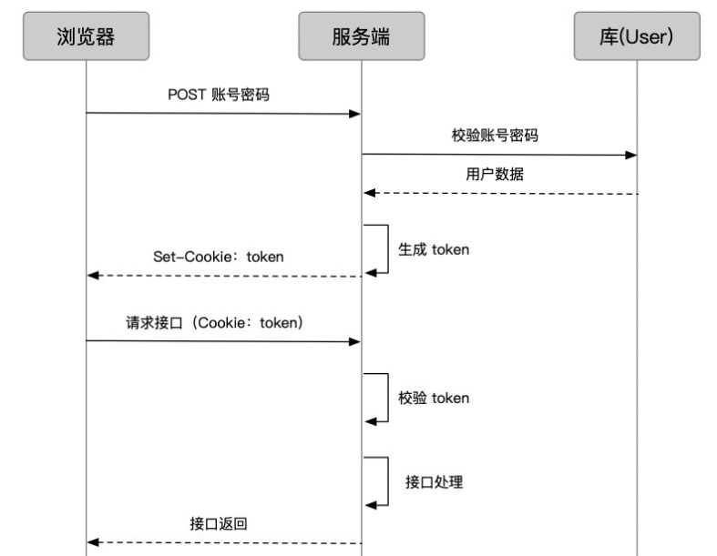
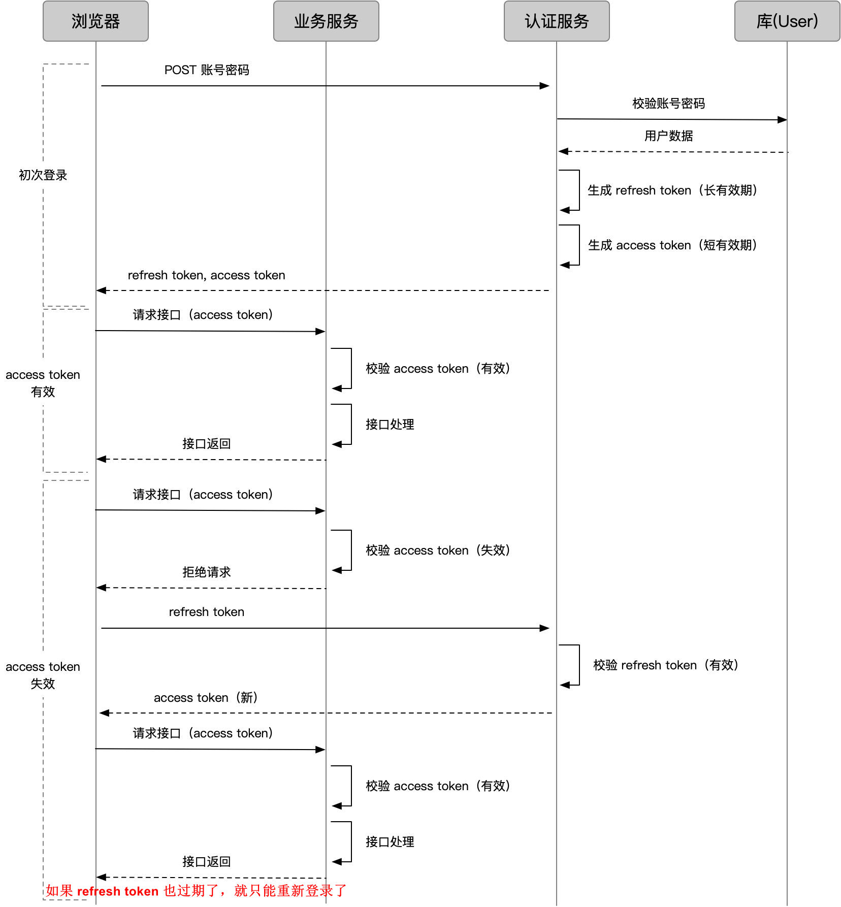
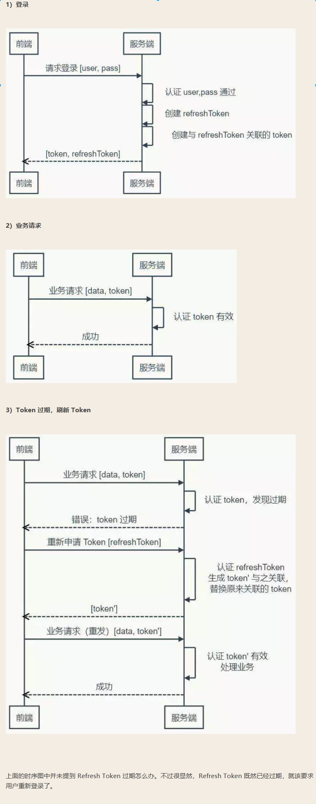

## cookie -token

```java
用户登录，服务端校验账号密码，获得用户信息
把用户信息、token 配置编码成 token，通过 cookie set 到浏览器
此后用户请求业务接口，通过 cookie 携带 token
接口校验 token 有效性，进行正常业务接口处理
```




## refresh token

```java
问题
	token，作为权限守护者，最重要的就是「安全」
    业务接口用来鉴权的 token，我们称之为 access token。越是权限敏感的业务，我们越希望 access token 有效期足够短，以避免被盗用。但过短的有效期会造成 access token 经常过期，过期后怎么办呢？
    
解决
    一种办法是
    	让用户重新登录获取新 token，显然不够友好，要知道有的 access token 过期时间可能只有几分钟
    另一种方法
    	再来一个 token，一个专门生成 access token 的 token，我们称为 refresh token
理解
    access token 
    	用来访问业务接口，由于有效期足够短，盗用风险小，也可以使请求方式更宽松灵活    
	refresh token 
    	用来获取 access token，有效期可以长一些，
    	通过独立服务和严格的请求方式增加安全性；由于不常验证，也可以如前面的 session 一样处理
```



## // ===

### refresh token

```java
介绍
     服务端不需要刷新 Token 的过期时间，一旦 Token 过期，就反馈给前端，前端使用 Refresh Token 申请一个全新 Token 继续使用。
    这种方案中，服务端只需要在客户端请求更新 Token 的时候对 Refresh Token 的有效性进行一次检查，大大减少了更新有效期的操作，也就避免了频繁读写。
    当然 Refresh Token 也是有有效期的，但是这个有效期就可以长一点了，比如，以天为单位的时间。
    
设置更复杂的机制
    Refresh Token 每次使用的时候，都更新它的过期时间，
    直到与它的创建时间相比，已经超过了非常长的一段时间（比如三个月），
    这等于是在相当长一段时间内允许 Refresh Token 自动续期。
```



## 