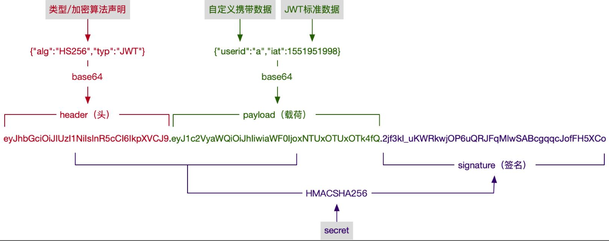

## 官网

```java
https://jwt.io/
```

## 背景


```java
token 的保密方式额外增加了 cookie 数量，数据本身也没有规范的格式， 所以就出现了 jwt 规范
```


## 概述

```java
名称
    Json web token (JWT),
	即JSON Web令牌，是一种自包含令牌， 一种认证授权机制
    
介绍
	// 一种成熟的 token 字符串生成方案，包含了我们前面提到的数据、签名 
	是为了在网络应用环境间传递声明而执行的一种基于 JSON 的开放标准（RFC 7519）        

    这些信息通过数字签名确保可信。        
作用
    最重要的作用就是对 token信息的防伪作用
   一般被用来在身份提供者和服务提供者间传递被认证的用户身份信息，以便于从资源服务器获取资源     
```

## 结构



### 构成

```java
构成
    // 三部分构成
    第一部分： 头部 header
    第二部分： 载荷 payload	存放有效信息的地方
    第三部分： 签证 signature  （签名信息、签名、签证）
    
//====
Base64URL
    Base64 有三个字符+、/和=，在 URL 里面有特殊含义，
    所以要被替换掉：=被省略、+替换成-，/替换成_ 。这就是 Base64URL 算法。
```

### 头部

```java
承载信息
    声明类型
    声明的加密算法
使用
    将头部进行base64加密（该加密是可以对称解密的),构成了第一部分.
完整头部信息如下
    {
        'typ': 'JWT',  // 属性表示这个令牌（token）的类型（type）
        'alg': 'HS256'  // 属性表示签名的算法（algorithm），默认是 HMAC SHA256（写成 HS256）
    }

```

### 载荷

```java
介绍
    存放有效信息的地方，就像货车的车厢
包含内容  
    // 参看补充
    标准中注册的声明
    公共的声明
    私有的声明
使用
    将其进行base64加密，得到Jwt的第二部分。
特点
    JWT 默认是不加密的，任何人都可以读到，所以不要把秘密信息放在这个部分。
例子
    {
      "sub": "1234567890",
      "name": "John Doe",
      "admin": true
    }
// === 补充 ===
标准中注册的声明（建议，但不强制使用）
    iss: jwt签发者
    sub: jwt所面向的用户
    aud: 接收jwt的一方
    exp: jwt的过期时间，这个过期时间必须要大于签发时间
    nbf: 定义在什么时间之前，该jwt都是不可用的.
    iat: jwt的签发时间
    jti: jwt的唯一身份标识，主要用来作为一次性token,从而回避重放攻击。
公共声明
        可以添加任何的信息，
        一般添加用户的相关信息或其他业务需要的必要信息.
        但不建议添加敏感信息，因为该部分在客户端可解密.
        
私有声明
        提供者和消费者所共同定义的声明，
        一般不建议存放敏感信息，
        因为base64是对称解密的，意味着该部分信息可以归类为明文信息。
```

### 签名信息

```java
内容    
    header (base64后的) 加密后的头部
    payload (base64后的) 加密后的载荷
    secret   加盐值，这个密钥只有服务器才知道，不能泄露给用户
    连接符  .
    
secret
    // jwt的签发生成也是在服务器端的
    secret是保存在服务器端的，是用来进行jwt的签发和jwt的验证
    是你服务端的私钥，在任何场景都不应该流露出去。
    一旦客户端得知这个secret, 那就意味着客户端是可以自我签发jwt了。
    


    
例子
// javascript ： 结果 xxx.xxx.xxx
HMACSHA256(
  base64UrlEncode(header) + "." +
  base64UrlEncode(payload),
  secret)
    
```

## 分类

### 介绍

```java
介绍
    其实就是沿用的 token 的分类
分类
    无状态的 JWT，token 中包含 session 数据。 //  不适合做为 session 机制
	有状态的 JWT，token 中仅有 session ID，session 数据还是存储在服务端
```

### 无状态的  jwt toke

```java
缺点
体积大
    如果把 session 信息编码后放入 token，那么其体积会很大，很有可能超出 cookie 的大小限制，
    那就只能把 JWT 保存在 Local Storage 了，也就产生了安全问题。
    
不安全
    如果放在 cookie 里，那和传统的 session 方案就差不多了，
    如果放在别的地方，就有其他安全问题了
    
无法使某个 JWT 无效
    当你发现风险时，无法杀死某个 session，
    如果你想解决这个问题，就需要服务端可以对 session 进行管理，那么就变回有状态的模式了
    
session 数据旧了
    在 JWT 过期之前，用户的角色发生了变化，那么这时 JWT 中的信息就是旧的了，因为无法更新
```


## 注意

```java

    不应该在jwt的payload部分存放敏感信息，因为该部分是客户端可解密的部分。
    保护好secret私钥，该私钥非常重要。
    如果可以，请使用https协议

        
（1）JWT 默认是不加密，但也是可以加密的。生成原始 Token 以后，可以用密钥再加密一次。

（2）JWT 不加密的情况下，不能将秘密数据写入 JWT。

（3）JWT 不仅可以用于认证，也可以用于交换信息。有效使用 JWT，可以降低服务器查询数据库的次数。

（4）JWT 的最大缺点是，由于服务器不保存 session 状态，
        因此无法在使用过程中废止某个 token，或者更改 token 的权限。
        也就是说，一旦 JWT 签发了，在到期之前就会始终有效，除非服务器部署额外的逻辑。

（5）JWT 本身包含了认证信息，一旦泄露，任何人都可以获得该令牌的所有权限。
        为了减少盗用，JWT 的有效期应该设置得比较短。
        对于一些比较重要的权限，使用时应该再次对用户进行认证。

（6）为了减少盗用，JWT 不应该使用 HTTP 协议明码传输，要使用 HTTPS 协议传输。
```


## 参考

```java
https://www.jianshu.com/p/576dbf44b2ae
```

