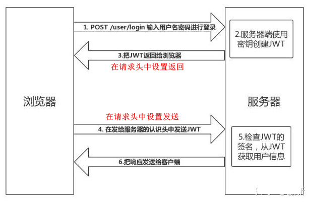

## 使用方式

### 概述

```java
客户端收到服务器返回的 JWT，可以储存在 Cookie 里面，也可以储存在 localStorage
```

### cookie

```java
当用户希望访问一个受保护的路由或者资源的时候，可以把它放在 Cookie 里面自动发送，但是这样不能跨域，
```

### 请求头

```java
介绍
	HTTP 请求头信息的 Authorization 字段里，使用 Bearer 模式添加 JWT。
    GET /calendar/v1/events
    Host: api.example.com
    Authorization: Bearer <token>
        
分析
用户的状态不会存储在服务端的内存中，这是一种 无状态的认证机制
服务端的保护路由将会检查请求头 Authorization 中的 JWT 信息，如果合法，则允许用户的行为。
由于 JWT 是自包含的，因此减少了需要查询数据库的需要
JWT 的这些特性使得我们可以完全依赖其无状态的特性提供数据 API 服务，甚至是创建一个下载流服务。
因为 JWT 并不使用 Cookie ，所以你可以使用任何域名提供你的 API 服务而不需要担心跨域资源共享问题（CORS）

//===
一般是在请求头里加入Authorization，并加上Bearer标注：
fetch('api/user/1', {
  headers: {
    'Authorization': 'Bearer ' + token
  }
})
        
```

###  POST 请求的数据体

```java
跨域的时候，可以把 JWT 放在 POST 请求的数据体里。
```

### url

```java
http://www.example.com/user?token=xxx
```

## 业务流程

```java
{
  "姓名": "张三",
  "角色": "管理员",
  "到期时间": "2018年7月1日0点0分"
}

服务器认证以后，生成一个 JSON 对象（如上），发回给用户
用户与服务端通信的时候，都要发回这个 JSON 对象。服务器完全只靠这个对象认定用户身份。
    为了防止用户篡改数据，服务器在生成这个对象的时候，会加上签名（详见后文）。    
服务器就不保存任何 session 数据了，也就是说，服务器变成无状态了，从而比较容易实现扩展。   
    
    
    
1. 用户输入用户名/密码登录，服务端认证成功后，会返回给客户端一个 JWT
2. 客户端将 token 保存到本地（通常使用 localstorage，也可以使用 cookie）
3. 当用户希望访问一个受保护的路由或者资源的时候，
    需要请求头的 Authorization 字段中使用Bearer 模式添加 JWT，
    其内容看起来是下面这样	Authorization: Bearer <token>
        
4. 服务端的保护路由将会检查请求头 Authorization 中的 JWT 信息，
        如果合法，则允许用户的行为
	因为 JWT 是自包含的（内部包含了一些会话信息），因此减少了需要查询数据库的需要
	因为 JWT 并不使用 Cookie 的，所以你可以使用任何域名提供你的 API 服务而不需要担心跨域资源共享问题（CORS）
	因为用户的状态不再存储在服务端的内存中，所以这是一种无状态的认证机制    
```

