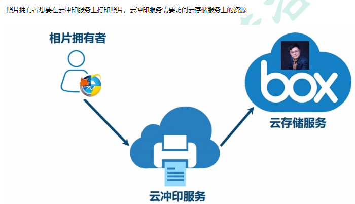

## 产生场景

### 场景使用



```java
需求
    你想要通过 wps 的打印照片的服务，去打印存储在百度云上的照片，但是 wps 和 百度云是不同公司，wps 不可能拥有 百度云的上关于用户的信息，所以需要你告诉百度云，你允许 wps 访问你在百度云上的内容，百度云才会让 wps 访问并打印你在百度云上照片
```

### 方式一

```java
介绍
    你直接告诉 wps 你的账户密码， 然后 wps 通过你提供的账号密码进行登陆，就可以直接访问你在百度云上内容
缺点
    1. wps 
    	保存你的账户密码，一旦他被破解，你的账户密码就会被泄漏
    	有了你的账号密码，他想干嘛就干嘛，用户无法限制其行为和有效期
    3. 用户
    	修改密码,会导致所有获得用户授权的第三方应用失效
    3. 百度云
    	不得不单独部署密码登陆，但是单纯的密码登录并不安全。  
```

### oauth

```java
百度云 /* http 服务提供商*/
    
wps /*第三方应用*/
    
用户 /*资源拥有者*/
```


## 需要总结

```java
https://www.ruanyifeng.com/blog/2014/05/oauth_2_0.html
```

