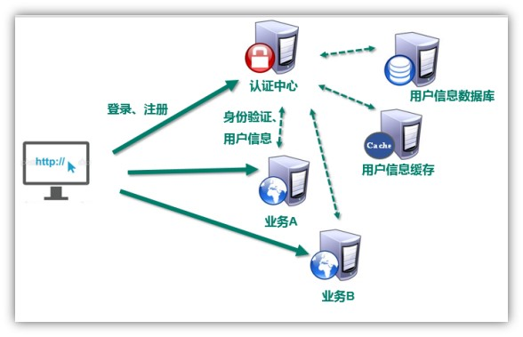
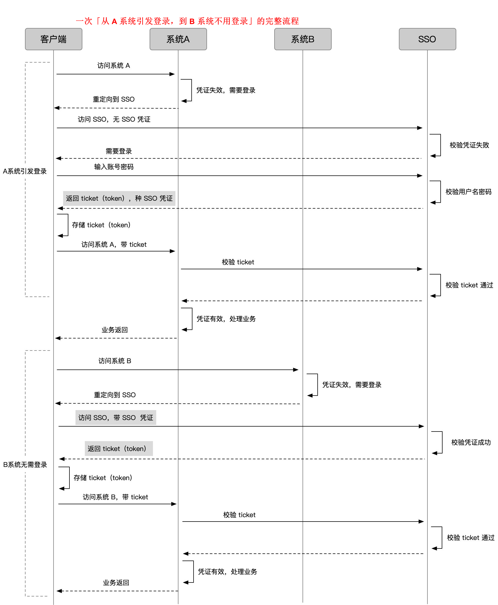
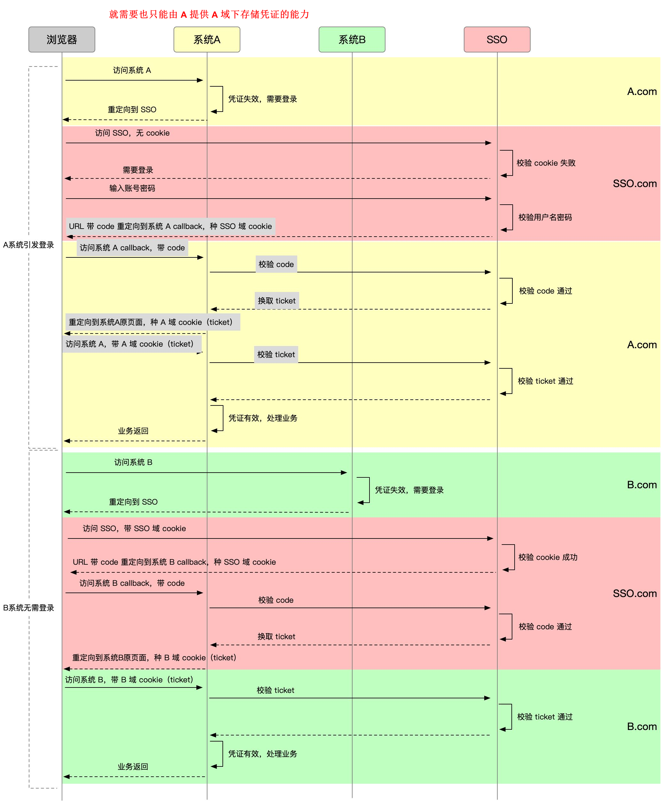

## 认证模式



## 登陆流程

### 基础流程

```java
1. 用户进入 A 系统，没有登录凭证（ticket），A 系统给他跳到 SSO
2. SSO 没登录过，也就没有 sso 系统下没有凭证（注意这个和前面 A ticket 是两回事），输入账号密码登录
3. SSO 账号密码验证成功，通过接口返回做两件事：
    一是种下 sso 系统下凭证（记录用户在 SSO 登录状态）；
    二是下发一个 ticket
4. 客户端拿到 ticket，保存起来，带着请求系统 A 接口
5. 系统 A 校验 ticket，成功后正常处理业务请求
6. 此时用户第一次进入系统 B，没有登录凭证（ticket），B 系统给他跳到 SSO
7. SSO 登录过，系统下有凭证，不用再次登录，只需要下发 ticket
8. 客户端拿到 ticket，保存起来，带着请求系统 B 接口
    
    
// =========
如图所示，
    图中有3个系统，分别是业务A、业务B、和SSO。
	业务A、业务B没有登录模块。而SSO只有登录模块，没有其他的业务模块。
一般过程如下：
	当业务A、业务B需要登录时，先跳到SSO系统。
	SSO从用户信息数据库中获取用户信息并校验用户信息，SSO系统完成登录。
	然后将用户信息存入缓存（例如redis）。
	当用户访问业务A或业务B，需要判断用户是否登录时，
	将跳转到SSO系统中进行用户身份验证，SSO判断缓存中是否存在用户身份信息。
	这样，只要其中一个系统完成登录，其他的应用系统也就随之登录了。这就是单点登录（SSO）的定义。
优点 ：  
	用户身份信息独立管理，更好的分布式管理。可以自己扩展安全策略
缺点：
	认证服务器访问压力较大。    
```



### 加入浏览器

```java
浏览器来说，SSO 域下返回的数据要怎么存，才能在访问 A 的时候带上？
    浏览器对跨域有严格限制，cookie、localStorage 等方式都是有域限制的。
    
1. 在 SSO 域下
    SSO 不是通过接口把 ticket 直接返回，
    而是通过一个带 code 的 URL 重定向到系统 A 的接口上，这个接口通常在 A 向 SSO 注册时约定
2. 浏览器被重定向到 A 域下，
    带着 code 访问了 A 的 callback 接口，callback 接口通过 code 换取 ticket
3. 这个 code 不同于 ticket，code 是一次性的，暴露在 URL 中，只为了传一下换 ticket，换完就失效
4. callback 接口拿到 ticket 后，在自己的域下 set cookie 成功
5. 在后续请求中，只需要把 cookie 中的 ticket 解析出来，去 SSO 验证就好
6. 访问 B 系统也是一样    
```



