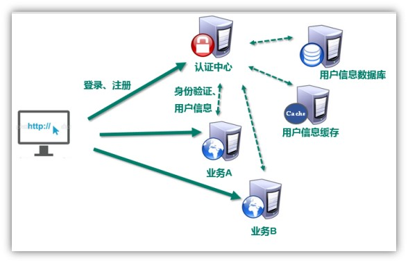

## 单一服务器模式


```java
用户向服务器发送用户名和密码。
验证服务器后，相关数据（如用户名，用户角色等）将保存在当前会话（session）中。
服务器向用户返回session_id，session信息都会写入到用户的Cookie。
用户的每个后续请求都将通过在Cookie中取出session_id传给服务器。
服务器收到session_id并对比之前保存的数据，确认用户的身份。

```


## SSO（Single Sign On）模式

### 介绍

```java
背景
	在同域下的客户端/服务端认证系统中，通过客户端携带凭证，维持一段时间内的登录状态。
	但当我们业务线越来越多，业务系统分散到不同域名下，就需要「一次登录，全线通用」的能力，叫做「单点登录」
概述
    分布式，SSO(single sign on)模式：
    单点登录英文全称Single Sign On，
    简称就是SSO。
    含义：
    	在多个应用系统中，只需要登录一次，就可以访问其他相互信任的应用系统。
    
```

## “虚假”的单点登录（一级域名相同）

```java
介绍
    如果业务系统都在同一一级域名下，比如wenku.baidu.com tieba.baidu.com，就好办了。
    可以直接把 cookie domain 设置为一级域名 baidu.com，百度也就是这么干的。
```


## “真实”的单点登录（一级域名不同）

```java
介绍
    比如滴滴这么潮的公司，同时拥有didichuxing.com xiaojukeji.com didiglobal.com等域名，
    这种 cookie 是完全绕不开的。
	
    这要能实现「一次登录，全线通用」，才是真正的单点登录。
```


## 认证模式



## 单一服务器模式


```java
用户向服务器发送用户名和密码。
验证服务器后，相关数据（如用户名，用户角色等）将保存在当前会话（session）中。
服务器向用户返回session_id，session信息都会写入到用户的Cookie。
用户的每个后续请求都将通过在Cookie中取出session_id传给服务器。
服务器收到session_id并对比之前保存的数据，确认用户的身份。

```

