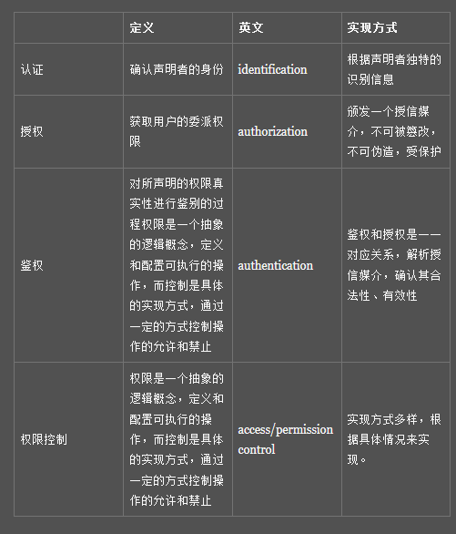

## 会话

### 中文解释

```java
中文
    // 维基百科
    又称谈话、对话、攀谈或聊天，是指两人及两人以上之间的交流和沟通
    不过简短的相互问候并不属于会话（例如彼此认识的两人在路上偶遇，互相道声 “你好” 就结束了），老板向员工发号施令也不是会话
```

### web 会话

```java
// 百度百科
简单理解
    // 你访问百度云，然后在百度云上进行一系列操作，然后关闭百度云的操作界面，退出， 就是一次会话
    用户开一个浏览器，访问某一个web站点，在这个站点点击多个超链接，访问服务器多个web资源，然后关闭浏览器，整个过程称之为一个会话。
```

## 认证

```java
英文
    identification
    authentication  // 注意是 ca
介绍	
	用户认证就是判断一个用户身份是否合法的过程
    解决的是 “我是谁？”的问题。
例子
    一个用户要访问张三百度云上的资源，那么百度云就需要判断这个用户是不是张三，
    所以就需要认证这个人是不是张三
    
方式
    身份证
    用户名和密码
    用户手机：手机短信、手机二维码扫描、手势密码
    用户的电子邮箱
    基于时间序列和用户相关的一次性口令
    用户的生物学特征：指纹、语音、眼睛虹膜
    用户的大数据识别
    
```

## 授权

```java
英文名称
    授权 (Authorization)  // 是 za
介绍    
    指的是什么样的身份被允许访问某些资源，在获取到用户身份后继续检查用户的权限
    单一的系统授权往往是伴随认证来完成的，但是在开放 API 的多系统结构下，授权可以由不同的系统来完成，例如 OAuth
    授权技术是解决“我能做什么？”的问题
```

## 权限控制

```java
英文
   	access/permission control
介绍
    对可执行的各种操作组合配置为权限列表，然后根据执行者的权限，若其操作在权限范围内，则允许执行，否则禁止
介绍
访问控制策略（AC）
    果我们需要把资源的权限划分到一个很细的粒度，就不得不考虑用户以何种身份来访问受限的资源，
    1. 基于访问控制列表（ACL）
    2. 基于用户角色的访问控制（RBAC）
    3. 其他访问控制策略。
```


## 凭证

```java
介绍
    实现认证和授权的基础是需要一种媒介（credentials）来标记访问者的身份或权利，
```

## 总结

```jav
认证 -- 授权 -- 鉴权 -- 权限控制
```




## 待整理

```java
https://insights.thoughtworks.cn/api-2/
```

