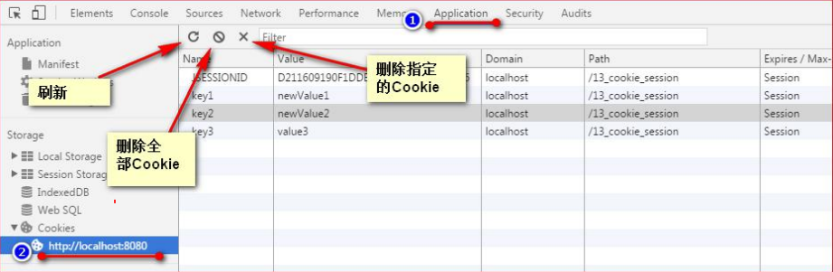

## 介绍

```java
名称
    HTTP Cookie
    Web Cookie 
    浏览器 Cookie
概述(是什么)
    // 存储cookie是浏览器提供的功能。cookie 其实是存储在浏览器中的纯文本
    // 浏览器安装文件夹的  cookie 文件夹来存放各个域下设置的cookie
    服务器发送到用户浏览器，并由浏览器保存在本地的一小块数据，   
    它会在浏览器下次向同一服务器再发起请求时被携带并发送到服务器上
    
本质
    Cookie实际上是一小段的纯文本信息（key-value格式）
    
内容
    1. 记录你的用户名、密码、浏览的网页等信息
作用
    当你在来这个网站的时候，服务器会先看它上次有无留下的 cookie，
    有的话就直接读取 cookie 中内容，进行判断，并送出响应的内容
    // 概述    
    会话状态管理（如用户登录状态、购物车、游戏分数或其它需要记录的信息）
    个性化设置（如用户自定义设置、主题等）
    浏览器行为跟踪（如跟踪分析用户行为等）

    
出现原因
// 由于 http 协议的原因  
HTTP协议
   无状态的， 即服务器无法判断用户身份
   没有缓存功能，所以只是在HTTP协议中扩充了缓存字段，让浏览器和服务端按照缓存控制字段处理是否需要缓存 
    本意是用来克服 HTTP 的无状态性，但不是唯一目的
```

## 种类

* 会话 cookie
    * 别称 ：临时 cookie
* 持久 cookie
    * 其他 cookie 都是 持久 cookie 的变种

## 执行流程(怎么用)

### 具体流程

```java
// 首次请求
客户端： 
    向服务器发送请求(比如登陆：信息包含账号密码)
服务端：
    接收请求，判断请求是否需要记录用户的状态（账号密码正确，允许登陆）
    创建 Cookie , 包含在 HttpResponse 响应中发给服务端（允许该账号密码的用户登陆，并标记相应的信息：是会员）
客户端：
    接收响应，分析并存储 Cookie (记录下服务器允许该用户登陆，而且是会员的信息)
    
    
// 非首次登陆
客户端
    向服务器发起请求， 请求头中就包含 Cookie （cookie中包含用户的信息：用户登陆，是个会员）
服务器
    接收请求，根据 cookie信息 区分不同用户（查看cookie 中的信息：是个会员，然后允许其访问特殊页面）
```

### 服务端验证

```java
// 根据 cookie信息 区分不同用户
在第一次缓存的时候浏览器收到的服务器报文中，有Last-Modified和ETag两个字段。
浏览器接下来的处理中
	会先下发HEAD请求，
    报文带上if-Modified-Since和if-None-Match两个字段以及上面Last-Modified和ETag两个字段, 
    交给服务器验证，	
	服务器验证后如果返回304 Not Modified，就说明缓存依然有效，浏览器就可以继续使用缓存
```


## cookie对象

### 创建 保存

```java
介绍
   
创建
     // cookie 创建是在 服务器端
    服务器使用 Set-Cookie 响应头部向用户代理（一般是浏览器）发送 Cookie信息
        HTTP/1.0 200 OK
        Content-type: text/html
        Set-Cookie: yummy_cookie=choco
        Set-Cookie: tasty_cookie=strawberry
    
保存
    // cookie 保存是在 浏览器端
    浏览器收到响应后通常会保存下 Cookie
	浏览器安装文件夹的  cookie 文件夹来存放各个域下设置的cookie
            
            
发送
	对该服务器发起的每一次新请求，
    浏览器都会将之前保存的Cookie信息通过 Cookie 请求头部再发送给服务器。            
        GET /sample_page.html HTTP/1.1
        Host: www.example.org
        Cookie: yummy_cookie=choco; tasty_cookie=strawberry        
            
            
```


### 生命周期

```java
会话期 Cookie
    浏览器关闭之后它会被自动删除
    不需要指定过期时间（Expires）或者有效期（Max-Age）
    注意
    	有些浏览器提供了会话恢复功能，即使关闭了浏览器，会话期Cookie 也会被保留下来
    
持久性 Cookie 
    取决于过期时间（Expires）或有效期（Max-Age）指定的一段时间    
    
注意
    当Cookie的过期时间被设定时，设定的日期和时间只与客户端相关，而不是服务端。
    站点对用户进行身份验证，则每当用户进行身份验证时，它都应重新生成并重新发送会话 Cookie，
```

### 属性

#### 概述

```java
属性
	expires、domain、path、secure、HttpOnly
设置格式
	// 设置这些属性时，属性之间由一个分号和一个空格隔开
    "key=name; expires=Thu, 25 Feb 2016 04:18:00 GMT; 
    domain=ppsc.sankuai.com; path=/; secure; HttpOnly"

#### 失效时间

```java
失效事件
expires  // 过期时间
   版本
    	http/1.0协议中的选项
    含义
    	cookie失效日期： cookie 到哪个时间点失效
    	如果没有设置该选项，则默认有效期为session，即会话cookie
    格式
    	必须是 GMT 格式的时间
    	（可以通过new Date().toGMTString()或者 new Date().toUTCString() 来获得）
    值
    	值是一个时间点（cookie失效时刻= expires）
    例子
    	expires=Thu, 25 Feb 2016 04:18:00 GMT
	    在2016年2月25日4:18分之后失效，对于失效的cookie浏览器会清空      
    
 max-age  // 有效期
	版本
		 http/1.0协议中的选项，
          在新的http/1.1协议中expires已经由 max-age 选项代替            
    含义
    	cookie失效日期， cookie 存活的时间长度
    	如果没有设置该选项，则默认有效期为session，即会话cookie  
	值          
		以秒为单位时间段（cookie失效时刻= 创建时刻+ max-age）。 
         默认值：  -1(即有效期为 session )
		负数：	   有效期session；
         0：       删除cookie；
         正数：    有效期为创建时刻+ max-age            
```

####  URL访问限定

```java
介绍
    Domain 和 Path 标识定义了Cookie的作用域：即允许 Cookie 应该发送给哪些URL    
	domain  是域名，path    是路径
    
Domain
    介绍
		指定了哪些主机可以接受 Cookie。
    值
    	默认: 自动取 url 的 host 作为 domain 值(origin)，不包含子域名
        指定： 指定什么，浏览器就保存什么 , 包含其子域
	例子
		// 设置 domain=baidu.com，则以下地址都会匹配            
		主域名： domain=baidu.com
		子域名： domain=api.baidu.com
		子域名： domain=dev.api.baidu.com            

	注意
		当前大多数浏览器遵循 RFC 6265，设置 Domain 时 不需要加前导点。
         有的浏览器不遵循该规范，则需要加前导点，例如：Domain=.mozilla.org  
         /*
         显式设置 domain 时，如果 value 最前面带点，则浏览器处理时会将这个点去掉，
         所以最后浏览器存的就是没有点的（注意：但目前大多数浏览器并未全部这么实现）
         
         前面带点‘.’和不带点‘.’有啥区别：
    		带点：
    			任何 subdomain 都可以访问，包括父 domain
    		不带点：
    			只有完全一样的域名才能访问，
    			subdomain 不能（但在 IE 下比较特殊，它支持 subdomain 访问）
         */
            
            
path
	概述
		识指定了主机下的哪些路径可以接受 Cookie（该 URL 路径必须存在于请求 URL 中）
	注意
		以字符 %x2F ("/") 作为路径分隔符，子路径也会被匹配。   
    例子
		// 设置 Path=/docs，则以下地址都会匹配		
            /docs
            /docs/Web/
            /docs/Web/HTTP            
            
// ==== domain 和 path 的例子
你发送一个请求到 ：domain=baidu.com path=/ 路径下的资源，所产生的 cookie
那么向 domin=api.baidu.com  path=/*   发送请求，也会将访问 baidu.com 的cookie 放到请求头中
                       
```

#### 跨域

```java
介绍
    默认情况下，在发生跨域时，cookie 作为一种 credential 信息是不会被传送到服务端的。
    必须要进行额外设置才可以

SameSite 
    允许服务器要求某个 cookie 在跨站请求时不会被发送，
    （其中  Site (en-US) 由可注册域定义），从而可以阻止跨站请求伪造攻击（CSRF）。
// 值    	
None。
    // 如果想要指定 Cookies 在同站、跨站请求都被发送，现在需要明确指定 SameSite 为 None。
    浏览器会在同站请求、跨站请求下继续发送 cookies，不区分大小写。
Strict。
    浏览器将只在访问相同站点时发送 cookie。
    （在原有 Cookies 的限制条件上的加强，如上文 “Cookie 的作用域” 所述）
Lax。
    // 与 Strict 类似，但用户从外部站点导航至URL时（例如通过链接）除外。 
    在新版本浏览器（大多数）中，为默认选项，
    Same-site cookies 将会为一些跨站子请求保留，如图片加载或者 frames 的调用，
    但只有当用户从外部站点导航到URL时才会发送。如 link 链接
注意
    // 以前
    如果 SameSite 属性没有设置，或者没有得到运行浏览器的支持，那么它的行为等同于 None，
    Cookies 会被包含在任何请求中——包括跨站请求。
```

#### 限制访问 cookie

##### 介绍

```java
有两种方法可以确保 Cookie 被安全发送，并且不会被意外的参与者或脚本访问：
    Secure 属性
    HttpOnly 属性。
```


##### secure

```java
secure属性
介绍
    用来设置cookie只在确保安全的请求中才会发送
    当请求是HTTPS或者其他安全协议时，加密过的请求才会发送给服务端
值
    默认
    	// cookie不会带secure选项(即为空)
    	不管是HTTPS协议还是HTTP协议的请求，cookie 都会被发送至服务端

注意
    1. secure选项只是限定了在安全情况下才可以传输给服务端，但并不代表你不能看到这个 cookie。
    2. 户端即网页中通过 js 去设置secure类型的 cookie，
   		必须保证网页是https协议的。
    	在http协议的网页中是无法设置secure类型cookie的。
    3. 但即便设置了 Secure 标记，敏感信息也不应该通过 Cookie 传输，
  		因为 Cookie 有其固有的不安全性，Secure 标记也无法提供确实的安全保障, 
		可以访问客户端硬盘的人可以读取它。
    
例子
    document.cookie = "name=huang; secure";
```

##### httpOnly 

```java
介绍
    用来设置cookie是否能通过 js 去访问
    限制客户端修改 cookie
值
    默认： cookie不会带httpOnly选项(即为空)
    	客户端是可以通过js代码去访问（包括读取、修改、删除等）这个cookie
    	
    带有 
    	当cookie带httpOnly选项时，
    		客户端则无法通过js代码去访问
	    	只能通过服务端来设置
使用
     客户端： 
    	js 的 Document.cookie API 无法访问带有 HttpOnly 属性的cookie
    服务器
    	此类 Cookie 仅作用于服务器
识别
    凡是httpOnly类型的cookie，其 HTTP 一列都会打上√()

    
限制原因
    当我们的网页遭受了 XSS 攻击，有一段恶意的script脚本插到了网页中。
    这段script脚本做的事情是：通过document.cookie读取了用户身份验证相关的 cookie，并将这些 cookie 发送到了攻击者的服务器。
    攻击者轻而易举就拿到了用户身份验证信息，于是就可以摇摇大摆地冒充此用户访问你的服务器了（因为攻击者有合法的用户身份验证信息，所以会通过你服务器的验证）。
————————————————
版权声明：本文为CSDN博主「show_code」的原创文章，遵循CC 4.0 BY-SA版权协议，转载请附上原文出处链接及本声明。

```


### 设置

#### 服务端

```java
介绍
    各种语言服务端程序中都集成了设置 Set-Cookie 响应头信息 :
    
实现
    服务端都会返回response。
    而response header中有一项叫set-cookie，是服务端专门用来设置cookie的
    
注意
    一个set-Cookie字段只能设置一个cookie，当你要想设置多个 cookie，需要添加同样多的set-Cookie字段。
    服务端可以设置cookie 的所有选项：expires、domain、path、secure、HttpOnly
```

#### 客户端(浏览器)

```java
介绍
    在网页即客户端中我们也可以通过js代码来设置cookie
可设置属性
    expires、domain、path、
    secure（有条件：只有在https协议的网页中，客户端设置secure类型的 cookie 才能成功）
    HttpOnly: 无法设置
例子
    // cookie确实设置成功了，而且属性选项 domain、path、expires都用了默认值
    document.cookie = "name=Jonh; ";
```

### 操作

```java
添加
    只要添加的 cookie 和已保存的 cookie 值在 path/domain 有不一样
    则就会往 cookie 中添加新的 cookie
修改
	// 新、旧 cookie 的  path/domain 需要一致，
	// 否则不会修改旧值，而是添加了一个新的 cookie
	要想修改一个cookie，只需要重新赋值就行，旧的值会被新的值覆盖
删除
    1. 重新赋值： 设置 expires 
 
覆盖
    name/domain/path 这3个字段都相同的时候
    
    
```

### 编码

```java
介绍
    cookie 字符串中的特殊符号： 逗号、分号、空格
    当cookie的 key 和 value 中含有这3个特殊字符时，需要对其进行额外编码
编码方式
    一般会用escape进行编码，读取时用unescape进行解码；
    当然也可以用encodeURIComponent/decodeURIComponent或者encodeURI/decodeURI
```


### 查看

* 谷歌浏览器




## 参考

```java
原文链接：https://blog.csdn.net/playboyanta123/article/details/79464684
```


