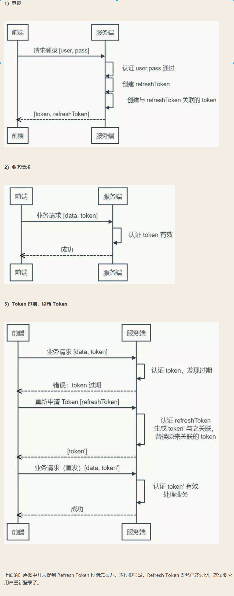
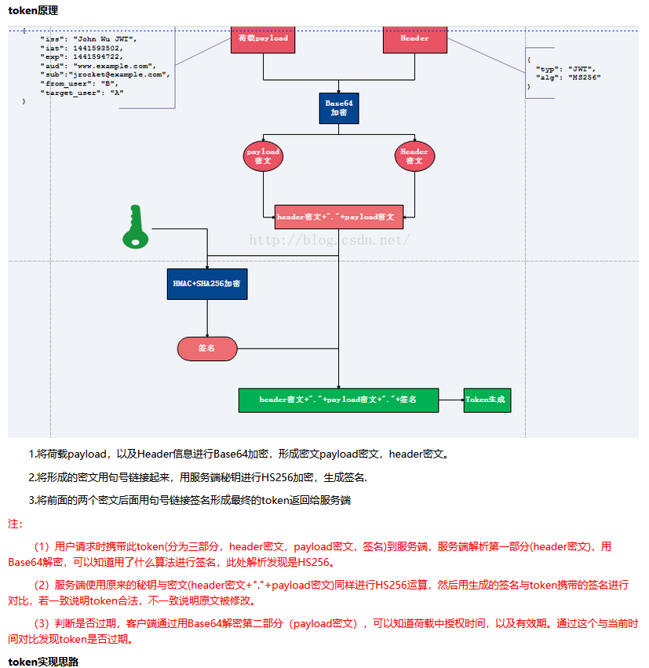
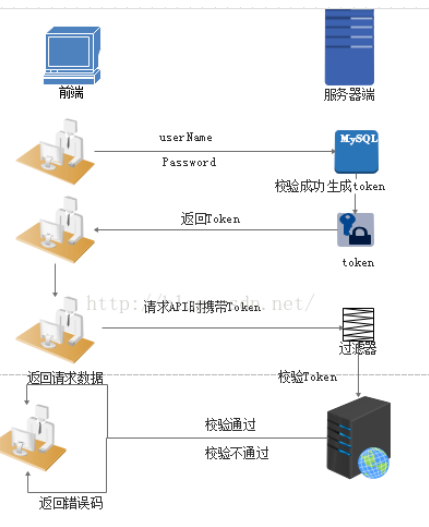

## 引入

```java
Token是在客户端频繁向服务端请求数据，服务端频繁的去数据库查询用户名和密码并进行对比，判断用户名和密码正确与否，并作出相应提示，在这样的背景下，Token便应运而生。
```

## token优势

```java
1.无状态、可扩展

        在客户端存储的Tokens是无状态的，并且能够被扩展。基于这种无状态和不存储Session信息，负载负载均衡器能够将用户信息从一个服务传到其他服务器上。如果我们将已验证的用户的信息保存在Session中，则每次请求都需要用户向已验证的服务器发送验证信息(称为Session亲和性)。用户量大时，可能会造成  一些拥堵。但是不要着急。使用tokens之后这些问题都迎刃而解，因为tokens自己hold住了用户的验证信息。

　　2.安全性

　　请求中发送token而不再是发送cookie能够防止CSRF(跨站请求伪造)。即使在客户端使用cookie存储token，cookie也仅仅是一个存储机制而不是用于认证。不将信息存储在Session中，让我们少了对session操作。token是有时效的，一段时间之后用户需要重新验证。我们也不一定需要等到token自动失效，token有撤回的操作，通过token revocataion可以使一个特定的token或是一组有相同认证的token无效。

　　3.可扩展性

　　Tokens能够创建与其它程序共享权限的程序。例如，能将一个随便的社交帐号和自己的大号(Fackbook或是Twitter)联系起来。当通过服务登录Twitter(我们将这个过程Buffer)时，我们可以将这些Buffer附到Twitter的数据流上(we are allowing Buffer to post to our Twitter stream)。使用tokens时，可以提供可选的权限给第三方应用程序。当用户想让另一个应用程序访问它们的数据，我们可以通过建立自己的API，得出特殊权限的tokens。

　　4.多平台跨域

　　我们提前先来谈论一下CORS(跨域资源共享)，对应用程序和服务进行扩展的时候，需要介入各种各种的设备和应用程序。Having our API just serve data, we can also make the design choice to serve assets from a CDN. This eliminates the issues that CORS brings up after we set a quick header configuration for our application.只要用户有一个通过了验证的token，数据和资源就能够在任何域上被请求到。Access-Control-Allow-Origin: *
　　5.基于标准

　　创建token的时候，你可以设定一些选项。我们在后续的文章中会进行更加详尽的描述，但是标准的用法会在JSON Web Tokens体现。最近的程序和文档是供给JSON Web Tokens的。它支持众多的语言。这意味在未来的使用中你可以真正的转换你的认证机制
```


## token概述

### 介绍

```java
概述
    Token是服务端生成的一串字符串，以作客户端进行请求的一个令牌，

目的
    目的是为了减轻服务器的压力，减少频繁的查询数据库，使服务器更加健壮。
其他
    把传过来的Token放在上下文中啊 过来就先比较字符串嘛 相等了就等于登录成功嘛 不同再去查数据库
    
优势    
    Token 完全由应用管理，所以它可以避开同源策略
    Token 可以避免 CSRF 攻击(http://dwz.cn/7joLzx)
    Token 可以是无状态的，可以在多个服务间共享
```

### 分类

```java
分类
    有状态
    	有状态的，即在服务端需要保存并记录相关属性
    无状态
    	JWT 
```


### 产生s使用

```java
产生
    Token 是在服务端产生的
使用
    首次：登录后，
    	前端： 使用用户名/密码向服务端请求认证
    	后端： 认证成功，服务器生成一个Token便将此Token返回给客户端，
    以后：
    	前端可以在每次请求的时候带上 Token 证明自己的合法地位， 无需再次带上用户名和密码。

    	
```

### 生命周期

```java
 Token 在服务端持久化（比如存入数据库），那它就是一个永久的身份令牌。
     
     
有效期
     Token 都需要设有效期，时间根据系统的安全需要，尽可能的短，但也不能太短
     登陆缓存： Token 的过期时保存在缓存或者内存中。
     refresh token:可以避免频繁的读写操作
        
```

### refresh token

```java
介绍
     服务端不需要刷新 Token 的过期时间，一旦 Token 过期，就反馈给前端，前端使用 Refresh Token 申请一个全新 Token 继续使用。
    这种方案中，服务端只需要在客户端请求更新 Token 的时候对 Refresh Token 的有效性进行一次检查，大大减少了更新有效期的操作，也就避免了频繁读写。
    当然 Refresh Token 也是有有效期的，但是这个有效期就可以长一点了，比如，以天为单位的时间。
    
设置更复杂的机制
    Refresh Token 每次使用的时候，都更新它的过期时间，
    直到与它的创建时间相比，已经超过了非常长的一段时间（比如三个月），
    这等于是在相当长一段时间内允许 Refresh Token 自动续期。
```



## token原理



## token 实现

### 概述

```java
// 常见方法
1、用设备号/设备mac地址作为Token（推荐）
2、用session值作为Token  
```

### 1、用设备号/设备mac地址作为Token（推荐）

```java
客户端：
    客户端在登录的时候获取设备的设备号/mac地址，并将其作为参数传递到服务端
服务端：
    服务端接收到该参数后，便用一个变量来接收同时将其作为Token保存在数据库，并将该Token设置到session中，
    客户端每次请求的时候都要统一拦截，并将客户端传递的token和服务器端session中的token进行对比，
    	如果相同则放行，不同则拒绝。
分析
    此刻客户端和服务器端就统一了一个唯一的标识Token，而且保证了每一个设备拥有了一个唯一的会话
    优点
    	客户端不需重新登录，只要登录一次以后一直可以使用，至于超时的问题是有服务器这边来处理，
    	/*
    		服务器的Token超时后，服务器只需将客户端传递的Token向数据库中查询，
    		同时并赋值给变量Token，如此，Token的超时又重新计时。
    	*/
    缺点
    	客户端需要带设备号/mac地址作为参数传递，而且服务器端还需要保存
```

### 2、用session值作为Token

```java
客户端：
    客户端只需携带用户名和密码登陆即可。

服务端：
    接收到用户名和密码后并判断，
    如果正确了就将本地获取sessionID作为Token返回给客户端，客户端以后只需带上请求数据即可。

分析：
    优点
    	这种方式使用的好处是方便，不用存储数据，
    缺点
    	当session过期后，客户端必须重新登录才能进行访问数据。

```

## 使用

### session 共享 -- 扩展性

```java
介绍
    session 用在单机当然没有问题，
    如果是服务器集群，或者是跨域的服务导向架构，就要求 session 数据共享，每台服务器都能够读取 session。
案例
    A 网站和 B 网站是同一家公司的关联服务。
    现在要求，用户只要在其中一个网站登录，再访问另一个网站就会自动登录
    
方法
// 方案一    
	session 数据持久化， 写入数据库或别的持久层，各种服务收到请求后，都向持久层请求数据。
        这种方案的优点是架构清晰，缺点是工程量比较大。
        另外，持久层万一挂了，就会单点失败。
// 方案二
    服务器索性不保存 session 数据了，所有数据都保存在客户端，每次请求都发回服务器
    	代表方案： jwt
```


### 重复提交

```java
// 网络不好或者并发请求时会导致多次重复提交数据
// 将session和Token套用
```


## 使用流程

### 有状态

```java
客户端
    使用用户名跟密码请求登录
服务端
    收到请求，去验证用户名与密码
    // 以某种方式比如随机生成32位的字符串作为token，
    // 存储到服务器中，并返回token到APP，
	验证成功: 服务端会签发一个 Token，再把这个 Token 发送给客户端
	服务器上token设置一个有效期，每次APP请求的时候都验证token和有效期        
客户端
        收到 Token 以后可以把它存储起来，比如放在 Cookie 里或者 Local Storage 里
        
// 再次请求        
客户端
    每次向服务端请求资源的时候需要带着服务端签发的 Token
服务端
	收到请求，然后去验证客户端请求里面带着的 Token，
    如果验证成功，就向客户端返回请求的数据
        

```



### 无状态

```java
介绍
    基于token的鉴权机制类似于http协议也是无状态的，它不需要在服务端去保留用户的认证信息或者会话信息
    基于token认证机制的应用不需要去考虑用户在哪一台服务器登录了，这就为应用的扩展提供了便利。
    
流程
    浏览器
    	用户使用账号密码请求服务器
    服务器
    	验证用户信息
    	发丝报告给用户一个 token
	浏览器
    	存储 tooken, 每次请求附送上 token 值
```


## 参考

```java
https://www.jianshu.com/p/24825a2683e6
https://www.cnblogs.com/lufeiludaima/p/pz20190203.html
```

