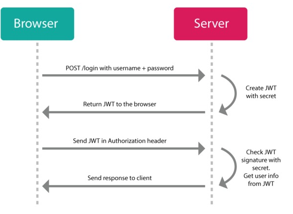

## 官网

```java
https://jwt.io/


```


## session 问题

```java
session
    用户认证后， 服务端都会记录，以备下次用户请求鉴别
    通常 session 保存在内存中，随着用户增多，服务端开销会变大
    
session 扩展性
    // 场景
    session 单机当然没有问题，对于多服务结构，无法解决多服务器 session 共享
	即： 增加新的服务器， 无法很好做到 session 共享，
    jwt 就是一种解决方案
CSRF
    session 基于 cookie 进行用户识别
    cookie 被截获， 用户就会很容易受到跨站请求伪造的攻击。
```

## jwt优点

```java
因为json的通用性，所以JWT是可以进行跨语言支持的，像JAVA,JavaScript,NodeJS,PHP等很多语言都可以使用。
因为有了payload部分，所以JWT可以在自身存储一些其他业务逻辑所必要的非敏感信息。
便于传输，jwt的构成非常简单，字节占用很小，所以它是非常便于传输的。
它不需要在服务端保存会话信息, 所以它易于应用的扩展


```


## jwt

### 概述

```java
名称
    Json web token (JWT),
	即JSON Web令牌，是一种自包含令牌
介绍
	基于JSON，对token进行设计的开放标准（(RFC 7519)   
作用
    最重要的作用就是对 token信息的防伪作用
```

### 结构

#### 介绍

```java
构成
    // 三部分构成
    第一部分： 头部 header
    第二部分： 载荷 payload	存放有效信息的地方
    第三部分： 签证 signature  （签名信息、签名、签证）
    
//====
Base64URL
    Base64 有三个字符+、/和=，在 URL 里面有特殊含义，
    所以要被替换掉：=被省略、+替换成-，/替换成_ 。这就是 Base64URL 算法。
```

#### 头部

```java
承载信息
    声明类型
    声明的加密算法
使用
    将头部进行base64加密（该加密是可以对称解密的),构成了第一部分.
完整头部信息如下
    {
        'typ': 'JWT',  // 属性表示这个令牌（token）的类型（type）
        'alg': 'HS256'  // 属性表示签名的算法（algorithm），默认是 HMAC SHA256（写成 HS256）
    }

```

#### 载荷

```java
介绍
    存放有效信息的地方，就像货车的车厢
包含内容  
    // 参看补充
    标准中注册的声明
    公共的声明
    私有的声明
使用
    将其进行base64加密，得到Jwt的第二部分。
特点
    JWT 默认是不加密的，任何人都可以读到，所以不要把秘密信息放在这个部分。
例子
    {
      "sub": "1234567890",
      "name": "John Doe",
      "admin": true
    }
// === 补充 ===
标准中注册的声明（建议，但不强制使用）
    iss: jwt签发者
    sub: jwt所面向的用户
    aud: 接收jwt的一方
    exp: jwt的过期时间，这个过期时间必须要大于签发时间
    nbf: 定义在什么时间之前，该jwt都是不可用的.
    iat: jwt的签发时间
    jti: jwt的唯一身份标识，主要用来作为一次性token,从而回避重放攻击。
公共声明
        可以添加任何的信息，
        一般添加用户的相关信息或其他业务需要的必要信息.
        但不建议添加敏感信息，因为该部分在客户端可解密.
        
私有声明
        提供者和消费者所共同定义的声明，
        一般不建议存放敏感信息，
        因为base64是对称解密的，意味着该部分信息可以归类为明文信息。
```

#### 签名信息

```java
内容    
    header (base64后的) 加密后的头部
    payload (base64后的) 加密后的载荷
    secret   加盐值，这个密钥只有服务器才知道，不能泄露给用户
    连接符  .
    
secret
    // jwt的签发生成也是在服务器端的
    secret是保存在服务器端的，是用来进行jwt的签发和jwt的验证
    是你服务端的私钥，在任何场景都不应该流露出去。
    一旦客户端得知这个secret, 那就意味着客户端是可以自我签发jwt了。
    


    
例子
// javascript ： 结果 xxx.xxx.xxx
HMACSHA256(
  base64UrlEncode(header) + "." +
  base64UrlEncode(payload),
  secret)
    
```

## jwt 应用

### 格式

```java
浏览器存储
    以储存在 Cookie 里面，也可以储存在 localStorage。
    
浏览器通信发送
    1. 放在 Cookie 里面自动发送，但是这样不能跨域，
    2. 放在 HTTP 请求的头信息Authorization字段里面。
    3. 跨域的时候，JWT 就放在 POST 请求的数据体里面。
    4. 可以放在 url 中发送


一般是在请求头里加入Authorization，并加上Bearer标注：
fetch('api/user/1', {
  headers: {
    'Authorization': 'Bearer ' + token
  }
})

```

### 业务流程

```java

{
  "姓名": "张三",
  "角色": "管理员",
  "到期时间": "2018年7月1日0点0分"
}

服务器认证以后，生成一个 JSON 对象（如上），发回给用户
用户与服务端通信的时候，都要发回这个 JSON 对象。服务器完全只靠这个对象认定用户身份。
    为了防止用户篡改数据，服务器在生成这个对象的时候，会加上签名（详见后文）。    
服务器就不保存任何 session 数据了，也就是说，服务器变成无状态了，从而比较容易实现扩展。    
```



### 注意

```java

    不应该在jwt的payload部分存放敏感信息，因为该部分是客户端可解密的部分。
    保护好secret私钥，该私钥非常重要。
    如果可以，请使用https协议

        
（1）JWT 默认是不加密，但也是可以加密的。生成原始 Token 以后，可以用密钥再加密一次。

（2）JWT 不加密的情况下，不能将秘密数据写入 JWT。

（3）JWT 不仅可以用于认证，也可以用于交换信息。有效使用 JWT，可以降低服务器查询数据库的次数。

（4）JWT 的最大缺点是，由于服务器不保存 session 状态，
        因此无法在使用过程中废止某个 token，或者更改 token 的权限。
        也就是说，一旦 JWT 签发了，在到期之前就会始终有效，除非服务器部署额外的逻辑。

（5）JWT 本身包含了认证信息，一旦泄露，任何人都可以获得该令牌的所有权限。
        为了减少盗用，JWT 的有效期应该设置得比较短。
        对于一些比较重要的权限，使用时应该再次对用户进行认证。

（6）为了减少盗用，JWT 不应该使用 HTTP 协议明码传输，要使用 HTTPS 协议传输。
```


## 参考

```java
https://www.jianshu.com/p/576dbf44b2ae
```

