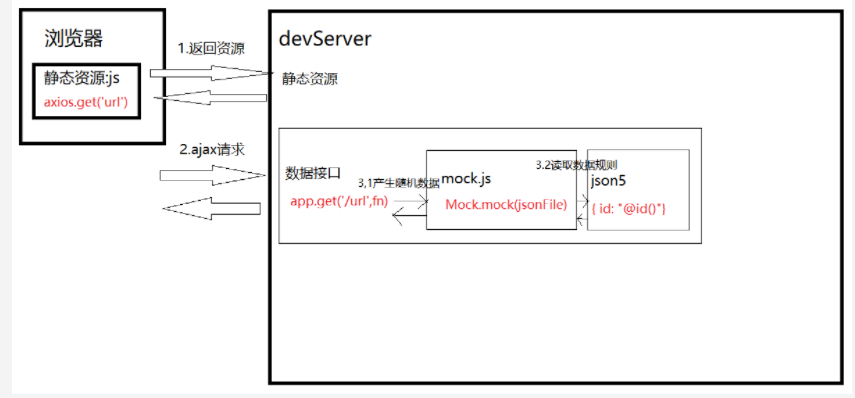

## 整合

### main.js

```java
// 将 mock 文件夹中的 index 文件加载进来， 在 main.js 加载的时候，就会加载这个文件
// 不用的时候，注释掉即可
import './mock/index'   
    
//     
Vue.config.productionTip = false
```

### mock/index.js

```java
import Mock from 'mockjs';
console.log('mock启动了')


// 配置返回数据 第一个参数是要匹配的url(可以使用正则匹配)，第二个参数是要返回的数据
/*
rurl 
	当无法拦截的时候， 可以设置如全部的请求，这样直接拦截
	例子：'http://www.ccc.com/a'
	相对路径
		/a

*/ 
Mock.mock('http://www.ccc.com/a', 'get', ()=> {
    return {
        username: 'ayaan',
        age: 18,
        gender: '男',
        type: '帅'
    }

});

Mock.mock('/login', 'post',  {

        success: true,
        code: 2000,
        data: {
            username: 'ayaan',
            age: 18,
            gender: '男'
        }

});


```

## 优化整合

### mock -- 数据.js

```java
// mock/modules/user
// 用户登陆的时候 保存用户的基本信息
const setUserInfo = (options) => {
    const userInfo = [
        {
            id: 9527,
            username: "admin",
            password: "admin",
            nickname: "小火车况且况且",
            token: "admin-token",
            avatar:"https://wpimg.wallstcn.com/f778738c-e4f8-4870-b634-56703b4acafe.gif"
        }
    ]
    return userInfo
}

// 获取用户信息, 路由信息
const getUserInfo = options => {
    console.log(options)
    return 1234
}

export default {
    setUserInfo,
    getUserInfo
}

```

### mock -- 数据 .json

```java
const fs = require('fs');
const path = require('path');
const JSON5 = require('json5');

//读取json文件
function getJsonFile(filePath) {
    //读取指定json文件
    var json = fs.readFileSync(path.resolve(__dirname,filePath), 'utf-8');
    //解析并返回
    return JSON5.parse(json);
}

var json = getJsonFile('./userInfo.json5');
console.log('json', json)
 
// json 文件    
{
	id: "@id()",//得到随机的id,对象 
     username: "@cname()",//随机生成中文名字 
     date: "@date()",//随机生成日期 
     avatar: "@image('200x200','red','#fff','avatar')",//生成图片,参数:size, background, foreground, 
     text description: "@paragraph()",//描述 
     ip: "@ip()",//IP地址 
     email: "@email()"//email     
}    

```


## ===========

### 介绍

### mock -- 引入拦截

```java
// 新建 mock 文件夹， 专门用来存放 mock 测试数据
//  mock/index.js

	// mockjs 导入依赖模块
    import Mock from 'mockjs'
    // json 数据文件， 可以放在 user.js 文件中
    import user from "./modules/user"    

        
   Mock.setup({
        timeout: 800 // 设置延迟响应，模拟向后端请求数据
    })
    
    // const getBaseURL = 'http://localhost:9527/mock'
    Mock.mock(`${getBaseURL}/user/login`, "post", user.setUserInfo)     
    Mock.mock(RegExp(getBaseURL + '/user/userInfo' + '.*'), "get", user.getUserInfo)
	Mock.mock("", "", {
         id: "@id()",//得到随机的id,对象 
         username: "@cname()",//随机生成中文名字 
         date: "@date()",//随机生成日期 
         avatar: "@image('200x200','red','#fff','avatar')",//生成图片,参数:size, background, foreground, 
         text description: "@paragraph()",//描述 
         ip: "@ip()",//IP地址 
         email: "@email()"//email 
    })   
        
// 下面的貌似不需要        
//    export default {
//        Mock
//    }
```


### 项目根目录 -- main.js

```java
// 貌似不用，发起 ajax 请求可以直接拦截
import '@/mock' // 导入 mock  不需要的时候注释
Vue.config.productionTip = false

```

## vue - cli 跨域引入



