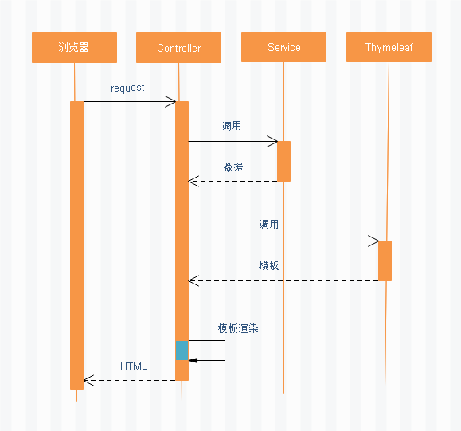
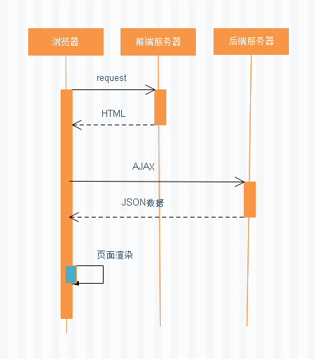
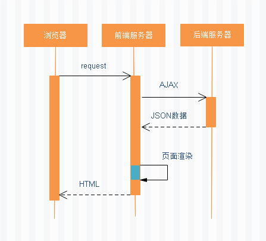

## 概念

### 路由

```java
普通路由
    路由 ： 决定数据包来源到目的地的路径
    传送  ：将输入端的数据局转移到合适的输出端
路由表
    介绍：
    	本质是一个映射表，决定了数据包的指向
	    还有一个 内网ip  ，电脑 ac 地址 ，相互一一对应()
web 路由
    介绍
    	是一个映射表，决定了 url 指向的页面或者内容 // 处理 url 对应关系的
    	这个映射表，实现了出现不同的 url 请求，对应不同的处理页面 // 多路复用
    理解
    	就像电梯门口的密码锁， 同一把密码锁，输入不同的密码可以打开不同的房间
    	密码锁内部就有一个 密码--房间 的映射关系
```

### 前后端分离

```java
前端
	Web前端, APP端, 桌面端等一切属于用户界面的这一层
后端
	即服务器端, 指一切属于用户界面之下的这一层
    
API
	就是前后端进行交互的方法 ，这些方法就叫 api 
    API通常是以Http的形式提供，它隐藏的含义就是，只要你符合我定义的标准，你就可以来使用我。
	于对外接口暴露的问题（此接口并非指java中的interface，而是指用户编程时可使用的接口）
    
api 接口    
    前端与后端进行数据交互的统称, 也叫做数据接口
	属于一种远程调用, 一般指前端通过HTTP(ajax)请求获取到的数据或者执行的某项操作
    // 前端接口
        // 假设使用 ajax 进行前后端分离， export 对象中有许多函数
        // 在某处调用 getName 这个方法(接口) ， 就可以实现向后端发送请求
        export default {
            function getName() {
                return request({
                    url: '/username',
                    method: 'get'
                })
            }
        }
	// 后盾接口
		// 该方法进行请求的处理，就叫该方法为接口
		@RestController   @GetMapping("/username")
		public R getUserName() { ... }
		

   
接口规范
	内容一般包含接口的地址, 接口的输入参数和输出的数据格式(结构)
	// 注意 ：谁主张起草都行，最重要的是双方进行接口规范确认
前后端分离
	后端来实现这些规范, 为前端提供符合规范的接口
// ----自己的理解---------------------------


axios
	把数请求给浏览器 ，浏览器得到 axios 数据， 后端得到axios数据进行处理再返回
// 这之间在纠结啥，当时想了，但是现在忘记了
    
```

### 模板渲染

```java
模板 
    // HTML代码＋逻辑控制代码
    htMl代码
    逻辑控制代码
    	不分离： java
    	分离：   js(衍生出来 vue 等框架)
    
模板渲染    
    // 数据+模板 拼接成 字符串
    通过逻辑控制代码，将数据填充到模板中，使 html 页面带有真实的数据
浏览器
    // 充当什么角色
    浏览器只是一个平台, 
    解析
	渲染    
     
            
```


## 后端服务器渲染 -- 后端路由

```java
服务端渲染
    又称SSR (Server Side Render)是在服务端完成页面的内容渲染，而不是在客户端完成页面内容的渲染。
	SSR并不是前端特有的技术，我们学习过的JSP技术和Thymeleaf技术就是典型的SSR
    
特点
    在服务端生成html网页的dom元素
    客户端（浏览器）只负责显示dom元素内容 
    
优缺点
    // 缺点
    1. 整个页面的模块有后端人员来编写和维护
    2. 前端人员如果要开发网页，需要通过 PHP Java 编写页面代码
    3. 通常情况下，HTML 代码和数据以及对应的逻辑混合在一起，维护起来很糟糕   
        
   // 优点：
    	有利于SEO，网站通过href的url将搜索引擎直接引到服务端，服务端提供优质的网页内容给搜索引擎。
   // 适用场景：
    	对SEO有要求的系统，比如：门户首页、商品详情页面等。   
    
    
    
服务端
    1. 含有前端 html(类)的页面
    2. 即后端处理 URL 和页面之间的映射关系
    
// 过程
用户：
    通过地址栏或者页面的按钮、表单等发起请求： js html
浏览器： 
    将一个页面的 url 发送到服务器: 包装为 http 请求
	接收到 http 响应，response 的body 中的 html 代码，进行解析
    解析过程中会遇到css、js等， 会再次向后端发起请求，后端（webserver） 找到对应文件，发送回来        
服务端
    1. 根据正则对该URL进行匹配
    2. 交给一个 Controller 进行处理：
    	thymeleaf 调用：thymeleaf      调用对应的模板，寻找对应的 html 页面模板
    	service   调用： mapper（dao）  生成对应的数据
    	模板渲染       ： 将数据填充入模板， 生成完备的 html 页面, 返回浏览器
         //  ==》 完成一次 I/O
浏览器
    拿到完备的页面， 进行 css 装饰显示
        
// =============
网页通常是通过后端路由直出给客户端浏览器的。也就是网页的html一般是在后端服务器里通过模板引擎渲染好再交给前端的。至于一些其他的效果，是通过预先写在页面里的jQuery、Bootstrap等常见的前端框架去负责的。        
```



## 浏览器(前端)渲染 -- 前后端分离

```java
介绍
    随着  Ajax 出现, 出现前后端分离模式
    客户端（浏览器） 
    	使用AJAX向服务端发起http请 求，
   		获取到了想要的数据，开始渲染html网页，生成dom元素，并最终将网页内容展示给用户。
过程    
    后端服务器
    	只提供API来返回数据， 一般为 json 格式
    前端服务器
    	存放静态资源，返回 html 模板
    浏览器
    	通过Ajax获取数据，前端写的 js 代码在浏览器中执行，
    	渲染： 将获取的数据 填充入 html 模板
    	展示： 将 html 全页面， 结合 css 进行显示
优势
    后端专注于数据 ，不用关心用户界面的内容，有利于提高服务端的开发效率。 
    前端专注于页面交互和可视化上， 用户体验性好
	当移动端(ios/android)出现后 , 后端不需要任何处理，依然使用之前的API即可
缺点
    不利于网站进行SEO，因为网站大量使用javascript技术，不利于搜索引擎抓取网页
适用场景：
    对SEO没有要求的系统，比如后台管理类的系统，如电商后台管理，用户管理等。  
    
    
// 
    浏览器从服务端拿到的html。这里面空荡荡的只有一个<div id="app"></div>
    这个入口的div以及下面配套的一系列js文件。
    所以你看到的页面其实是通过那些js渲染出来的。这也是我们常说的前端渲染。    
```




## 前端服务器渲染 -- 前端路由

```java
前端服务器：静态资源服务器
	// html + css + js -->url1
	// html + css + js -->url2
	index.html + css + js -->url1
    
单页面富应用
    整个页面只有一个html 页面， 但是第一次加载速度比较慢
前端路由
    单页面富应用阶段  SPA   =  掐后端分离 + 前端路由 （前端维护的一套规则）
    前端管理映射关系
    	当页面执行一个操作时 ， 浏览器生成一个 URL ，
    	通过 js 代码判断 ，从请求下来的资源 抽离需要显示的东西 ，进行显
    
执行流程
// 从客户端请求到Nuxt.js进行服务端渲染的整体的工作流程    
1）用户打开浏览器，输入网址请求到Node.js中的前端View组件
2）部署在Node.js的应用Nuxt.js接收浏览器请求，并请求服务端获取数据 
3）Nuxt.js获取到数据后进行服务端渲染 
4）Nuxt.js将html网页响应给浏览器    
    
    
// =========
前端
	把所有的 HTML css js 全部下载下来，但是并不是全部执行
    使用哪个，就抽离哪一个
后端 
	只提供 API 服务器    
```



## 参考

```java
前后端接口规范
	https://blog.csdn.net/xs18952904/article/details/88954376
```


## // ==

## 介绍

```java
前后不分离
    通过引入的方式使用vue，也就是本文实现的方式
前后半分离
    前后端项目写在一个项目里，分别搭建工程，
    前端项目也通过tomcat部署管理，
    后端工程师使用起来比较得心应手，且前端项目拆分时也比较方便
    // 可以参考：https://github.com/xichengxml/springboot-vue-template，
前后分离。
    前后端分别搭建项目，不多介绍
```


## 不分离

```java
通过
	后端
    	只是进行数据查询操作
    	需要同时通过后端的的模板渲染引擎进行：数据和页面的结合
    前端
    	只负责展示
```


## 分离

```java
通过
	后端
    	只是进行数据查询操作
    前端
    	进行数据渲染，使用前端自己的模板
```

