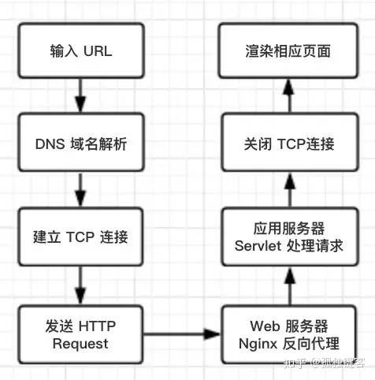

## 一个web请求的必经之路

```js
// 从用户在浏览器中输入 URL 地址，然后浏览器找到服务器地址，并发起请求；
	输入 URL --> DNS 域名解析 --> 建立 TCP 连接 --> 发送 HTTP Request 给服务器
// 分析请求在达反向代理服务器内部处理；
	发送 HTTP Request 给服务器 --> web服务器 Nginx 反向代理 --> 应用服务器 Servlet 处理请求
// 最后到请求在服务器端处理完成后，浏览器渲染响应页面过程
    应用服务器 Servlet 处理请求 --> 关闭 TCP 连接 --> 渲染响应页面

// DNS 域名解析参看 tcp_ip 协议 / ip 协议 / dns
// tcp 连接  ：web / 协议 / tcp 协议
```




## 简单流程

```js
前端	
	// DNS 域名解析
	1. 浏览器通过 DNS 把域名解析为对应的 IP 地址
    2. 根据这个 IP 地址在互联网上找到相应的服务器，建立 socket 连接
    3. 客户端向服务器发送 HTTP 协议请求包， 请求服务器里的资源文档
后端
	4. 服务端处理
    	有复杂的业务逻辑，指定哪一台服务器处理请求， 设计负载均衡设备来平均分配所有的用户
        请求的数据在分布式缓存里、静态文件、数据库中
    5. 返回数据
    	浏览器拿到返回数据，进行解析发现静态文件，还会请求 CDN ，CDN 服务器处理请求
断开
	客户端与服务器断开，客户端解释 html 文档，客户端屏幕渲染数据
```


## 没有整理的知识点

```js
https://zhuanlan.zhihu.com/p/61927945

https://zhuanlan.zhihu.com/p/129856333

https://zhuanlan.zhihu.com/p/133906695
```


