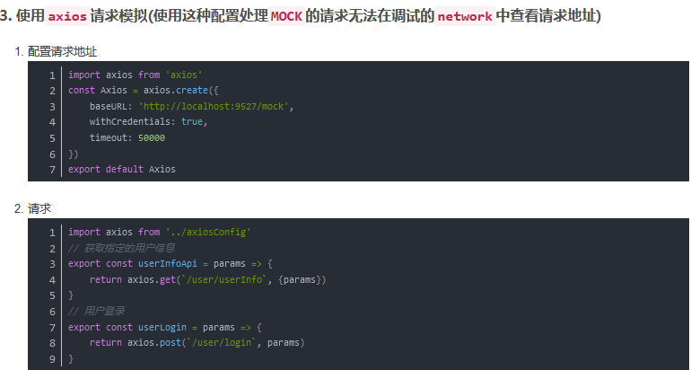

## 介绍

```java
从 1.0 开始，Mock.js 通过覆盖和模拟原生 XMLHttpRequest 的行为来拦截 Ajax 请求，
不再依赖于第三方 Ajax 工具库（例如 jQuery、Zepto 等）。
```


## 安装

```java
方法一
    <script src="http://mockjs.com/dist/mock.js"></script>
        
方法二
	//使用axios发送  ajax
	  	cnpm install axios --save
	//使用mockjs产生随机数据
	  	cnpm install mockjs --save-dev
	//使用json5解决json文件,无法添加注释问题
	  	cnpm install json5 --save-dev    
```

## api 介绍

### mock

```java
Mock.mock( rurl?, rtype?, template|function( options ) )
    
rurl
    需要拦截的 URL，可以是 URL 字符串或 URL 正则
rtype
    表示需要拦截的 Ajax 请求类型
template
    表示数据模板，可以是对象或字符串。例如 { 'data|1-10':[{}] }、'@EMAIL'。
function(options)  
    表示用于生成响应数据的函数。
    指向本次请求的 Ajax 选项集，含有 url、type 和 body 三个属性
    返回值
    	/*
            注意最后一个参数，不管是函数，还是表达式

            return {}
            {}
            这个对象就是响应体中的 data
            //  console.log(response):
                    config
                    data		// {} 就是其中的数据
                    headers
                    request
                    status
                    statusText
        */   
    options
    	options --> { url, type, body }
		获取响应参数使用
    
// 注意 
    function(options) {
     // return si[0] ===  return Mock.mock(si[0])
	}
```

## 参数获取

```java
获取参数，需要返回的数据模板是函数
    
// 请求地址 http://localhost:9527/mock/user/userInfo?userId=9527
const base = 'http://localhost:9527/mock/user/userInfo?userId=9527' 
请求地址
    正则 /\api\/get\/news/  包含这个类路径的请求都会被拦截
    星号 '/user/userInfo' + '.*'
    
    
Mock.mock('/login', 'get', options=> {
	  	console.log(options)
	// 利用解构 {url, type, body} = options
    body: null
    type: "GET"
    url: "/login" // 第一个参数写的是啥(/login)， 显示啥(/login)，不存在拼接什么的，
        
	// 根据 url 获取 query 参数
	

});
```

### `GET`请求和参数获取

```java
GET请求带参数
    参数获取: 需要借助于NodeJS的querystring模块
        

// 请求地址http://localhost:9527/mock/user/userInfo?userId=9527 获取的参数为{userId: "9527"}    
// 方法一        
import qs from 'querystring'
Mock.mock(RegExp(getBaseURL + '/user/userInfo' + '.*'), "get", options => {
	const {url} = options
    // 获取 ？ 前后的内容分成两部分，问号前一部分，问好后一部分
    const getParams = url.split('?')[1]
    // 将键值对转换为对象, 获取到参数
    console.log(qs.parse(getParams)) // {userId: "9527"}
})
    
// 方法二  
Mock.mock(RegExp(getBaseURL + '/user/userInfo' + '.*'), "get", options => {
    	const {url} = options
	    const queryParam = getQuery(url, 'userId')
})        
        
getQuery(url, name) {
	const index = url.indexOf('?')        
	if (index !== -1){
        const resStr = url.substr(index+1).split('&') // 得到数组，就是参数列表
        // 循环遍历，再进行切割 split('=')
    }
}
```


### `POST`请求和参数获取

```java
POST的参数都是
    保存在options.body中,以JSON字符串形式保存的,
	需要使用JSON.parse(options.body)转换
        
Mock.mock(`${getBaseURL}/user/login`, "post", options =>{
	const getUserInfo = JSON.parse(options.body)
})      

        
//========================================================
const data = Mock.mock({
  "list|20-60": [
      {}]
})    
Mock.mock('/api/add/news', 'post', (options) => {
  let body = JSON.parse(options.body)
  
  data.list.push(Mock.mock({
    "id": '@increment(1)',
    "title": body.title,
    "content": body.content,
    "add_time": "@date(yyyy-MM-dd hh:mm:ss)"
  }))

  return {
    status: 200,
    message: '添加成功',
    list: data.list
  }
})        
```

### 注意

```java
但是netWord里面是找不到请求的, 因为这是假的ajax！
    
// 注意及时打印 response    
```




## node文件读取 json 文件

```java
const fs = require('fs');
const path = require('path');
const JSON5 = require('json5');

//读取json文件
function getJsonFile(filePath) {
    //读取指定json文件
    var json = fs.readFileSync(path.resolve(__dirname,filePath), 'utf-8');
    //解析并返回
    return JSON5.parse(json);
}

var json = getJsonFile('./userInfo.json5');
console.log('json', json)
```


## jquery 整合

### 介绍

### mock文件夹

```java
// index.js
// 拦截请求 + 请求方法 + 返回对象
// 返回对象位置可以是一个函数，但是需要返回一个 对象

if(window.ENV == 'true'){
    Mock.mock('/user/userinfo','get',{
        id: "@id()",//得到随机的id,对象
        username: "@cname()",//随机生成中文名字
        date: "@date()",//随机生成日期
        avatar: "@image('200x200','red','#fff','avatar')",//生成图片,参数:size, background, foreground, text
        description: "@paragraph()",//描述
        ip: "@ip()",//IP地址
        email: "@email()"//email
    })
    Mock.mock('/todo/addTask','post', function(options){
        return Mock.mock({
            _id: "@id()",
            title: o.title,
            complete: false
        })
    })        
}

```


### 项目

```java
index.html
        <script src="https://cdn.bootcss.com/jquery/2.2.4/jquery.min.js"></script>
	    <script src="https://cdn.bootcss.com/Mock.js/1.0.0/mock-min.js"></script>
通过添加全局变量ENV来判断    
    <script>MOCK = 'true'</script>
```

