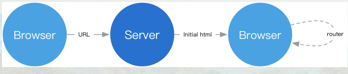

## web 路由

### 介绍

```css
Angular , react , Vue  三大前端框架都有自己路由的实现

vue-router 是基于路由和组件的
	路由用于设定访问路径，将路径和组件映射起来
    在 vue-router 的单页面应用中，页面的路径的改变就是组件的切换
```


### 发展历程

* 后端路由  -- 后端服务器渲染

    

* 前后端分离 --  浏览器渲染

    ```java
    只要在浏览器地址栏输入URL再回车，是一定会去后端服务器请求一次的。
    而如果是在页面里通过点击按钮等操作，利用router库的api来进行的URL更新是不会去后端服务器请求的。
    ```

    

    

*   前端路由 -- 前端服务器渲染


### 名词名称

*   router : 理解为一个容器，或者说一种机制，它管理了一组 route

*   route  : route 只是进行了URL和函数的映射

    ```js
    golang 中
    	设置路由 ： router（内含多路复用器） 
    	处理器函数 ：route （Controller）
    ```


### 作用

```go
1. 解析 URL(网址) ，调用对应的控制器（方法，并传递参数）(将请求分配到指定的一个端，)
2. 为 http request 中的 path_uri 与执行脚本做绑定（映射）

// 注意
	不仅会根据URL来匹配，还会根据请求的方法来看是否匹配。


// 例子
  /users        ->  getAllUsers()
  当访问 /users 的时候，去路由映射表中查找执行 getAllUsers() 函数 , 这就是一条路由
```

### 路由模式

```js
// 不太懂
hash: 
	// 使用 URL hash 值来作路由。支持所有浏览器，包括不支持 HTML5 History Api 的浏览器。
	用的是浏览器不会对#号后面的路径对服务端发起路由请求。
    例子
		http://localhost/#/user/1和http://localhost/
		其实到服务端都是去请求http://localhost这个页面的内容
	使用
    	而前端的router库通过捕捉#号后面的参数、地址，来告诉前端库（比如Vue）渲染对应的页面。
        这样，不管是我们在浏览器的地址栏输入，或者是页面里通过router的api进行的跳转，都是一样的跳转逻辑。
        所以这个模式是不需要后端配置其他逻辑的，只要给前端返回http://localhost 对应的html
		，剩下具体是哪个页面，就由前端路由去判断便可。
        

history:
	通常能见到的URL形式, 依赖 HTML5 History API 和服务器配置。
    例子
    	history.pushState()可以向浏览器地址栏push一个URL，而这个URL是不会向后端发起请求的！
        通过这个特性，便能很方便地实现漂亮的URL
	使用
    	页面里的跳转，通常是通过router的api去进行的跳转，
        router的api调用的通常是history.pushState()这个api， 所以跟后端没什么关系
        但是一旦你从浏览器地址栏里输入一个地址，
        	比如http://localhost/user/1,这个URL是会向后端发起一个get请求的。
			后端路由表里如果没有配置相应的路由，那么自然就会返回一个404了
       浏览器
	       	拿到这个html之后，router库就开始工作，开始获取地址栏的URL信息，
        	然后再告诉前端库（比如Vue）渲染对应的页面。到这一步就跟hash模式是类似的了。
            由于后端无法抛出404的页面错误，404的URL规则自然是交给前端路由来决定了

    abstract: 支持所有 JavaScript 运行环境，如 Node.js 服务器端。如果发现没有浏览器的 API，路由会自动强制进入这个模式。
```

### 路由参数传递

```js
// 就是修改 url ， 这个是 Vue 中的路由参数传递
传递参数
	params   
    query 动态网页
params 参数类型
	配置路由格式 /router/:id
    传递的方式  在 path 后面上跟上对象的值
    传递后形成路径  /router/abc

query 类型
	配置路由格式 /router 也就是普通配置
    传递的方式  对象中使用query的key 作为传递方式
    传递后形成路径  /router？id=abc
```


## 分类

### 服务端路由

```js
1. 传统模式 
	客户端发送不同请求(URL形式)给服务器 
    URL 对应服务器某个目录下的某个文件
 2. MVC 模式
 	客户端发送不同请求(URL形式)给服务器 
    WEB会截获所有的请求，不做资源存在检查，直接转发给路由程序，
总述 ：
	1. 当接收到客户端发来的HTTP请求，会根据请求的URL，来找到相应的映射函数，然后执行该函数，并将函数的返回值发送给客户端。
    2. 对于静态资源服务器，可以认为，所有URL的映射函数就是一个文件读取操作。
    3. 对于动态资源，映射函数可能是一个数据库读取操作，也可能是进行一些数据的处理，等等。
  
    
// =====================================    
    web后端，不管是什么语言的后端框架，都会有一个专门开辟出来的路由模块或者路由区域，用来匹配用户给出的URL地址，以及一些表单提交、ajax请求的地址。通常遇到无法匹配的路由，后端将会返回一个404状态码。这也是我们常说的404 NOT FOUND的由来。
```

### 前端路由

```js
通常对浏览器
	路由的映射函数通常是进行一些DOM的显示和隐藏操作
    这样，当访问不同的路径的时候，会显示不同的页面组件
方式
    带有hash的前端路由，# 及其后面的部分为 hash。
    	优点：兼容性高。
        缺点： URL带有#号不好看
    不带hash的前端路由，
    	优点：是URL不带#号，好看。
        缺点： 既需要浏览器支持也需要后端服务器支持
        //==================
	    基于 Hash  ：URL中 
        基于 History API
       //==================

特点
	1. 基于Hash的路由，兼容性更好；基于History API的路由，更加直观和正式。
    2. 基于Hash的路由不需要对服务器做改动，基于History API的路由需要对服务器做一些改造
    
    


 一些参考
 	  https://developer.mozilla.org/en-US/docs/Web/API/History_API
       https://css-tricks.com/using-the-html5-history-api/
	  history 库 ： https://github.com/ReactTraining/history
```

### 动态路由

*   介绍

    ```js
    配置路由时，一般都是直接配置固定的路径 , 但是路由路径中使用“动态路径参数” ,让路径不再是固定的 ，这样的路由就是动态路由（path不确定）
    
    例子
    	/user/zhangsan 	/user/lisi
    	把这两者映射到相同的路由中 /user/:name   
    ```

    

*   实现方法

    ```js
    // 前端控制路由
    // 后端处理路由
    ```

    

### 严格路由

```go

```


```js

        
        路由器再调用相关的控制器，控制器调用相关的服务（相关处理函数），返回视图对象，路由器再从对象中提取生成好的网页代码返回给 Web 服务器，最后返回客户端
        
        
        

不同的请求地址  ------》  路由处理  ---》对应的控制器处理

1. 当用户发送的请求，无需请求服务器，直接在页面段修改，则使用理由
2. 根据 URL 来将请求分配到指定的一个端，

2. 使用 js 不会更新 URL 
   使用 路由 URL 也是对着改变的，当用户直接赋值或者收藏当前页的 url 给被人，是有好的
3. routie	根据 url 分配到对应的处理程序

MVC 结构中，route 的会将 uri 映射到 controller，具体业务逻辑在 controller 里面进行。


路由器里根据目标IP，找到中间需要经过的路由器路径。
Web里根据网址找到能处理这个URL的程序或模块
```

## 没有整理完全的知识

```js
理解Web路由 - 「已注销」的文章 - 知乎
https://zhuanlan.zhihu.com/p/24814675
```


