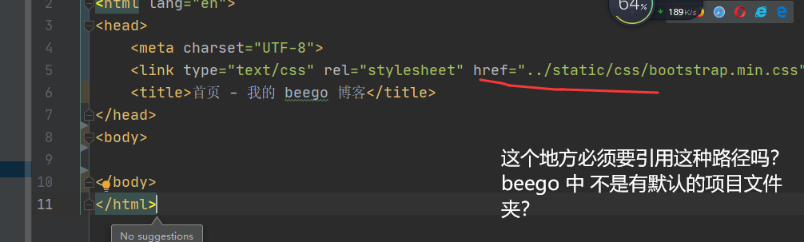
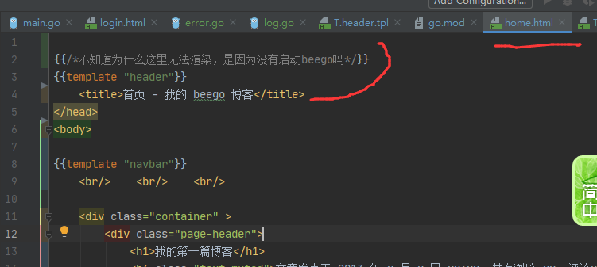
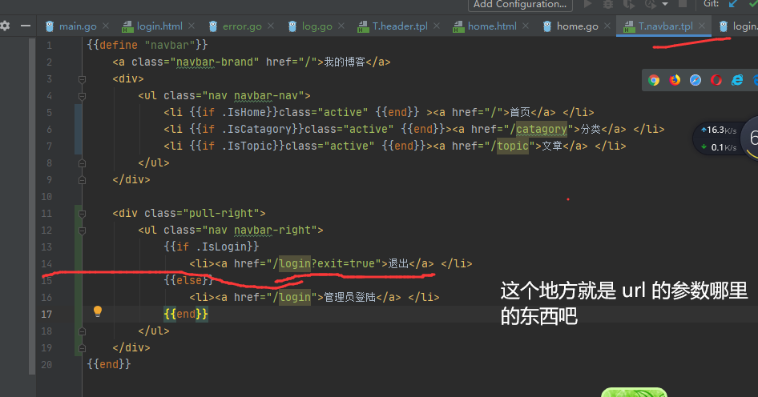
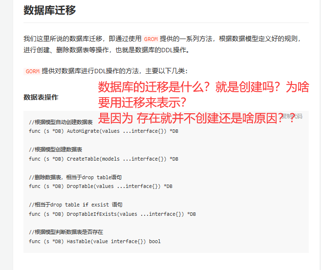

## 做过的一些操作

```go
1. 新建了 views,移动了文件目录
    修改 css js 样式，特别是引用类的文章
        这些都是直接去页面，不需要去引擎
[遇到 static ,就去点static ,去 views/staitc  这样的话，可以删除图片的前面的 ././等]
    http.Handle("/static/",http.StripPrefix("/static/",
                http.FileServer(http.Dir("views/static"))))


func CheckUserNameAndPassword(username string,password string)(*model.User,error){
    sqlStr := `select id `
    row := utils.Db.QueryRow(sqlStr)

    // 这个需要注意的 这个地方是 & ，后面也需要用 &  ？？？？
    user := &model.User{}
    row.Scan(&user.ID,&user.Username,&user.Password,&user.Email)
    return user,

nil

}

// 账户密码操作

    1. 查找账号密码，找到怎么样 ，找不到怎么样
    2. 存储账号面
```


```go
这里向 服务器发送请求 方式是 POST 这个发送到服务器的地址，服务器的什么地址？


1. 对于要操作的
    最好是启动起来页面，页面启动起来了，你才直到哪个超链接对不对，哪个页面对不对

2. 表单设置那里，使用了 js 来实现界面的情况，然后分别设置

3. 通过发送 Ajax 验证用户名是否可用
    jQuery.ajax()    
    jQuery.Get()
    jQuery.GetJSON()
  jQuery.post()
```

# 数据库连接的好操作

```go
// 这样可以直接获取全局化的数据可
var (
    Db *sql.DB
    err error
)

func init() {
    Db,err = sql.Open("mysql","root:123@tcp(localhost:3306)/bookstore0612")
    if err != nil {
        fmt.Println(" sql.Open err=",err)
    }
}
```

# 模型结构

```go
1. 为啥叫这些结构体叫模型   ？？？    
model/book.go
    type book struct {}   // 模型
    // 其实 book 的操作方法可以写在 结构体下面


dao/bookdao.go
    book 的操作方法 
```

## 问题

```js
func GetPageBooksByPrice(w http.ResponseWriter,r *http.Request){
    pageNo := r.FormValue("pageNo")
    minPrice := r.PostFormValue("min")
    maxPrice := r.PostFormValue("max")
    // 值判断
    if pageNo == "" {
        pageNo = "1"
    }

    if minPrice == "" && maxPrice == "" {
        page , _ := dao.GetPageBooks(pageNo)
    } else {
        // 获取所有图书
        page , _ := dao.GetPageBooksByPrice(pageNo,minPrice,maxPrice)
    }

    // 解析模板文件
    t := template.Must(template.ParseFiles("/views/index.html"))

    // 执行
    t.Execute(w,page)  // 为啥这个地方 Page 会报错  ？？、 

}

-------------------------------------------------

func GetPageBooksByPrice(w http.ResponseWriter,r *http.Request){
    pageNo := r.FormValue("pageNo")
    minPrice := r.PostFormValue("min")
    maxPrice := r.PostFormValue("max")
    // 值判断
    if pageNo == "" {
        pageNo = "1"
    }

    var page *model.Page
    if minPrice == "" && maxPrice == "" {
        page , _ = dao.GetPageBooks(pageNo)
    } else {
        // 获取所有图书
        page , _ = dao.GetPageBooksByPrice(pageNo,minPrice,maxPrice)
    }

    // 解析模板文件
    t := template.Must(template.ParseFiles("/views/index.html"))

    // 执行
    t.Execute(w,page)
}


----------------------------------------

                <a href="/getPageByPrice?pageNo={{.GetNextPageNo}}&min={{.MinPrice}}&max={{.MaxPrice}}">下一页</a>
问号是啥意思？ 是 web 模板里面的内容吗？ 
```

## 脚本


```js
1. test1.html 应给怎么引用
     <script src="../../static/script/jQuery/jquery-1.10.1.js">   // 就是这个

         请求头中的 cookie
         
         r.header["cookie"]


session 和 cookie 
	需要了解深入问题吗？？？
    
Tcp / ip  协议需要注意什么问题呢？


```


# 零星

```go
<div>
    <a href="/pages/manager/book_manager.html">图书管理</a>
    <a href="/">返回商城</a>
</div>


如果没有服务器，打开这个超链接就可以直接打开文件，
但是有了服务器以后，就不需要直接打开超链接的，直接给服务器发送后台管理的请求

那到底什么文件的这种链接需要
表单那个通过 action 可以进行进行传递，但是这个怎么进行传递
这个就是管理者进入后台以后，就是手动进行挑选的

manager.html

            <div>
                <a href="/getBooks">图书管理</a>
                <a href="/">返回商城</a>
            </div>    


对于图书管理，你需要列出来所有的图书，这时候，需要使用动作
{{range . }}
{{end}}


对于表单是怎么进行传递的呢？？ 


js
    进行删除


cookie 何止一次就行了吗？
	cookie  都应该用在什么地方？只是在登陆的时候用吗？
	在每一步请求的时候都要检查 cookie 吗 ？

什么时候需要判断是否登陆了？ 
怎么才能判断是否是用户进行的登陆》是需要一连串的操作码 ？还是需要每一步都要进行登陆判断？


	上下文是什么？？？应该怎么理解？？上下文是怎么运行的？ 
```


## boostrapt









```js
1. 没有引入js文件
2. css 基础知识没有扎实，晚上要进行背诵 
```

