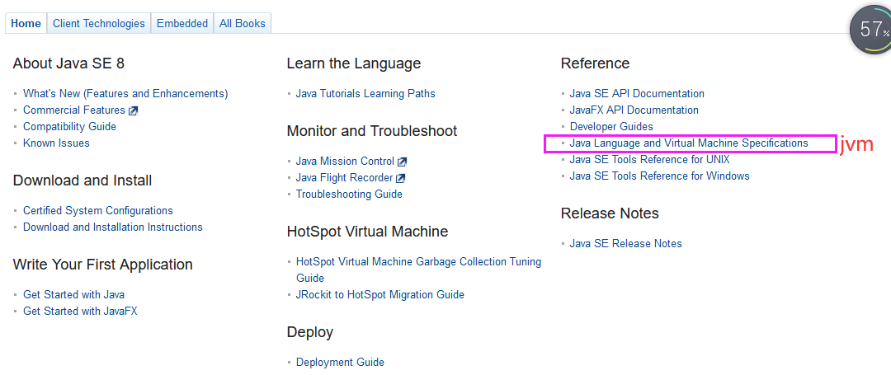
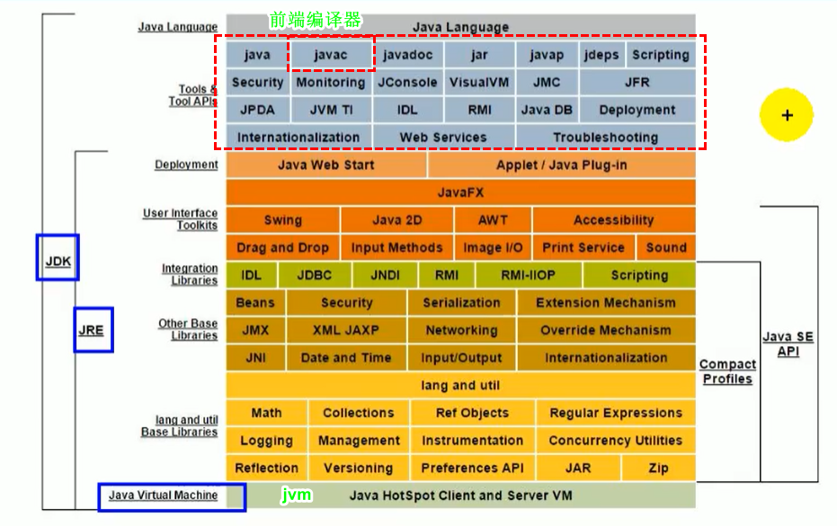
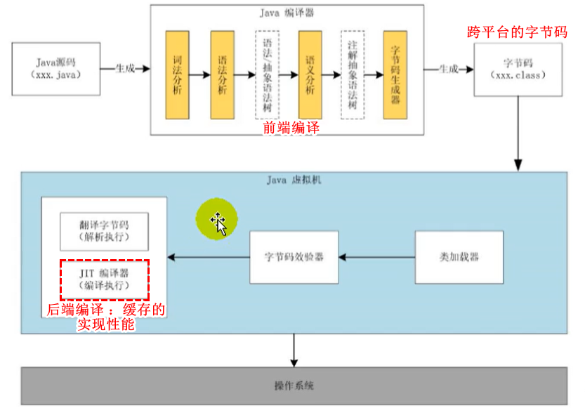

## 官网

```java
oracl
    下载页面 ：https://www.oracle.com/downloads/
java(即 javase )下载
    https://www.oracle.com/downloads/
详细页面
    https://www.oracle.com/java/technologies/javase-downloads.html


https://docs.oracle.com/javase/specs/index.html
```




## 发展

* 1990年开发 oak , 后改名为 Java
* 1996年发布 JDK1.0
* 2000年 ， jdk1.3 ， Java HotSpot Virtual Machine 正式发布 ， 称为 Java 默认的虚拟机
* 2002年， jdk1.4 , classic虚拟机退出
* 2004年 ， jdk1.5 , 改名为 Java5.0


## Java 体系结构



## Java 代码执行流程




## 未整理

```java
Java 中一个方法的执行，就是压栈，
```


