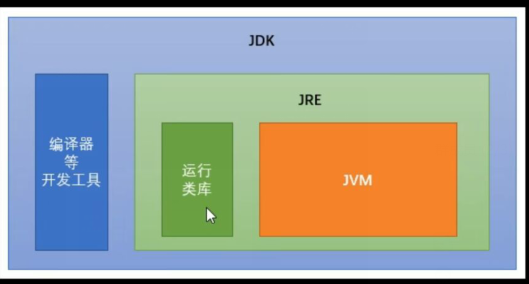
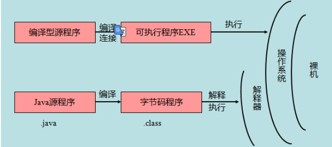

## java 发展史

* 1995年5月23日，Java语言诞生 
* 1999年6月，SUN公司发布Java的三个版本：
    * 标准版：J2SE， 开发桌面级应用（现在学的是抛开桌面应用 api 的web需要的基础）
    * 企业版：J2EE， web 程序开发
    * 微型版：J2ME， 移动终端（手机 pda）
* 2004年9月30日 ： J2SE1.5更名为J2SE5.0       
* 2005年6月，JavaOne大会召开
    * 企业版：J2EE 更名为Java EE, 
    * 标准版：J2SE更名为Java SE，
    * 微型版：J2ME更名为Java ME
* 2006年11月13日，SUN公司宣布Java全线采纳GNU General Public License Version 2，从而公开了Java的源代码。 
* 2011   jdk7
* 2014  jdk8.0
* 2017 jdk9.0 最大限度实现模块化
* 2018.3 jdk10.0  版本号 18.3

## 特点

* 面向对象
* 分布式
* 安全、健壮
* 体系中立
* 可移植
* 解释型、动态
* 多线程、高性能

## 名词介绍

* JVM
    * java 跨平台虚拟机

* JRE 
    * java runtime  environment
    * java 程序运行时环境， 包含JVM + 需要的核心库
* jdk
    * java development kit
    * java 程序开发工具包
    * 包含 JRE



## Java 程序

* 认为是一系列对象的集合，而这些对象通过调用彼此的方法来协同工作




## 主要理解

```java
// 这是我自己理解的

类
    成员变量
    成员方法
接口
    成员变量
    成员方法
```


## C 、 C++ 、Java

* C语言这种的面向过程语言的最大的优势就是适合模块化设计
* C++ 相对于C语言的基础上就添加了面向对象和模块的思想，这也可以理解成 C++ 中两个加号的来历
* Java 由 C++发展而来的，它保留了 C++ 的大部分内容，其编程方式类似于 C++。但 Java 的句法更清晰、规模更小、更易学


