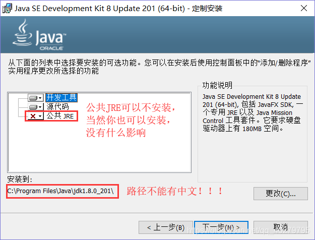
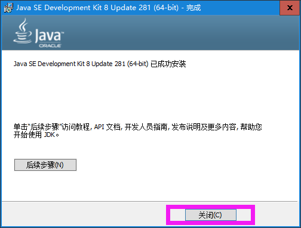

## 安装注意






## 环境变量配置

```java
新建环境变量
    key: JAVA_HOME
	value: jdk 安装路径（可以点击做边角的浏览目录进行选择）

path 配置
	/* 
		win10 是分条目的 ，写一起不行
		进入path系统变量，进行新建
	*/
	%JAVA_HOME%\bin   // javac.exe 全局配置
        
        
        
//================================================        
	jre/bin 目录
CLASS_PATH
	// 这个最好不要进行配置，配置的话可能会出问题       
	.;%JAVA_HOME%\lib\dt.jar;
	%JAVA_HOME%\lib\tools.jar;
检测
	 java -version、java、javac  出现版本信息即可
```


