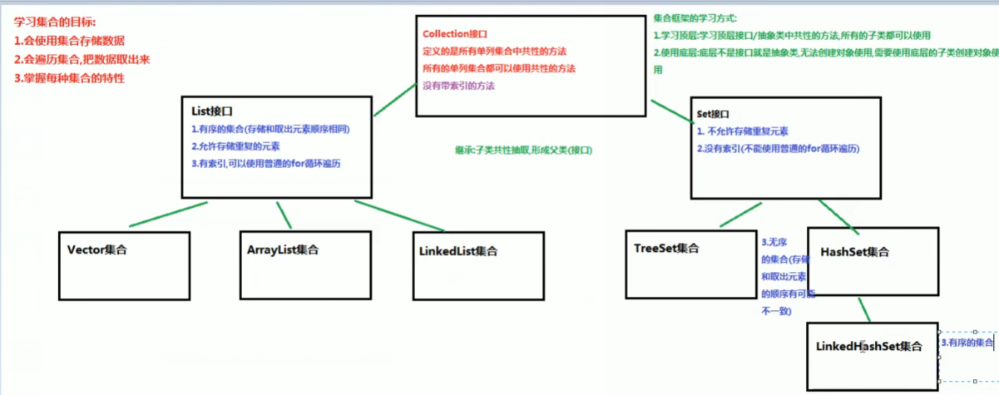

## 介绍

* collection 接口
    * List 接口
        * vector 	Arraylist 	LinkedList
    * Set 接口
        * TreeSet
        * HashSet
            * LinkedHashSet


## 待整理

```java
java 集合类都可以自动调整尺寸，
    可以将任意数量的对象放置到集合中， 不用担心饱满
```

