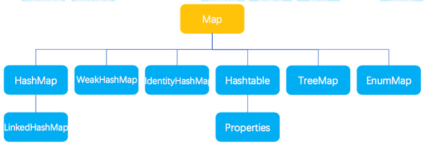

## interface map

### 介绍

* 就是键值对
* key - value

### 特点

* 键值对
* 双列集合， key - value  一一对应， key 值不允许重复， value 无限制
* key value 类型无限制

### 视图

```java
Map接口而言，JDK源码中将其分为三种视图，其实就是三种以某种集合存储值的表现形式。
    Set<K> :用以存储Map的key；
    Collection<K> 用以存储Map的value;
	Set<Map.Entry<K,V>>是存储key-value对(键-值对)。
    Set视图就是使用Set集合存储的View,Set集合特点就是不可重复。 
```


### 常用方法

```java
put	   // key 没有就添加，有就覆盖
remove
get		// 不存在返回 null  , 存在返回值
comtainskey // 不包含返回 false
Set

// 遍历
    keySet
```

### 遍历

* 方式一

```java
方式一
	Map<String,Integer> map = new HashMap<>();
	// 1. 使用 map 集合中的方法 ksySet() 把 集合的所有key 都取出来，存到一个集合中
	Set<String> set = map.keySet();
-------------------------------------	
	// 2. 遍历 set 集合 ， 获取 map 的每个 key , 
	Iterator<String> it = set.iterator();
	while (it.hashNext()){
        String key = it.next();
        // 通过 map 中get方法来找value
        Integer value = map.get(key);
    }
------------------------------------
    for (String key:map.get) {
        Integer value = map.get(key);
    }
```

* 方拾二

```java
// 使用 map 集合中的方法 entrySet() , 把 map 集合中多个 Entry 对象取出来，存储到一个 Set 集合中
Set<map.Entry<String, Integer>> set = map.entrySet();

-------------------------------------
// 2. 使用 set 集合，获取每一个 Entry 对象
iterator<Map.Entry<String, Integer>> it = set.iterator();
while (it.hasNext()){
    map.Entry<String, Iteger> entry = it.next();
    // 3. entry 中的  getkey 和 getValue 获取键和值
    String key = entry.getKey();
    Integer value = entry.getValue();
}
------------------------
for ( map.Entry<String, Iteger> entry: set) {
    String key = entry.getKey();
    Integer value = entry.getValue();
}
```


## Entry

### 常用方法

```java
set
    把 map 集合内部的多个 Entry 对象取出来存储到一个 Set 集合中
getkey 
getValue
```

### 使用

* map 遍历

### 特点

* map 的内部接口
* 当 Map 集合一旦创建， 就会在   Map 集合中创建一个 Entry 对象， 
* 用来记录键和值

## HashMap

### 特点

* 输出无序
* 不同步
* 允许 null 值、null 键
* 底层是 哈希表， 速度快 ， 

### 使用

* 存储自定义类型

```java 
介绍
    map 集合保证 key 是唯一的 ，
    作为key 的元素， 必须重写 hashcode 和 equals 方法 ，以保证 key 唯一
```


## LinkedHashMap

### 特点

* 有序输出 ：底层是 哈希表 + 链表
* 是 hashmap 的子类
* key 不允许重复


## hashtable

### 特点

* 键和值都不可以为空
* 一个线程安全的，单线程集合，速度慢
* 被 hashMap 取代，但是其子类 properties 仍然再用





