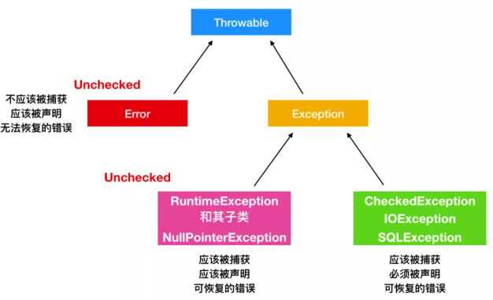
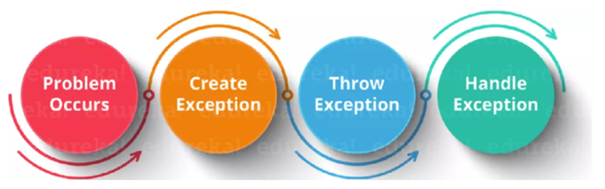

## 需要整理

```java
https://www.zhihu.com/question/25530011
```


## 异常

### 出现时期

```java
运行期异常
    被抛出可以不用处理
编译器异常
    编辑代码的时候抛出的异常： 发现错误的理想时期
    因为你不用运行程序，只是凭借着对 Java 基本理念的理解就能发现问题
```


### 异常分类

```java
一种是 java.lang.Exception 
一种是 java.lang.Error
```



### 异常处理

```java
// 抛出异常之后
1.  java 使用 new 在堆上开辟异常对象
2. 当前执行路径被终止， 并且弹出异常对象的引用， 
3. 异常处理程序接管程序，选择一个恰当的地方继续执行
```

### 异常处理模型

```java
1. 终止模型
    // Java 的模型
    假定错误时关键的，  无法返回到异常发生的地方继续执行，
2. 恢复模型
    异常处理程序的工作是修正错误，然后重新调用出问题的方法，并认为第二次能成功
```



## 异常分类

### ThrowAble

```java
介绍
    是 Java 语言中所有错误(errors)和异常(exceptions)的父类。
    
可被抛出    
    1. 只有继承于 Throwable 的类或者其子类才能够被抛出
    2. 带有 Java 中的 @throw 注解的类也可以抛出。

    
常用方法
    // 因为 Throwable 的父类也是 Object，
    	所以常用的方法还有继承其父类的getClass() 和 getName() 方法
    // 返回抛出异常的详细信息
    public string getMessage();
    public string getLocalizedMessage();

    //返回异常发生时的简要描述
    public public String toString()；

    // 打印异常信息到标准输出流上
    public void printStackTrace();
    public void printStackTrace(PrintStream s);
    public void printStackTrace(PrintWriter s)

    // 记录栈帧的的当前状态
    public synchronized Throwable fillInStackTrace();
    
```


### Exception

#### 常见异常

```java
// RuntimeException
    ArrayIndexOutOfBoundsException	数组越界异常
    NullPointerException	空指针异常
    IllegalArgumentException	非法参数异常
    NegativeArraySizeException	数组长度为负异常
    IllegalStateException	非法状态异常
    ClassCastException	类型转换异常
        
// UncheckedException
    NoSuchFieldException	表示该类没有指定名称抛出来的异常
    NoSuchMethodException	表示该类没有指定方法抛出来的异常
    IllegalAccessException	不允许访问某个类的异常
    ClassNotFoundException	类没有找到抛出异常   
        
        
 
NoSuchMethodException：找不到⽅法

IOException：由于⽂件未找到、未打开或者I/O操作不能进⾏⽽引起异常

NumberFormatException： 字符的UTF代码数据格式有错引起异常；
        
InterruptedException： 线程中断抛出的异常
```

#### 异常关键字

```java
throw throws
try finally catch    
```


### error

#### 介绍

```java
概述
    严重的错误， 无法通过处理的错误， 只能事先避免， 
    不能处理， 是系统内部错误，运行时报错， 系统问题
    大多数错误与代码编写者执行的操作无关，而表示代码运行时 JVM（Java 虚拟机）出现的问题
    不可检查的
    // 绝大多数是程序运行时不允许出现
    例子
    	内存溢出
    	系统崩溃
发生位置
    只有程序计数器是不会发生 OutOfMemoryError 情况的区域
    虚拟机栈：
    	如果线程请求的栈深度大于虚拟机栈所允许的深度，将会出现 StackOverflowError 异常；
    	如果虚拟机动态扩展无法申请到足够的内存，将出现 OutOfMemoryError。

	本地方法栈
    	和虚拟机栈一样

	堆：
    	Java 堆可以处于物理上不连续，逻辑上连续，就像我们的磁盘空间一样，
    	如果堆中没有内存完成实例分配，并且堆无法扩展时，将会抛出 OutOfMemoryError。

	方法区：
    	方法区无法满足内存分配需求时，将抛出 OutOfMemoryError 异常。
    
```

#### 识别

```java
NoClassDefFoundError 和 ClassNotFoundException 有什么区别？
    类的加载过程中， JVM 或者 ClassLoader 无法找到对应的类时，都可能会引起这两种异常/错误，
    相同点
    	都是由 CLASSPATH 中缺少类引起的，通常是由于缺少 JAR 文件而引起的
    
    NoClassDefFoundError 
    	表示这个类在编译时期存在，但是在运行时却找不到此类, 有时静态初始化块也会出现
    	JVM 认为应用运行时找不到相应的引用，就会抛出此错误
    	是 JVM 引起的错误，是 unchecked，未经检查的。因此不会使用 try-catch 或者 finally 语句块
		是链接错误，发生在链接阶段，当解析引用找不到对应的类，就会触发            
    ClassNotFoundException 
    	与编译时期无关，当你尝试在运行时使用反射加载类时，ClassNotFoundException 就会出现。
    	代码中显示的加载类比如 Class.forName() 调用时却没有找到相应的类。会跑此错误
		是受检异常，因此需要 try-catch 语句块或者 try-finally 语句块包围，否则会导致编译错误  
		是发生在运行时的异常。            
```


## 异常关键字

### throw & throws

```java
介绍    
    // 通常是成对出现的    
 // throws 语句用在方法声明后面，表示再抛出异常，由该方法的调用者来处理。
    // 声明这个方法会抛出这种类型的异常，使它的调用者知道要捕获这个异常。    
    static void cacheException() throws Exception{  
    // throw 语句用在方法体内，表示抛出异常，由方法体内的语句处理   
    // 具体向外抛异常的动作，所以它是抛出一个异常实例。      
    throw new Exception(); 
}
```


#### throw 抛出

```java
作用    
    // 捕获异常引用    
    可以使用该关键字在指定的方法中抛出指定的异常 
格式    
    throw new xxException("异常的原因");
位置    
    必须写在方法的内部new     
    创建的是，xxxException    
    对象必须是 Exception 或者 Exception 子类对象，即格式固定 处理    
    只要抛出指定的异常，就必须处理这个异常   
    
    1.  如果是 RuntimeException 或其子类对象， 我们可以不处理，交给 JVM 处理（打印错误，中断程序）   
    2.  编译异常必须处理，要么 throws 要么 try...catch
```


#### throws 声明

```java
声明异常    将问题标识出来， 报告给调用者， 是 java 强制执行的    如果方法内通过 throw 抛出了编译时的异常， 但没有捕获处理 ，name必须使用 throws 声明，让调用者去处理格式    修饰符 返回值类型 方法名(参数) throws 异常类名1, 异常类名2， ... { 		throw new XXXException("产生原因")；	}注意    xxException        对象必须是 Exception 或者 Exception 子类对象，即格式固定    多异常抛出    	// 注意 ：第一个抛出异常，程序就会中断，不会执行下面的代码了    	可以抛出多个异常，父子异常的只用抛出父异常 ,但是要最后抛出父类异常    作用    1. 会把异常对象抛给方法调用者处理， 最终都交给 jvm 进行中断处理    2. 使用 try ... catch 进行处处理语法例子    // 交给别人处理 ， 
```


### try 、finally 、catch

#### 常见组合

```java
try...catch try...finallytry...catch...finally。
```

#### try...catch

```java
介绍    自己处理异常 ，catch 就是异常处理程序的表示    对某一段代码可能抛出异常进行的捕获格式    try {        // 可能产生异常的代码    } catch (异常变量名 变量名) {        // 异常处理逻辑， 异常对象产生之后怎么处理对象        // 一般会把异常记录到日志文件中    } catch(异常变量名 变量名) {        ...    }注意    1. try 可能抛出多个异常，就可以使用多个 catch 来捕获异常    2. try 中产生异常， catch 处理异常，单个处理完之后，不会执行下一个catch 会直接跳过
```

#### finally

```java
介绍    有些特定的代码 ，无论是否发生异常都要执行    比如： 文件的打开关闭，无论是否出现错误， 使用完之后都必须要关闭打开的资源 使用    // 不能单独使用， 必须和 try 一起使用    // 一般用于资源释放(资源回收)，无论程序是否出现异常，最后都要进行资源释放  组合    try...finally  try...catch...finally  语法格式    try {            } catch() {            } finally {        // 无论是否出现异常，改代码块都会执行    }注意    不要在 finally 语句中使用 return 语句，        永远只返回 finally 中的结果，应该避免该情况     
```

### try-with-resources

#### 介绍

```java
语法格式   
    // 应尽可能使用try-with-resources代替常规try-catch-finally
    参看： 使用案例-- 如何优雅关闭资源 -- jdk7+
使用
	// 就是那个类需要自动关闭，它自身就要实现 atuoCloseabke 接口
    声明的所有资源try()必须实现该AutoCloseable接口。
    这些通常是各种类型的编写器，读取器，套接字，输出或输入流等resource.close()
    
自定义的情况
    // 很少会遇到想要编写自己的资源的情况。
    需要实现AutoCloseable或Closeable
    （仅在此处保持向后兼容性，最好使用AutoCloseable）接口并重写该.close()方法：
    
    public class MyResource implements AutoCloseable {
        @Override
        public void close() throws Exception {
            // close your resource in the appropriate way
        }
    }


```


#### 异常发生

```java
// 异常处理
介绍
    块中引发异常，则在该块的括号内打开的任何资源try仍将自动关闭。
    try-with-resources的工作原理与try-catch-finally相同，只是增加了一点点.
	这种增加称为抑制异常
        
场景
1. try-with-resources块中发生异常
2.  并调用.close()在中声明的所有资源try(), 其中一种.close()方法引发异常
catch块会“捕获”哪个异常 ??
    
执行顺序
    资源尝试块
    最终隐式
    捕获块（如果在[1]和/或[2]中引发了异常）
    （明确）终于  
    
注意
    1. 万一尝试关闭资源时引发资源异常，在同一try-with-resources块中打开的任何其他资源仍将关闭。
    2. 在该try块没有引发异常的情况下，并且尝试.close()使用所使用的资源时引发了多个异常，
    	第一个异常将在调用堆栈中传播，而其他异常将被抑制。
    3. 在try块内只能抛出一个异常。引发异常后，将立即退出try块代码，并且Java尝试关闭资源。
```


## 异常处理

### 处理原则

```java
1. 不要捕获类似 Exception 之类的异常，而应该捕获类似特定的异常，
    比如 InterruptedException，方便排查问题，而且也能够让其他人接手你的代码时，会减少骂你的次数。
2. 不要生吞异常。
    这是异常处理中要特别注重的事情。
    如果我们不把异常抛出来，或者也没有输出到 Logger 日志中，程序可能会在后面以不可控的方式结束。
3. 不要在函数式编程中使用 checkedException。
```


### 多异常

```java
处理    多个异常分别处理    多个异常一个捕获，多次处理    多个异常一个捕获，一次处理使用    // 多个异常分别处理    有一个异常就捕获一次， 抛出多个异常，就写多个，繁琐    // 多个异常一个捕获，多次处理    一个 try ，执行多个 catch    // 多个异常一个捕获，一次处理    
```

### 父子异常

```java
介绍    // 父类异常怎么样， 子类异常也要怎么样 ，子类重写弗雷方法    1. 如果父类抛出多个异常，    		子类要抛出和父类一样的异常、父类异常的子类、不抛出异常    2. 如果父类没有没有抛出异常，     		子类也不可以抛出异常，就算子类有异常，也不能声明抛出，只能捕获处理	
```

## 自定义异常

```java
介绍    需要从已知的异常类中继承异常基类    exception      runtimeException格式    // 继承自 runtimeException 也可以	public class xxxException extends Exception {    	// 添加一个空参数的构造方法        // 添加一个带异常信息的构造方法    }注意    一般以 Exception 结尾， 说明是一个异常类    必须继承 Exception runtiimeException     	继承 Exception      		: 编译期异常，方法内部抛出编译器异常，就必须处理，要么throw 要么 try catch    	继承 runtimeException              : 运行期异常 ， 无需处理， 交给虚拟机处理(终断处理)                 例子   p
```


## 使用案例

### 优雅关闭资源

#### 介绍

```java
Java 类库中有许多资源需要通过 close 方法进行关闭。    比如 InputStream、OutputStream，数据库连接对象 Connection，MyBatis 中的 SqlSession 会话等。    作为开发人员经常会忽略掉资源的关闭方法，导致内存泄漏。
```

#### jdk7- : try-finall

```java
介绍
    需要手动关闭资源

例子    
	BufferedWriter writer = null;
    try {
        writer = new BufferedWriter(new FileWriter(fileName));
        writer.write(str);  // do something with the file we've opened
    } catch (IOException e) {
       // handle the exception
    } finally {
        // 手动选择关闭
        try {
            if (writer != null)
                writer.close();
        } catch (IOException e) {
           // handle the exception
        }
    }
  
问题
    即使 try - finally 能够正确关闭资源，但是它不能阻止异常的抛出，
    因为 try 和 finally 块中都可能有异常的发生。
	// 其中有多个异常， 第一个异常就会盖住所有异常，而抛出         
```

#### jdk7+: try-with-resources

```java
介绍
    // Java7 中引入了try-with-resources 语句时
    

    try(
        // 用到的需要关闭的资源，
        /*
        多个资源
        	书写：用 分号 间隔
        	打开顺序： 按照写的顺序
        	关闭顺序： 以相反的声明顺序关闭       		        
        */ 
        
        BufferedWriter writer = new BufferedWriter(new FileWriter(fileName))；
        ...
    ){
        writer.write(str); // do something with the file we've opened
    }
    catch(IOException e){
        // handle the exception
    }
理解
    在try语句之后在括号中打开的资源仅在此处和现在需要。
    .close()在try块中完成工作后，我将立即调用它们的方法。
    如果在try块中抛出异常，无论如何我都会关闭这些资源。
```

#### jdk9+

```java
    // jdk9  ===============================================    
    BufferedWriter writer = new BufferedWriter(new FileWriter(fileName));    
	try (writer) {        
        writer.write(str); 
        // do something with the file we've opened    
    }catch(IOException e) {        
        // handle the exception    
    }
```

