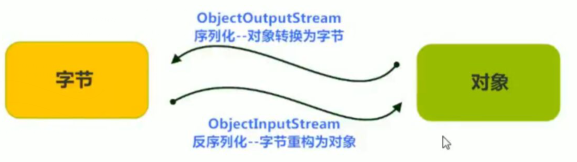

## 序列化+反序列化

## 介绍

* 一种对象的序列化机制
* 序列化
    * 变成有序的对象（类结构）
* 反序列化
    * 对象（类结构）变为无顺序的二进制文件




## 序列化

```java
介绍
    // 对象序列化城有顺序的类结构体
    ObjectOutputStream 
    把对象以流的方式写入到文件（内存）中
    写入对象，对象的序列化

 序列化流的构造方法
    // 对象文件角度，输出
    ObjectOutputStream 
 步骤
    创建 ObjectOutputStream  对象
    使用 writeObject
```

## 反序列化

```go
介绍
    // 反序列化变成无序的二进制文件
	ObjectInputStream 对象的反序列化流(对象，文件，input)
	把文件（内存）中的对象，以流的方式读取出来
	读出对象，也叫对象的反序列化介绍
累
    java.io.ObjectInputStream extends Inputstream;
使用步骤
    创建对象， 传递输入流
    readObject 读取对象
    释放资源
    使用读取出来的对象
    

```

### class 文件序列号

```
修改出现异常
	// 每次修改累的定义，都会给 class 文件生成一个新的序列号
    对象在反序列化后，能找到 class 文件
    但是序列化对象后修改 class 文件， 反序列化会抛出异常 InvalidClassException 
解决
	手动给类添加一个序列号， 无论类是否更改，都不生成新的序列号
添加格式
	// 声明为 serialVersionUID 的字段
	static final long serialVersionUID = 42L;
```


## 注意

```java
介绍
	序列化或反序列化的时候，会抛出 NotSerializableException 没有序列化异常
    类实现 java.io.Serializable 接口以启用其序列化功能
    未实现此接口的类将无法使其状态序列化或者反序列化
Serializable 接口
    // 要进行的类需要实现此类
    标记型借口
    要进行序列化和反序列化的类必须实现 Serializable 接口， 就会给类添加一个标记
    进行fan/序列化时候，就检查此标记。没有则跑出异常
注意
    被 static transient 修饰的成员变量不能被序列化
```

