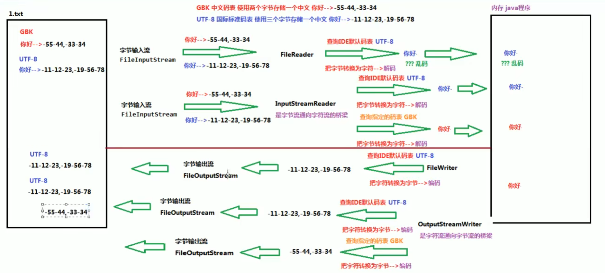

## 转换流

## 介绍

* 编码
    * 按照某种规则，将字符存储到计算机中
    * 字符 -->  字节
* 解码
    * 按照某种规则，见计算机中的二进制数据显示出来
    * 字节 --> 字符
* 字符集
    * charset  编码表

## 原理

```java
java.io.InputStreamReader
    是 reader 的子类，是字节流到字符流的桥梁
    读取字节，并用指定的字符集将其解码为字符
    字符集可以有名称指定、也可以使用默认的
    

```




## 字节输出流

```java
// java.io.OutputStreamWriter extends writer 字节转换为字符
	继承父类的所有方法，
```

## 字节写入流

```java
// java.io.InputStreamReader extends Reader  字符转换为字节

InputStreamReader 对象， 传入字节流和编码表
read
释放资源
```

