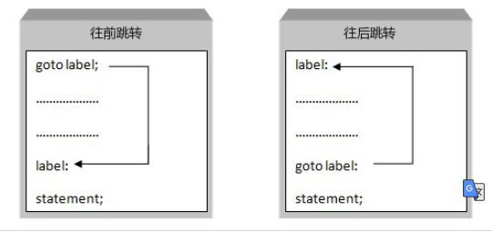

<font size=5 color= yellow>流程控制</font>

主要是三大流程控制流程控制语句

1)顺序控制

2)分支控制

3)循环控制

## 1.顺序控制

程序从上到下逐行地执行，中间没有任何判断和跳转。

## 2.选择/分支语句

### 注意

```c
C 语言把
    任何非零和非空的值	假定为 true，
    把零或 null 		假定为 false。
```


### 1.形式

* 单分支  (单行)
* 双分支（）
* 多分支(多条件)

### 2. if  分支控制

#### 2.单分支控制  if

```go
// 条件表达式后面不要写 分号
if (条件表达式) {
	// 条件表达式为true时，就会执行{}的代码
	执行代码块;
}


注意
	{}是必须有的，就算你值写一行代码
// 分开写 ，都行
if (条件表达式) 
{
	// 条件表达式为true时，就会执行{}的代码
	执行代码块;
}

```

#### 3.双分支语句  if

```go
if 条件表达式 {
    // 条件表达式为true时，就会执行代码块1
	执行代码块 1;
} else {
    // 条件表达式为false时，就会执行代码块2
    执行代码块 2;
}

// 注意
注意
	{}是必须有的
2.双分支只会执行其中的一个分支

```

#### 4.多分支控制  if

```go
if (条件表达式) {
	执行代码块1;
} else if (条件表达式) {
    执行代码块2;
} else if (条件表达式) {
    执行代码块3;
} else {
    执行代码块 n;
}
// 注意
else不是必须的，但多分支只能执行一个执行入口    
    
```

#### 5.if 特殊写法

```go

```


### 3. 嵌套分支

```c++
在一个分支结构中又完整的嵌套了另一个完整的分支结构，里面的分支的结构称为内层分支，外面的分支结构称为外层分支。
    嵌套分支不宜过多，建议控制在3层内。
       
if (条件表达式)
{
	if (条件表达式) 
	{
	
	}
}
```

### 4. switch case分支控制

1. switch语句用于基于不同条件执行不同动作，每一个case分支都是唯一的，从上到下逐一测试，直到匹配为止。
3. 用来改多重 if else 语句

```go

switch (表达式) {
	case 整数1 ：
		语句块1;
    	break;
	case 整数2 :
		语句块2;
    	break;
	default:
		语句块3;
    	// 强烈不建议省略
    	break;
}

// 注意
1.先执行switch的表达式得到值。然后执行case的语句，进行比较，遇到相等的，就比配到，执行对应的case的语句块，然后退出switch，如果没有匹配成功，就会执行default语句
2.switch 后面也可以不带表达式，直接跟上（:）类似 if - case 分支来使用
	switch:{}
3. case
	// 非整形只能使用 if
	case 后面必须是一个整数，或者是结果为整数的表达式，但不能包含任何变量
		// String 底层是 char[]  ,char 底层是 
		类型固定： byte short byte String char枚举类型
	case 后面的值不能重复
4. break
	// case 没有 break 就会一直往下执行
	witch 语句不会在执行判断为真后的语句之后跳出循环，而是继续执行后面所有 case 语句。
	在每一 case 语句之后增加 break 语句，使每一次执行之后均可跳出 switch 语句
	
4. default
	由于 default 是最后一个分支，匹配后不会再执行其他分支，所以也可以不添加break;语句
	default 不是必须的。当没有 default 时，如果所有 case 都匹配失败，那么就什么都不执行
例子
	int a = 10;
    switch (a) {
        case 10: cout<< "真的" <<endl; break;
        case 4 :
            cout << "假的" << endl;
            break;
        default :
            cout << "鬼才晓得" << endl;
        	break;
    }
	
```

## 3.循环结构

### 1.for 循环结构

#### 语法

```go
for ( 循环变量初始化 ；循环条件 ； 循环变量迭代) {
	循环执行语句（语句）
} 

// 执行顺序
// 变量初始化 - 循环条件 - 执行语句 - 循环变量迭代 - 循环条件 - 执行语句 - 循环变量迭代 -。。。
// 注意省略情况

// 初始化语句
	 第一次循环前执行的语句，一般使用初始语句执行变量初始化，
	 如果变量在此处被声明，其作用域将被局限在这个 for 的范围内。 
	 初始语句可以被忽略，但是初始语句之后的分号必须要写，

// 条件表达式
	控制是否循环的开关， 每次循环开始前都会计算条件表达式，

     表达式为 true     ：则循环继续，

     表达式为 false   ：结束循环

     表达式忽略        ：后默认形成无限循环。 

// 结束语句
	在结束每次循环前执行的语句，如果循环被 break、goto、return、panic 等语句强制退出，结束语句不会被执行。

// 简化写法 不建议用
1. 省略初始化循环变量、循环变量迭代： //相当于while循环 
		循环变量初始化
		for (;xx;xx){
            循环变量迭代；
        }
             
       
        说明：1.此for循环是一个无限循环
             2.break就是来跳出for语句
2.全部省略   // 无限循环
	1.保留分号
		for ( ; ;) {
                循环执行语句
                break
            } 
	2. 没有全部省略的情况
```

#### 逗号操作符

```java
注意
    逗号分隔符 ： 用于放的参数分隔
    逗号操作符 ： 只用在 for 语句中进行初始化和不仅控制
例子
    for (int i=0, j=1; i<5; i++, j=i*2){};
```

#### foreach - 遍历

```java
参看标准库遍历
```


### 3.while   循环

```go
标准写法
	// 当循环条件为真，就执行循环语句
	while (循环条件)  {
        循环语句
        // 其中有到循环变量迭代
    }
	for 循环可以改写为 while语句

```

### 4. do - while

```go
语法
do {
    // 其中有到循环变量迭代
    循环语句;
} while (循环条件)；
 1.先执行，再判断，因此至少执行一次
 2.循环条件成立后，就会执行break，跳出for 循环，结束循环
```

### 5. 特殊循环

#### 1.多重循环控制

1. 一个循环放在另一个循环体内，就形成了嵌套循环，建议一般使用两层，最多不适用三层
2. 实质就是内层循环的循环条件为false时，才会跳出内层循环，才结束外层的  当次  循环
3. 外层循环m次，内层循环n次，则内层循环体需要执行  m *   n次
4. 编译后先易后难，将一个复杂的问题分解为简单的问题，

#### 2. 死循环

```java
标准格式
    while(true) {
        循环体
    }
```


### 6.跳出循环

#### 标签

```java
语法
    边签名：
作用
    // 只是为了跳出嵌套循环
    唯一的地方刚好在迭代语句之前， 刚好的意思是：在标签和迭代语句之间放入任何语句都不好
java限制
    java 对于标签做了限制
    
使用
    continue + 标签 ：会到达标签的位置，并重新进入紧挨着哪个标签后面的循环
    break + 标签 : 中断并跳出标签所指的循环
```


#### 1. break

* 一般都是用来跳出 `for` 或 `switch` 语句。

* 跳出 

    * 当前（最近内层）  的 for 循环、switch语句
    * 多层跳出

    ```c++
    // 默认情况下循环只能一层一层退出，
    //为此就需要设置一个状态变量 breakAgain，需要退出时，设置这个变量为 true。
    
    int main() {
        
        bool breakAgain = false;
        for (int x= 0; x < 10; x++) {			// 外循环
            for (int y= 0; y < 10; y++) {		// 内循环     
                if( y == 2) {			     	// 满足某个条件时, 退出循环
                     breakAgain = true ;       // 设置退出标记，退出内层循环
                    goto lable;
                     break;
                }
            }
            lable:
            if (breakAgain) {  // 根据标记, 跳出外层循环
               break
            }
        }
        fmt.Println("done")
    }
    ```

    

*  跳出标签, 
    * 表示退出某个标签对应的代码块，
    * 标签要求必须定义在对应的 for、switch 和 select 的代码块上。 

*  语句不能跨越函数边界。

```go
// 跨越边界会报错	 break is not in a loop, switch, or select
```

#### 3.contine

2. 跳出本次循环，执行下一次循环

2. continue 标签

    *    表示开始标签对应的循环 
    *    对于 **while** 和 **do...while** 循环，**continue** 语句重新执行条件判断语句。

4. 可以通过标签指明要跳过的哪一层循环，调到标签对应的 for 循环处

   ```go
   here:
       for i:=0;i<4;i++{
           for j:=1;j<4;j++{
               if j==2{
                   continue here  // 代码运行到这里开启下一层循环
               }
              fmt.Print("i=",i,"j=",j)
           }
       }
   
   /*
   
   i= 0 j= 1
   i= 1 j= 1
   i= 2 j= 1
   i= 3 j= 1
   
   */
   
   ```

   

#### 4.goto

1. 不建议使用，以免造成程序流程的混乱，使理解和调试程序都产生困难

2. 可以无条件

    * 跳到程序中指定的行，接着往下运行

          


```go
 介绍
	goto语句通常与条件语句配合使用。可用来实现条件转移，跳出循环体等功能。
// 最终只会打印出来 1 4
	cout << "1" << endl;
    goto flag;
    cout << "2" << endl;
    cout << "3" << endl;
    flag:
    cout << "4" << endl;
```

#### 5.return

```java
作用
    1. 指定一个方法的返回值， 
    	如果一个方法没有返回值，name在该方法结尾会有一个隐式的 return 语句
    2. 终止当前所在的方法，不再执行 return 后面的代码
```


### 循环区别

```java
for while 执行 >= 0 次
    确定次数的循环多用 for
    次数不确定的循环多用 while
do		 执行 >= 1 次 
    b不常用
```


