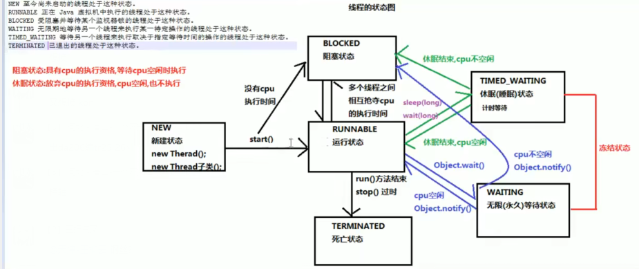
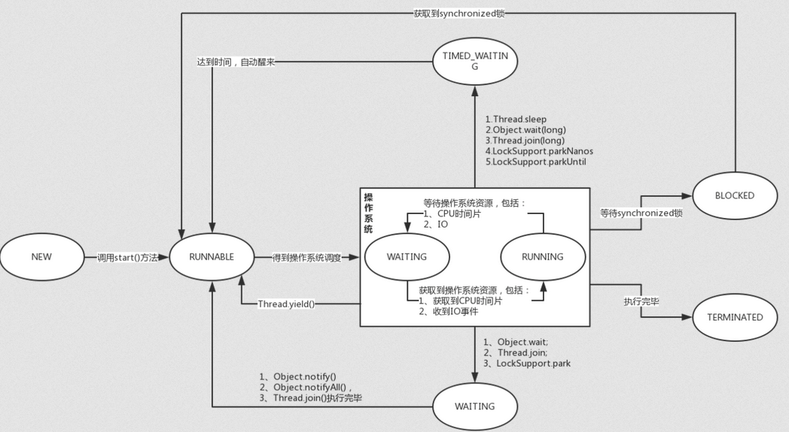

## 线程调度

* 分时调度
    * 所有线程轮流使用 CPU 的使用权，
    * 平均每个线程占用 CPU 的时间
* 抢占式调度
    * 优先让优先级高的线程使用 CPU 
    * 如果线程优先级相同，那么会随机选择一个（线程随机性）， java 使用抢占式调度
* 主线程
    * 执行 主 main 的线程
* 单线程程序
    * java 程序只有一个线程
    * 程序执行从 main 方法开始 ， 从上自下执行

## 线程状态

### 介绍

* 线程创建并启动以后，不是马上进入执行状态，也不是一直执行
* API 中有 6 种线程状态

### 状态

```java
注意
    在 jdk1.8 源码中 java.lang.THread 类中，有一个枚举类，
    该类标注了线程的状态是有 6 种
NEW 
    线程对象创建，但是尚未启动
	Thread t = new MyThread();
RUNNABLE ：可运行
	在Java虚拟机中执行的线程处于此状态。 
    线程持有锁， 可能在运行自己的代码，可能不是，取决于作系统处理器
BLOCKED ： 锁阻塞
    处于运行状态的线程，暂时放弃 CPU 的执行权， 停止执行
	被阻塞等待监视器锁定的线程处于此状态。 
     线程在等待获取一个被其他线程占用的锁，
WAITING ： 无限等待
	正在等待另一个线程执行特定动作的线程处于此状态。 
     一个线程在等待另一个线程执行一个（唤醒）动作， 
     该状态的线程不能自动唤醒，必须等待一个线程调用 notify 、notefyAll 才能唤醒
TIMED_WAITING ：计时等待
	正在等待另一个线程执行动作达到指定等待时间的线程处于此状态。 
     同waiting 状态，该状态一直保持超时期满、或者被唤醒通知
     Thread.sleep  Object.wait
TERMINATED 
	已退出的线程处于此状态。
```

### 线程状态图






### 补充

```java
线程阻塞
    1）等待阻塞：
    	运行状态中的线程执行 wait()方法，使本线程进入到等待阻塞状态；
	2）同步阻塞：
    	线程在获取 synchronized 同步锁失败(因为锁被其它线程所占用)，
    3）其他阻塞：
    	通过调用线程的 sleep()或 join()或发出了 I/O 请求时，
```


## 线程间通信

```java
概念
    多个线程在处理同一个资源， 但是处理的动作（任务）不相同
例子
    包子是资源，一个线程来吃，一个线程来做，那么这两个线程之间就存在通信问题
 处理原因
    多个线程并发执行，默认 CPU 是随机切换线程的
    我们希望线程有规律执行（如：同步），就需要在 线程间协调通信
    帮助我们达到多线程共同 （有序）操作一份数据
如何处理
    等待唤醒机制
```

## 等待唤醒机制

### 介绍

* 用于线程之间进行通信

```java
wait
    线程不再活动，不参与调度，进入 wait set 中，不会浪费CPU 资源，不会竞争锁
    线程状态是 waiting ，等待通知，在这个对象上的线程从 wait set 中释放，进行调度队列
notify 
    选取所通知对象的一个线程释放
notifyAll
    释放通知对象啊的 wait set 上的全部线程
    
注意
    即使只通知了一个等待的线程， 被通知的对象也不能立即恢复执行，
    因为他中断的地方是在同步代码块中，而此刻它已不再持有锁，所以要再次去尝试获取锁（可能有其他线程竞争），
    成功后才能在当初调用 wait 方法之后的地方恢复执行
总结
    如果能获取锁， 线程就从 waiting 状态变为 runnable 状态
    否则，从 wait set 出来， 又进入 entry set ，线程就从 waiting 状态变为 blocked 状态
    
    
wait vs notify
    两者必须使用同一锁对象，
    	对应的锁对象可以通过 notify 唤醒使用同一个锁对象调用的 wait 方法后的线程
   	都属于 Object 类的方法
    	锁对象可以是任意对象，任意对象都是继承 Object 类
    必须在 同步代码块或者同步函数中使用，
```

### 生产消费者模型

```java
主要是两个方法 
    wait()  // 使线程挂起
    notify() // 使挂起的线程运行
    
代码例子
public class WaitAndNotify {
    public static void main(String[] args) {
        Object obj = new Object();
        new Thread(){
            @Override
            public void run() {
                // 等待和唤醒稚嫩有一个执行
                synchronized(obj){
                    System.out.println("告诉老板要买包子");
                    try {
                        obj.wait();
                    } catch (InterruptedException e) {
                        e.printStackTrace();
                    }
                    // 唤醒之后执行
                    System.out.println("开始吃");
                }
            }
        }.start();


        new Thread(){
            @Override
            public void run() {
                // 话 5 秒钟做帽子
                try {
                    Thread.sleep(5000);
                } catch (InterruptedException e) {
                    e.printStackTrace();
                };
                synchronized(obj){
                    // 唤醒顾客
                    System.out.println("老板5秒做好，告知复刻");
                    obj.notify();
                }
            }
        }.start();
    }
}
```


## 线程池

### 介绍

```java
原因
    并发的数量很多， 每个线程都是执行一个时间很断的的任务就结束了，这样频繁创建线程就会大大降低系统的执行效率
    频繁创建、销毁线程需要时间
介绍
    一个容纳多个线程的容器， 其中的线程可以重复使用，省去频繁创建线程对象的操作
    使用的结合，使用的是 LinkedList<Thread> 也可以是其他集合
优势
    1. 避免资源消耗
    	减少线程线程创建、销毁的次数， 每个工作线程都可以被重复利用，可执行多个任务
    2. 提高响应速度
    	任务到达，不用等待线程创建就可以立即执行
    3. 线程可管理，提高系统的承受能力， 调整线程池中工作线程的数目，防止内存消耗太多把服务器干趴下
    	一个线程大约要 1MB 内存
```


### 使用

```java
使用到的包
    // 生产线程池的工厂类
    java.util.concurrent+Executors
    
// ExecutorService 线程池接口
static ExecutorService newFixedThreadPool(int nThreads)  // 创建有一个可冲用的固定线程数的线程池
 
ExecutorService 线程池接口
    // 用来从线程池中获取线程，调用 start 方法，执行线程池任务
    submit()
    // 关闭销毁线程池的方法
    void shutdown()
步骤
    1. 使用线程池的工厂类 Excecutors 里面的提供的静态方法， newFixThreadPol 生产指定数量的线程池
    2. 创建一个类， 实现 Runnable 接口， 重写 run 方法， 设置线程任务
    3. 调用 submit , 传递线程任务（实现类），开启线程，执行 run 方法
    4. shutdown 销毁线程， 不建议执行
```

### 实例

```java
public static void main(String[] args) {
    ExecutorService es = Executors.newFixedThreadPool(2);
    es.submit(new RunnableImpl());

}

public class RunnableImpl implements Runnable{
    @Override
    public void run() {
        System.out.println(Thread.currentThread().getName() + "创建了一个新的线程");
    }
}
```

