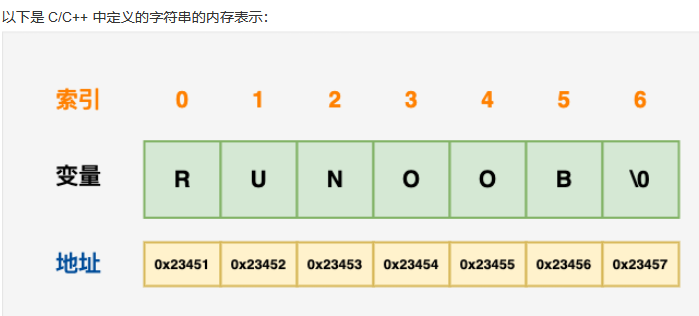

<font size=5 color= yellow>字符串</font>

*   字符串就是一串固定长度的字符连接起来的字符序列。
*   字符串可以包含任意的数据，但是通常是用来包含可读的文本， 
*   字符串一旦赋值

## C中字符串

### 介绍

```c++
字符串
    C 语言中，字符串实际上是使用 null 字符 \0 终止的一维字符数组
    一个以 null 结尾的字符串，包含了组成字符串的字符
声明赋值
    char string[7] = {'R', 'U', 'N', 'O', 'O', 'B', '\0'}
	// 简写
	// 不需要把 null 字符放在字符串常量的末尾。
	// C 编译器会在初始化数组时，自动把 \0 放在字符串的末尾
	char site[] = "RUNOOB";

```

### 内存占用



## 1.声明/赋值c

* 声明赋值

    ```go
    参照变量的声明/赋值/初始化
    
    C 风格
    	char 变量名[] = "字符串面值";
    	例子
    		char str[] = "这就是字符串";
    		cout << str << endl;
    
    	注意
    		要用双引号括起来
    C++ 风格
    	语法
    		// 头文件
    		#include <string>
    		string 变量名 = "字符串字面值";
    	例子
    		string a = "这是字符串";
    		cout << a << endl;
    ```

*   字符串字面量

    ```go
    包括符号
    	双引号、单引号、反引号
    // 双引号
    	字符串之间不能有换行
    	会识别转义字符  
    	var a string = "sd"
    // 单引号
    	以字符串的原生形式输出，包括换行和特殊字符，可以实现防止攻击、输出源代码等效果
    	var a string = 'sd'
    // 反引号
    	1. 换行将被作为字符串中的换行，但是所有的转义字符均无效，文本将会原样输出。(以字符串的原生形式输出，可以实现防止攻击、输出源码等效果)
    	2. 多行字符串一般用于内嵌源码和内嵌数据等
    	 const str =`第一行
                 	 第二行
    		   	    第三行`
    注意
    	字符串太长，可以使用 + ，把字符串拆分开，进行分行拼接
    ```


## 2.遍历

1. 获取字符串的内容------->标准索引法

   ```go
     str [ i ]            
   // [ ]内写索引，索引从0开始，
   // 此转换方案只对ASCII码的字符串有效
   // 注意：获取字符串中某个字节的地址属于非法行为，例如 &str[i]。
   ```

2. 直接使用下标  

```go
ASCII 字符串遍历---------> (这种中文使用会出现乱码 )

theme := "狙击 start"
for i := 0, i < len(theme), i++ {
    fmt.Printf("ascii: %c  %d\n", theme[i], theme[i])
}
```

3. Unicode字符串遍历------------>for range

```go
theme := "狙击 start"
for _, s := range theme {
    fmt.Printf("Unicode: %c  %d\n", s, s)
}
```

## 3.操作

### 1.查询子串

```go
字符串中的某一段为    子串

使用string包中的函数
    // 子串 sep 在字符串 s 中第一次出现的位置，子串 sep 第一个元素
	// 不存在则返回-1
    func Index(s, sep string) int


    // 串 sep 在字符串 s 中最后一次出现的位置，不存在则返回-1。
    func LastIndex(s, sep string) int

```

### 2.修改

* 字符串是值类型(不可更改的字节序列)，且值不可变，就是字符串一旦赋值了，字符串就不能修改了,是不可变的

* 字符串无法被直接修改，只能通过构造新的字符串并赋值给原来的字符串

```go
// 字符串转化为[]byte进行修改，然后再转回来
// []byte和string可以通过强制类型进行互换 

// 无法直接修改每一个字符元素，只能通过重新构造新的字符串并赋值给原来的字符串变量实现
// 修改字符串时，可以将字符串转换为 []byte() 进行修改，
// []byte 和 string 可以通过强制类型转换互转。
str := "hello"
str1 := []byte(str)  // 字符串转为切片
对切片进行操作
str = string(str1) // 切片转为字符串。这里就完成了对字符串的修改，相当于重新创建了一个字符串

```

### 4.截取

*   普通字符串

    ```go
    // 直接当成数组切片
    a := "asdfghj"
    a = a[:len(a)-1]  // a = "asdfgh"
    
    // 转换为数组（有声明内部变量）切片
    a = string([]byte(a)[:len(a)-1]) // a = "asdfgh"
    ```

*   带有中文的字符串

    ```go
    // 一个中文字符肯定不占据一个字节，遍历肯定不行
    str := "你好啊666是不"
    str = string([]rune(str)[:3]) // str = "你好啊6"
    ```

    


### 3.连接

```go
1. 直接使用  +  或者 += 
2. byte.Buffer   (使用string包)
	hammer := "吃我一锤"
    sickle := "死吧"
// 声明字节缓冲
// bytes.Buffer 是可以缓冲并可以往里面写入各种字节数组的
    var stringBuilder bytes.Buffer
 // 把字符串写入缓冲 . 字符串也是一种字节数组，使用 WriteString() 方法进行写入
    stringBuilder.WriteString(hammer)
    stringBuilder.WriteString(sickle)
 // 将缓冲以字符串形式输出
    fmt.Println(stringBuilder.String())

将需要连接的字符串，通过调用 WriteString() 方法，写入 stringBuilder 中，然后再通过 stringBuilder.String() 方法将缓冲转换为字符串。
```

### 4.比较

*   相等
    *   必须是字符串的长度和各个对应的位置的字符都相等才是相等
*   不等判大小
    *   长度不等
        *   子串 < 主串
    *   长度相等
        *   通过组成串的字符之间的编码来进行的
    *   其他不能判断

```go
1. 一般的比较运算符（==、!=、<、<=、>=、>）是通过在内存中按字节比较来实现字符串比较的，因此比较的结果是字符串自然编码的顺序。

2.字符的编码： 字符在对应的字符集中的序号
```

### 5.查长

```go
// 统计 ASCII 字符数量。
// 函数的返回值的类型为 int，表示字符串的 ASCII 字符个数或字节长度。
	len() 


// 统计 Uncode 字符数量。
// UTF-8 格式保存，每个中文占用 3 个字节
RuneCountInString()
```

### 6.遍历字符串

```go

```


### 6.格式化输出

```go
参见 fmt 包的 占位符
  fmt Println("格式化样式",参数列表)
	格式化样式：字符串的形式，格式化动词 % 开头 : %s
	参数列表  ：多个参数以逗号分开。 参数就是   :tring name
```


## 4.字符串优势

*    天生线程安全，大家使用的都是只读对象，无须加锁；
*   方便内存共享，而不必使用写时复制（Copy On Write）等技术；
*   字符串 hash 值也只需要制作一份。 

## 跳转

* [golang知识库总结](https://www.cnblogs.com/shulei/p/13426361.html)
* [golang 数据类型](https://www.cnblogs.com/shulei/p/13425813.html)
