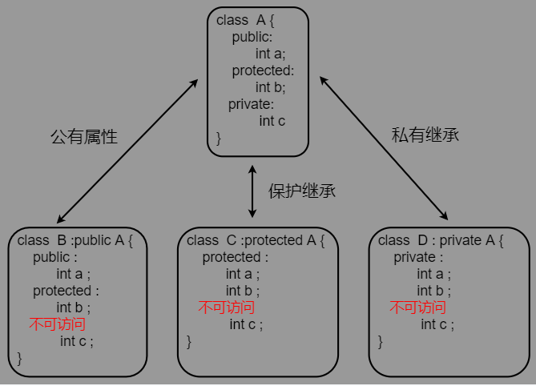

## 1.介绍

* 是一组方法签名的集合， 
* 是调用方和实现方均需要遵守的一种协议，大家按照统一的方法命名参数类型和数量来协调逻辑处理的过程。 

```go
使用组合实现对象特性的描述。
对象的内部使用结构体内嵌组合对象应该具有的特性，
对外通过接口暴露能使用的特性。
```

## 类

### 声明

```c++
方式
    1. 先声明后赋值
    2. 声明的时候赋值
    
标准格式
    class 类名 {
        访问权限： 属性(字段属性)；
        访问权限： 行为(方法)
    };
    
语法实例
// 先声明后赋值
    // 先声明 ，相当于告诉编译器，等下会声明这个类，不用报错
    class Person；
    // 赋值
    class Person {
        Person(){};
    }

// 声明的时候赋值
	class person {
         Person(){};
    };
```

### 关键字

```c++
// 访问权限
    public	公共权限
    	类内部可以访问  ， 类外不能访问
    protected  保护权限
    	类内部可以访问 ， 类外不能访问 , 子类可访问父类保护内容
    private 	私有权限(默认)
    	类内部可以访问  ， 类外不能访问 ， 子类不可访问父类私有内容
// 状态
    static  静态成员(类独有) ，静态成员都有访问权限
    	静态成员变量 
    	静态成员方法
    friend 友元类
    	
// 属性
    类的属性和行为统一称为成员 
    属性 ,  成员属性 ， 成员变量
// 行为方法
    类的属性和行为统一称为成员 
    行为 ， 成员方法 ， 成员函数

    
// 例子
class Circle {
    public: 
    	int m_r;
	    double calculate() {
            return 2 * PI * m_r;
        }
}
int main() {
    Circle c1;
    c1.m_r = 10;
    c1.calculate();   // 20PI
}

// 接口不需要显示实现，只要一个变量，含有接口类型中的所有方法，那么这个变量就实现这个接口
```

### 实例化赋值

```c++
介绍
    // 实例化 、 实现 、
    实现类，将类变成一个实际的类
    主要还是字段属性的赋值 ，方法就直接传参调用了
声明
    
    class Student {
        public:
        	string name;
        protected:
        	string Car;
        private:
        	string password;
        	void set() {
                // 类内部均可以访问到
                name = "lili";
                Car = "ziz";
                password = "123";
            }
    }
    
普通类例化
    // class 关键字可以省略，故建议省略，虽然写着舒服
    class Student s1;
指针类匿名
    Student *abc = new Student;


权限
    s1.name;  // 可以
    s1.Car; // 类外访问不到
	s1.password; // 类外访问不到
```

### 访问、赋值

```c++
访问
    点操作符(.) : 进行普通类成员访问
    箭头	(->) : 进行指针类成员访问


赋值
    周期分类
    	实例化之后赋值
    	实例化的时候赋值(少见)
    方式分类
    	普通类 ： 点操作符(.) + 内部函数
    	指针类 ： 箭头   (->) + 内部函数
  	例子
1.实例化之后赋值
    // 通过 . 操作符进行赋值
       s1.name = "lili";
    // 通过 内部方法对字段进行赋值
     class Student {
         Public:
         	string Name;
         	void SetName(string name) {
                Name = name;
            };
     }
	s1.SetName("lili");
	// 指针累的通过箭头赋值
	abc->name = "lili"
```


### 初始化列表

```c++
参考成员方法中的构造方法
    用来初始化属性字段
```


## 成员属性

## 成员函数

### 声明实现

```c++
介绍
    成员函数，就是函数 ， 只不过函数作为类的属性了
    成员函数的形式按照函数来
形式
    1. 声明的时候赋值 ，写在类体中
    2. 先声明后赋值 ， 写在类外
例子
 // 以下使用的是以构造函数为例子
// 声明的时候赋值 ，写在类体中
    class Person {
        Person() {} ;
    }

// 先声明后赋值 ， 写在类外
	class Person {
        Person();
    }
	// 类外实现方法 类名::函数；
	// void Person::Person(){}
	Person::Person(){};
```


### 构造和析构函数

```c++
介绍
    构造函数
        用于创建对象时为对象额成员属性赋值
        由编译器自动调用 ， 无需手动调用
    析构函数
        主要在对象销毁前清理对象
        有系统自动调用 ，执行清理工作
    注意
        如果没有设置这两个函数，编译器会提供
        编译器提供的构造函数和析构函数是空实现
   
 // 语法
     构造函数
        类名(){};
        构造函数，没有返回值也不写 void , 名称和类名相同
        构造函数可以用参数，因此会发生重载
        程序在调用对象的时候会自动调用，而且只会调动一次
    析构函数
         ~类名(){};
        没有返回值，也不写 void , 名称和类名相同 ，名称前加上 ~
        不可以有参数，不可以进行重载
         程序在对象销毁前进行自动调用 ，而且只会调用一次
 // 例子
  class Person {
  public:
      // 可以利用这个进行初始化
      Person(){};
      
      // 析构函数，不释放是不会执行的
      ~Person(){ 可以自己写一些代码进行提示 };
  }
```

### 构造函数

#### 分类

```c++
分类
    参数分类 ： 有参构造 、 无参构造(默认构造函数)
    类型分类 ： 普通构造 、 引用构造

例子
class Person {
public :
    // 普通构造
    Person() { " 无参构造函数" }
    Person(int a) {"有参构造函数"}
    
    // 拷贝构造函数
    Person( const Person &p) {
       // 拷贝、引用拷贝" 
        age = p.age
    }
    
}
```

#### 调用

```c
调用方式
    括号法
    显示法
    隐式转换法

 // 沿用分类中的构造函数
括号法
    Person p1;  // 默认构造函数调用
	Person p2(10); // 有参数构造函数
    Person p3(p2);  // 拷贝构造函数
显示法
    Person p1;			// 默认构造函数
    Person p2 = Person(10) // 有参构造 ， Person(10)  匿名对象
    Person p3 = Person(p2)  // 拷贝
        
隐式构造
    // Person p4 = Person(10)   ，有参构造
    Person p4 = 10;
	// Person p5 = p4;  拷贝构造
	Person p5 = p4;
注意
    1. 调用默认构造函数的时候，不要加括号，否则编译器会认为是一个函数声明，不会创建对象
	    Person p1();  // 编译器就会认为是一个函数
	2.不要利用拷贝构造函数初始化匿名对象
        Person p3 = Person(p2);
		Person(p3)  // 这里再执行，编译器会认为是 Person(p3) === Person p3; 重复声明
```

#### 调用声明周期

```c++
// 拷贝函数调用时机
场景
    1. 使用一个已经创建完毕的对象来初始化一个新的对象 
    2. 值传递的方式给函数参数传值
    3. 以值的方式返回局部对象
例子
    class Person {
        int Age;
        Person(){ cout << "默认构造函数" << endl; }；
        Person(int age) {  cout << "有参构造函数"  << endl;  Age = age ;};
        Person(const Person& p){  cout << "拷贝构造函数"  << endl;  Age = p.Age ;};
    }
	void dowork(Person p3) { };
	Person do() { Person p5 ; return p5; };
	int main() {
        // 1. 使用一个已经创建完毕的对象初始化一个对象 ， 相当于复制一个一样的
        Person p1(20);
        Person p2(p1)  // p2.Age 就是 20；
            
        // 2. 值传递的方式给函数参数传值 , 就是以类为参数传递
        Person p4;
        dowork(p4) // 实参 p4 拷贝一份副本传给 形参 p3
            
        // 3. 以值的方式返回局部对象
        // 这里 p6 和 p5 不是同一个对象
        Person p6 = do() 
        
    }
```


#### 调用规则

```c++
介绍
    默认情况下， c++ 编译器至少给一个类添加 3 个函数
    1. 默认构造函数（无参，函数体为空）
    2. 默认构析函数 （无参， 函数体为空）
    3. 默认拷贝函数 , 对属性进行值拷贝
调用规则
    1. 用户定义有有参构造函数， v++ 不再提供默认无参构造函数 ， 单会提供默认拷贝构造
    2. 用户： 定义拷贝构造函数 ， c++ 不再提供其他构造函数
```

#### 初始化列表

```c++
作用
    提供了初始化列表语法 ， 用来初始化属性字段
语法
    构造函数（）：属性1(值1)，属性2(值2)，... {}
例子
    class Person {
        // 初始化类表语法
        Person():A(10),B(20),C(30) {};
        Person(int a, int b, int c):A(a),B(b),C(c) {};
        int A;
        int B;
        int C;
    };

	int main() {
        // 会将 30 传给 a , a 传给 A
        Person p(30,20,10)
    }
```


## 限定词

### const

#### const 修饰成员函数

```c++
常函数
    介绍
    	成员函数后加 const 后， 这个函数称为 常函数
 	特点
	    常函数内不可以修改成员属性
    修改变量
         成员变量前加关键字 mutable , 在常函数中依然可以修改
 常对象
    介绍
    	声明对象前加 const , 该对象就称为 常对象
    特点
    	常对象只能调用常函数 ，不能调用其他没被 const 修饰的代码
 例子
    class Person{
    public:
        // 定义常函数
        // this 本质是指针常量
        // 没加 const 的时候 ： Person *const this;
        // 加上 const        : 让 this 指向的值也不能变 ，相当于混合两种值 , const Person * const this;
        // c成员函数后面加 const 。修饰的是 this 指向 ，让指针指向的值也不可修改
        void showPerson() const {
		   // 常函数不能修改成员属性的值
           // m_A = 10; 这里直接修改值会报错
            this->m_B = 10;
            
        }
        int m_A;
         mutable int m_B;
    }

	void test() {
        // 声明对象前加 const , 该对象就称为 常对象
        const Person p;
        p.m_A=2; //报错，不可以被修改
        p.m_B=1; // 可以 ， 有 mutable
    }
```


### private

#### 私有化字段属性

```c++
优势
	1. 成员属性设置为私有 ，可以自己控制权限
	2. 对于写权限 ， 我们可以检测数据的有效性
例子
class Person {
public:
    // 设置姓名
    void setName(string Name) {
        name = Name;
    }
    // 获取姓名
    string getName() {
        return name;
    }
    // 年龄设置
    int getAge() {
        // 年龄初始化
        age = 0;
        return age;
    }
    // 爱人权限设置
    setLover(string name) {
        lover = name;
    }
private:
    // 设置权限为可读可写
    string name;
    // 设置为只读
    int age;
    // 设置为只写
    string lover;
}

// d都用
class Person p;
p.setName("lili"); // 写
p.getName()    // 读
```


### static

#### 静态成员变量

```c++
介绍
    所有对象公用一份数据 
    	不属于某个对象，
    在编译阶段分配内存(全局区)
    类内声明 ， 类外初始化
    
访问
    1. 通过对象进行访问
    2. 通过类名进行访问
语法例子
    class Person {
    public:
        // 类内声明
        static int age;
    }

	// 类外初始化
	// 2 通过类名进行访问
	int Person::age = 20；
    	Person::age  // 20
	void test() {
        Person p1;
        p1.age   // 20
        
         // 类外访问
        // 1. 通过对象进行访问
        Person p2;
        p2.age = 200;
        p2.age // 200
        p1.age  // 200
    }
```

#### 静态成员方法

```c++
介绍
    所有对象共享同一个函数
    静态成员函数只能访问静态成员变量
    
调用
    1. 通过对象访问
    2. 通过类名访问
语法例子
    class Person {
    public:
        int num;
        static int age;
        static void func() {     
             // 出错，静态成员函数不能访问费静态成员变量
            // 无法判断变量属于哪一个对象
            num = 10;
            // 静态变量不属于哪个对象，变相理解成全局的 ，全局只有一个
            age = 20; 
            cout << "static" << endl;
        }
    }
	
	// 类外初始化变量
	int Person::age = 20;
	void test() {
        // 通过对象访问
        Person p;
        p.func();
        
        // 通过类名访问
        Person::func();
    }
```


### friend

#### 介绍

```c++
介绍
    有些私有属性也想让类外特殊的一些函数或者类进行访问，就用友元技术
目的
    让一个类或者函数访问另一个类中私有成员
关键字
    friend
实现
    全局函数(做友元)    注意和成员的区别
    成员函数(做友元)
    类(做友元)
```


#### 全局函数做友元

```c++
class  Building {
	// 全局函数友元注册
    friend  void goodGay(Building &buiding);
public :
    Building(){
        m_SittingRoom = "客厅"；
        m_bedRoom = "卧室"；
    };
    string m_SittingRoom; // 客厅
private ：
    string m_bedRoom;
}

// 全局函数
void goodGay(Building &buiding){
    cout << "好基友访问" << building->m_SittingRoom << endl;
    // 没有加 friend ，进行友元注册： 私有属性是访问不到 ，下面的语句会报错
    // 友元注册以后使用，下年可以执行
    cout << "好基友访问" << building->m_bedRoom << endl;
}

void test() {
    Building building;
    goodGay(&building)  // 
}
```

#### 属性函数做友元

```c++
class Building{
	// 属性函数注册友元 
    // 告诉编译器 GoodGay 类下的 visit 成员函数作为本类的好朋友，可以访问私有成员
    friend void GoodGay::test();
    public:
        Building(){
            m_sittingRioom = "客厅"；
            m_bedRoom = "卧室";
        };
    	string m_sittingRoom;
    private:
    	string m_bedRoom;
}

class GoodGay {
    public:
    	GoodGay(){
            buiding = new Building;
        };
    	// 让 visit 函数可以访问 building 中的私有成员
    	void visit();
    	// 让 visit2 不可以访问 building 中的私有成员
    	// 正常情况下都是不能访问的
    	void visit2();
    	Buiding *building;
}

void GoodGay::visit(){
    // 可以访问
    cout << "基友在访问：" << building->m_bedRoom << endl;
};
void GoodGay::visit2(){
    // 不可访问到
    cout << "基友在访问：" << building->m_bedRoom << endl;    
};

void test() {
    GoodGay gg;
    gg.visit();
}
```


#### 类做友元

```c++
class  Building {
    // 注册一个友元类，使其可以访问该类的私有属性
	friend class GoodGay;
public :
    Building()；

    string m_SittingRoom; // 客厅
private ：
    string m_bedRoom;
}
// 类外写成员函数
Building::Building() {
        m_SittingRoom = "客厅"；
        m_bedRoom = "卧室"；
};


class GoodGay{
    public:
    	// 参观函数 访问build中的属性
    	
    	Building *building;
    	GoodGay() {
        	// 创建建筑物对象
            // new 一个对象，放到堆区
            building = new Building;          
   		};
    	void visit() {
            cout << "好基友类正在访问：" << building->m_bedRoom << endl;
        }
}

void test01{
    GoodGay gg;
    gg.visit();
}
```


## 特殊类

### 匿名类

```c++
介绍
    匿名对象， 当前行执行结束后，系统会立即回收掉匿名对象
 例子
    int main() {
    	Person(10)  // 这一行执行完，这里创建的对象就会被回收
	}
```

### 类嵌套

```c++
介绍
	类对象作为类成员 ，称该成员为 对象成员
语法例子
    class A {};
	//  B 类中有对象 A 作为成员， A 为对象成员
	class B {
        A a;
    }

// 问题
1. 构造析构顺序
    构造顺序 ：内部对象 a , 再构造父类(自身) 对象
    解析顺序 ：父类对象(自身)先析构 ，在析构内部对象(子类)
    
例子
    class Phone {
    public: 
        string PName;
        Phone(string name) {
            PName = name;
        }
    }

	class Person {
        sring mName;
        Phone mPhone;
        // 下面类似写了 Phone mPhone = phone ; 构造函数匿名调用
        Person(string name, string phone):mName(name),mPhone(phone) {}
    }
```


## 类中指针

### 拷贝

```c++
介绍
    深拷贝 ： 简单的赋值拷贝操作 
    浅拷贝 ： 在堆区重新申请空间， 进行拷贝操作
总结
    如果属性有在堆区开辟的 ， 一定要自己提供拷贝函数，防止浅拷贝带来的问题
    
例子
    class Person {
        Person() {
            cout << "默认构造函数" <<endl;
        }
        
        Person(int age， int height) {
            Age = age;
            // 开辟一个堆区的数据
            Height = new int(height)；
            cout << "有参数构造函数" << endl;
        }
        // 0----------------------------------------------------------
        // 解决浅拷贝这样的问题，使用深拷贝
        // 自己实现拷贝构造函数，解决浅拷贝函数
        Person(const Person & p) {
            cout << "拷贝函数调用" << endl;
            Age = p.Age;
            // 深拷贝操作
            Height = new int(*p.Height);
        }
        // 0----------------------------------------------------------
        ~Person() {
            // 析构代码， 将堆区开辟数据做释放操作
            if (Height != NULL) {
                delete Height;
                Height = NULL;
            }
            cout << "析构函数" << endl;
        }
        
        int Age;
        int *Height;  // 指针开辟到堆区
    }

	void test1() {
        // 堆区的存储特点是，先进先出
        // 所以程序先释放 p1 随后释放 p2
        Person p1(18);
        // 下面利用编译器提供的拷贝函数， 会做浅拷贝
        // p2 拿到的 Height 和 p1 拿到 Height 的堆内存地址是一样
        // 前面 p1 已经进行过释放了（标记为未分配），这里 p2 再进行释放操作， 就会出现错误
        Person p2(p1);
        // 0----------------------------------------------------------
        // 深拷贝解决
        // p2 拿到的 Height 和 p1 拿到 Height 的堆内存地址是不一样的了
        // p2 重新开辟了一个新的堆内存
        Person p2(p1)；
        
        // 0------------------------------------------------------------

    }

	int main() {
        test1();
    }
```


### this 指针

```c++
介绍
    c++ 通过提供特殊对象指针 ： this 指针
    this  指针指向被调用的成员函数所属的对象
特点
    this 指针隐含每一个费静态成员函数内的一种指针
    this 不需要定义，直接使用即可
用途
    // 解决命名冲突
    当形参和成员变量同名时， 可用 this 指针来区分
    //  返回对象本身
    在类的非静态成员函数返回对象本身， 可使用 return *this
    
本质
    this 指针的本质就是 ：指针常量 ， 指针的指向是不可以修改的
    
例子
    class Person {
    public:
        int age;
        // 编译器认为 Person 构造函数中三个 age 是一回事儿 , 无法传进来实参
        Person(int age) {
            age = age;
            // 改进
            // this->age = age;
        }
        
        void PersonAddAge(Person &p) {
            this->age += p.age;
        }
        
        // const Person& p
        // 链式调用 ， 这里返回的是引用 ，
        // 如果 引用 Person& 改成 值 ，会拷贝一本新的一样的对象，跟原来不一样了
        Person& PersonAddAge(Person &p) {
            this->age += p.age;
            return *this;
        }

    }
	void test01() {
        Person p1(18);
        //  this  指针指向被调用的成员函数所属的对象
        // this 这里就是值 p1
        p1.age  // 乱码随机值
    }

	void test02(){
        Person p1(10);
        
        Person p2(10);
        p2.PersonAddAge(p1); 
        p2.Age  // 20
        p2.PersonAddAge(p1).PersonAddAge(p1); 
        p2.Age //30
    }
```

### 空指针访问成员函数

```c++
介绍
    c++ 空指针也可以调用成员函数，
    但是要注意使用有没有使用到 this 指针 ，用到 this , 要加以判断代码的健壮性
    
例子
    class Person {
    public :
        int age;
        void showClass(){ cout <<"showclass"<< endl; };
        // 属性前边都默认加了一个 this 箭头
        // cout << this->age << endl
        void showage(){ 
            // 防止空指针
            if (this == NULL) {
                return;
            }
            cout << age << endl;
        }；
    }

	void test(){
        Person *p = NULL;
        p->showClassName();
        // 下面出现  this 冲突 , p 是空指针，是空的东西，
        // 方法调用 this 指向一个空的值 ，再访问其中的属性，所以会报错
        p->showage();
    }
```


## 类底层

### 变量和方法存储

```c++
介绍
    类的成员变量和变量方法分开存储
    	成员变量 ： 非静态对象 -- 对象上
    	成员方法 ： 堆
    对象上：（占用对象的空间）
   		非静态成员变量
实例
    空对象占用内存空间  1 ；
    	c++ 编译器会给每个空对象也分配一个字节空间 
    	为了区分空对象占用内存的位置 ， 每一个空对象也应该有一个独一无二的地址
    非空对象
    	非静态成员的属性字段的大小之和 ，不包括对象方法
    	因为静态成员不属于任何一个对象
```


## 继承

### 声明赋值

```c++
优势
    可以减少重复的代码
名词
    子类 、派生类
    父类 、基类
注意
    可以多重继承
    
语法
    class 子类 ： 继承方式 父类;
 方式
    公共继承 public
     	除了父类的私有属性无法访问 ，其他父子一样
    保护继承 protected
     	除了父类的私有属性无法访问 ，其他父类属性均变为子类的 保护类 
    私有继承 private
        除了父类的私有属性无法访问 ，其他父类属性均变为子类的 私有类
```



### 实现方式

#### 公共继承

```c++
class father {
public :
    int m_A;
protected :
    int m_B;
private:
    int m_C;
}


class son :public father {
public:
    void func(){
        // son 中该属性还是 public
        m_A = 10;
        // son 中该属性还是 protected
        m_B = 10;
        // 父类私有属性无法继承 , 访问不到
        // m_C = 10;
    }
}
```

#### 保护继承

```c++
class father {
public :
    int m_A;
protected :
    int m_B;
private:
    int m_C;
}


class son :public father {
public:
    void func(){
        // son 中该属性 变为 protected
        m_A = 10;
        // son 中该属性还是 protected
        m_B = 10;
        // 父类私有属性无法继承 , 访问不到
        // m_C = 10;
    }
}
```

### 对象模型

```c++
介绍
    从父类继承过来的成员，
    父类中所有非静态成员属性都会被子类继承下去
例子
    class father {
    public :
        int m_A;
    protected :
        int m_B;
    private:
        int m_C;
    }


    class son :public father {
        public:
        	int a;
    }
	// 16  父类中所有非静态成员属性都会被子类继承下去
	// 父类中私有属性是被编译器隐藏了，所以访问不到，但是的确是继承下去了
	sizeof(son) 
```


### 构造和析构顺序

```c++
顺序
    // 创建在堆中，先进先出
    子类继承父类以后， 当创建子类对象，也会调用父类的创建函数
    先调用父类的构造函数，再调用子类的构造函数
    析构顺序正好相反
```

### 成员重名

#### 介绍

```c++
介绍
    子类和父类出现同名的额成员
    静态成员和非静态成员出现同名，处理方式一样
访问
    访问子类同名成员 ，直接访问
    	子类实例.成员
    访问父类同名成员 ， 需要加作用域
    	子类实例.父类::成员
注意
    如果子类中出现和父类同名的成员函数， 子类的成员成员会自动隐藏掉父类中所有的同名成员函数
```

#### 非静态成员

```c++

例子
  
    class father {
    public :
        int m_A = 100;
    protected :
        int m_B;
    private:
        int m_C;
    }


    class son :public father {
        public:
        	int m_A = 12;
    }

	// 访问
	son.m_A  // 12
    son.father::m_A // 100
```

#### 静态成员

```c++
class Base {
    public :
    	int m_A;
}
class Son {
    public :
    	int m_A;
}


void test01() {
    
    
    // 通过对象访问
    cout <<  s.m_A;
    cout << s.Base::m_A;
    
    //通过类名进行访问
    cout <<  Son::m_A;	// 通过类名访问
    cout << Son::Base::m_A;  // 第二个 :: 代表父作用域
}
```

### 多继承

```c++
介绍
    一个类继承多个类
语法
    class 子类 :继承方式 父类1， 继承方式 父类2， ...
问题
    可能会引发父类中有同名成员的出现 ， 需要加作用域区分
	// 开发中不建议使用多重继承
        
例子
 class Base1 {
     public:
    	int m_A=100;
 };
class Base2 {
    public :
    	int m_B=200;
}
class Son :public Base1, public Base2 {
    public :
    	Son() {
           m_C = 30;
        };
    	int m_C;
    	int m_A
}

// 注意
	Son s;
	cout << "访问base1中的" << s,Base::m_A;
```


### 虚继承

```c++
// 菱形继承
   --- A ---
  |        |
  B        C
  |        |
   --- D ---
       
菱形继承介绍
     B 、C 都继承 A
     D 继承 B ， D 继承 C ；
       
菱形继承问题
    1. D 可能从 B 、C 继承了同一个属性字段
       
菱形继承例子
   // 菱形继承     
    class A {
      public:
          int age
    }

    class B :public A {};
    class C :public A{};
    // D 从 B 、C 继承同一个字段
    // 若 B 、C 这个字段的值不同，就会导致 D 这个字段有二义性 ，通过不同作用域有不同的值
    class D :public B, public c {

    }
虚基类继承
    
虚基类关键字
    virtual
虚基类语法例子
	// 虚继承
    class A {
      public:
          int age
    }
	
	// 此时 A 就是虚基类
    class B :virtual public A {};
    class C :virtual public A{};
    // D 从 B 、C 继承同一个字段
    // 若 B 、C 这个字段的值不同，就会导致 D 这个字段有二义性 ，通过不同作用域有不同的值
    class D :public B, public c {};
	
	void test(){
        D d;
        d.B::age = 18;
        d.C::age = 28;
        
        cout << d.B::age << d.B::age ; // 两个值都是 28 
    }

虚基类 原理
    D 从 B C 继承下来的是 vbptr  --- >  vbtable
    	vbptr	: virtual base  pointer
		vbtable ：virtual base table
```


## 多态

### 介绍

```c++
多态
    class 有多种实现;
分类
    静态多态 ： 函数重载 和 运算符重载属于静态多态 ，复用函数名
    动态多态 ： 派生类 和 虚函数实现运行时是多态(常用)
区别
    静态多态 ： 静态多态的函数地址早绑定 -- 编译阶段确定函数地址
    动态多态 ： 动态多态的函数地址晚绑定 -- 运行阶段确定函数地址
   
满足
    1. 需要有继承关闭
    2. 子类要重写父类的虚函数
    	重写 : 返回值类型 函数名 参数列表 完全相同
使用
    父类的指针或者引用执行子类对象
            
优点
    代码组织 结构清晰
    可读性强
    利于前期和后期维护
    
例子
    class Animal {
        public :
        	// virtual void speak() {cout << "动物在说话"; }；
        	void speak() {cout << "动物在说话"; }；
    }
	class Cat {
        public :
            // virtual void speak() {cout << "猫在说话话";}
        	// 这里的  virtual 可以省略
        	void speak() {cout << "猫在说话话";}
    }
	
	// 地址绑定 ， 在编译阶段就确定函数地址，你下面调用， 调用的是 Animal
	// 如果执行猫叫，那么这个函数地址不能提前绑定，需要在运行阶段进行绑定 ，地址晚绑定
	// 所以就要设置 虚函数
	//  父类的指针或者引用执行子类对象
	void doSpeak(Animal &animal) {
        animal.speak()
    }
	void test01() {
        Cat cat;
        // Animal &animal = cat , 允许父子之间的类型转化
        doSpeak(cat);
    }
```

### 写法

```c++
方法一 
	class AbstructCalculator {
    public:
        virtual int getResult(){
            return 0;
        };
        int num1;
        int num2;
    };

    class AddCalculator :public AbstructCalculator {
        // 子类重写虽然可以省， 但是不建议省略，否则看的时候会造成自己理解困难
        virtual int getResult() {
            return num1 + num2;
        }
    };

    class SubCalculator :public AbstructCalculator {
        virtual int getResult() {
            return num1 - num2;
        }
    };

    void test() {
        // 方法一 ： AbstructCalculator &abc = AddCalculator add;
        // 方法二 ： 注意将两者分开的时候，注意参数和实例化的格式 
        AbstructCalculator *abc = new  AddCalculator;
        abc->num1 = 10;
        abc->num2 = 10;
        cout <<abc->getResult();
    }
```


### 底层原理

```c++
class Animal() {
    // 不加 virtual 占用内存大小为 1 字节
    // void speak(){}
    // 加了 virtual 就变成 4 个字节,  类内部变成 指针
    virtual void speak(){};
    
}

Anilmal 内部结构
    // vfptr  virtual function pointr 
    // vtftable virtual function table 表内记录虚函数的地址
    vfptr  -- 指向 -->  vtftable
    
发生重写
    // 不重写的话， 会完整继承父类，使用父类的虚函数表
    子类中的虚函数表 内部 会替换成 子类虚函数地址

分类指针或者引用指向子类对象后，发生多态  
    Animal &animal = cat；
    animal.speak 会走子类的虚函数表
```


### 纯虚函数

```c++
介绍
	多态中通长父类中虚函数实现是无意义的 ， 主要在于子类重写的内容
    所以将虚函数改为纯虚函数

纯虚函数语法
    virtual 返回值类型 函数名(参数列表) = 0；
     virtual void speak() = 0;
```

### 抽象类

```c++
介绍
    当类中有了纯虚函数，这个类就称为抽象类
 特点
    无法实例化对象
    子类必须重写类中的纯虚函数， 否则也属于纯虚函数， 无法实例化
    	子类继承了函数
```


### 虚析构和纯虚析构

```c++
应用
    // 也并不是都需要，子类开辟内存到堆区才使用 ，没有就不用了
    解决子类有属性开辟到堆区 ，那么父类指针在释放时无法调用到子类的析构代码
 	将父类的析构函数改为虚析构函数或者纯虚析构函数
两者共性
    可以解决父类指针释放子类对象
    都需要有具体的实现,防止父类有些对象开在堆区
两者不同
    纯虚构函数所在的类属于抽象类，无法实例化对象
   
 两者语法
    // 虚构函数
    virtual ~类名(){};
	// 纯虚构函数
	virtual ~类名() = 0;
	// 纯虚构实现
	类名::~类名(){};
例子
    
```


