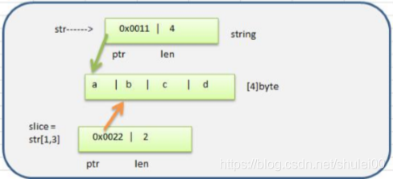

@[toc]
## 切片

## 介绍

```go
1. 任何数据类型都有切片 , 表示多个相同类型元素的连续集合
2. 底层本质
	底层就是数组 ，是对大户组一个连续片段的引用
	切片是通过指针的形式指向不同数组的位置从而形成不同的切片，
	切片对本身元素的修改，也会影响到数组和其它的切片。 
3. 类型
	一个引用类型。遵守引用传递的机制
4. 注意
	// 不带长度的数组就是切片
	（因此更类似于 C/C++ 中的数组类型，或者 Python 中的 list 类型）


2. 
3. cap是一个内置函数，用于统计切片的容量，即最大可以存放多少个元素
4. 
5. 切片可以继续切片
```


* 

## 特性

```go
// 是一个可以动态变化数组
切片的长度是可以变化，切片一般用于快速地操作一块数据集合 
切片默认指向一段连续内存区域
```

## 声明赋值

### 介绍

```go
类型
	一个引用类型。遵守引用传递的机制
定义后未赋值
	// 值为 nil , 本身是空的， 不能使用
	1. 让其引用到一个数组，
	2. make一个空间供切片来使用
初始化切片
	仍不能越界，但是可以动态增长
格式
	// 参看变量的声明/赋值 四种格式
	单维和多维的声明/赋值方式都是一样的	
赋值
	赋值的时候，一个花括号对表示一个数组
```


### 单维切片

#### 介绍

```go
// 切片定义完后，还不能使用，因为本身是一个空的


```

#### 1.直接声明

```go
介绍
	参看变量声明/赋值的方式(4+1)
标准形式
	// []必须是空的，就是没有长度的数组，可以用 type 把原先写长度的地方给占了
    var name [type]Type  
    注释
       name 表示切片的变量名
       type  表示切片的key的类型(可以省去)
       Type 表示切片对应的元素（value）类型， 任意类型的切片类型

声明的时候赋值
	var strslice []string = []string{"tom"}
类型推倒
	//name 已经被分配到了内存，但没有元素，默认值就不是 nil
    var name = []int{}     // // 声明一个空切片
	// 声明字符串切片
    //声明但未使用的切片的默认值是 nil
    var strList []string     
```


#### 2.从连续区域中截取（生成）切片

```GO
// 默认指向一段连续内存区域，可以是数组，也可以是切片本身。
// 连续区域：切片、数组等（每一种类型都可以拥有其切片类型）
语法
	slice [开始位置 : 结束位置]
  注释
	// 不包含结束位置的元素，左闭右开
    slice：表示目标切片对象；对象名字
    开始位置：对应目标切片对象的索引；
	结束位置：对应目标切片的结束索引(不包含)。
规则
    1. 最后一个元素	: slice[len(slice)] 获取 
    2. 中间元素采用左闭右开， 不包含  结束位置对应的索引的元素
        缺省位置
            起始位置： 从连续区域开头切		[  : 结束的位置]
            结束位置： 到连续位置结尾结束		[开始位置:   ]  // 却省结尾，能取到最后一个元素
            均缺省  ： 与切片、数组本身等效	[        :   ] // 却省结尾，能取到最后一个元素 
            均为0   ：空切片				  [  0   :  0 ]  // 清空切片
    3. 索引大小为 （0～len(slice)-1）
        超界会报运行时错误
        生成切片时，结束位置可以填写 len(slice) 但不会报错
例子
    // 1.从指定范围中生成切片(从指定的数组中)
    var a  = [3]int{1, 2, 3}     // a 是一个拥有 3 个整型元素的数组，被初始化为数值 1 到 3
    fmt.Println(a, a[1:2])       //使用 a[1:2] 可以生成一个新的切片
    运行结果
    [1 2 3]  [2]

```

#### 3. make 函数构造


   ```go
介绍
	动态 地创建一个切片，可以使用 make() 内建函数
	通过make方式创建的切片对应的数组是由make底层维护，对外不可见，即只能通过slice去访问各个元素
make 函数
    make( []Type, size, cap )  // 等价于 var 切片名 []type 
        Type 是指切片的元素类型，
        size 指的是为这个类型分配多少个元素，
        cap 为预分配的元素数量，这个值设定后不影响 size，只是能提前分配空间，降低多次分配空间造成的性能问题。
语法
	格式 
		参见变量声明赋值四种格式
	简写	
        //预分配 2 个元素的切片
        a := make([]int, 2) 
        //预分配2个元素的切片，只是b内部存储空间已经分配了 10 个，但实际使用了 2 个元素
        b := make([]int, 2, 10)  
        //容量不会影响当前的元素个数，因此 a 和 b 取 len 都是 2

// 一下为make创建切片示意图
   ```

#### 4.声明方式比较

   *  使用 make() 函数
      *   生成的切片一定发生了内存分配操作，
   *  给定开始与结束位置（包括切片复位）的切片
      *   只是将新的切片结构指向已经分配好的内存区域，设定开始与结束位置，不会发生内存分配操作。 
   *  make（）和new()生成切片

   ```
   new    创建map时，返回的内容是一个指针，这个指针指向了一个所有字段全为0的值map对象，需要初始化后才能使用
   make   创建map时，返回的内容是一个引用，可以直接使用。
   ```

  


### 多维切片

```go
注意
	单维切片的方式同样使用与多维数组
	标准形式
		// 每个[]代表着一个维度，切片有几个维度就需要几个[ ]。
		var sliceName [size][size]...[size]Type 			
            sliceName 为切片的名字，
			size  数组长度
            Type为切片内数据的类型，
	声明的时候赋值
		var slice [][]int = [][]int{{10}, {100, 200}} 
		注释
            二维切片赋值
            外层的切片包括两个元素，每个元素都是一个切片，
            第一个元素中的切片使用单个整数 10 来初始化，
            第二个元素中的切片包括两个整数，即 100 和 200。
```

## 单维切片操作

### 添加元素

```go
// go语言内建函数append()可以切片动态添加元素，本质就是对数组扩容
// append(a,b,c...)  将 b,c,...等一系列的元素，追加到 a 的末尾，并返回该切片


var a = []int{1,2,3}
a = append(a, 1) 				  // 在 a 尾部追加1个元素
a = append(a, 1, 2, 3)             // 在 a 尾部追加多个元素, 手写解包方式
a = append(a, []int{1,2,3}...)     // 在 a 尾部追加一个切片, 切片需要解包

a = append([]int{0}, a...) 		  // 在 a  开头添加1个元素
a = append([]int{-3,-2,-1}, a...)  // 在 a 开头添加1个切片


// 每个添加操作中的第二个 append 调用都会创建一个临时切片，并将 a[i:] 的内容复制到新创建的切片中，然后将临时创建的切片再追加到 a[:i] 中。
a = append(a[:i], append([]int{x}, a[i:]...)...) //链式操作， 在第i个位置插入x
a = append(a[:i], append([]int{1,2,3}, a[i:]...)...) //链式操作， 在第i个位置插入切片

备注：
1.切片开头添加元素一般都会导致内存的重新分配，而且会导致已有元素全部被复制 1 次，因此，从切片的开头添加元素的性能要比从尾部追加元素的性能差很多。
2.append 函数返回新切片的特性，所以切片支持链式操作，即将多个append操作组合起
```

### 复制

```go
介绍
	可以将一个数组切片复制到另一个数组切片中，
函数
    copy( destSlice, srcSlice []T) int
        srcSlice 为数据来源切片，
        destSlice 为复制的目标,
		返回值 int 实际发生复制的    元素个数。(是个数值)
使用注意
		b = copy()  此时 b 是发生赋值的元素个数
		copy()      此时 就是一个复制操作
		循环复制 ：利用 for 循环
规则
	copy(A,B)
	将 B -- 复制到 --> A
    1.长度：B < A ,将 B 中元素复制到 A 对应的前几个位置中
    2.长度：B > A ,只复制 B 中对应 A 长度的元素
	// 按照其中较小的那个数组切片的元素个数进行复制,复制到目标文件的前面,这样就会可能导致数据 丢失
	// 保留目的切片的大小，注意是对应索引位置复制，切片元素可重复
例子
    ----------
    a := []int{1, 2, 3, 4}
    b := []int{5, 6}
    copy(a, b)  // 复制 2 个元素 
    fmt.Println(a) // [5,6,3,4]  目的切片
    fmt.Println(b) //[5,6]
    -----------------
    copy(b,a)	// 复制 2 个元素
    fmt.Println(a)  // [1,2,3,4]
    fmt.Println(b)  // [1,2]   目的切片

```


### 删除

```go
介绍
	go语言 没有对删除切片元素提供专用的语法或者接口，需要使用切片本身的特性来删除元素 
本质
	// 移动数据指针
	以被删除元素为分界点，将前后两个部分的内存重新连接起来。  
删除位置
	开头	结尾	中间
缺点
	1. 连续容器的元素删除无论在任何语言中，都要将删除点前后的元素移动到新的位置，随着元素的增加，这个过程将会变得极为耗时，
	2.当业务需要大量、频繁地从一个切片中删除元素时，如果对性能要求较高的话，就需要考虑更换其他的容器了（如双链表等能快速从删除点删除元素）。 
例子
	开头/结尾
		a := []int{1,2,3,4}
        // 开头删除 k 之前的元素    ：[k:]    
        a = a[1:]  //[2,3,4]
        // 结尾删除 k 及其以后的元素 ：[:k]
        a = a[:2]  //[1,2]
        //  利用 append 和 copy 将需要的值重新加到一个新的切片中
        //  删除开头的元素和删除尾部的元素都可以认为是删除中间元素操作的特殊情况
            a = append(a[:i], a[i+1:]...) // 删除中间1个元素
	中间位置
	// 以被删除元素为分界点，将前后两个部分的内存重新连接起来。
	// 可以用 append 或 copy 原地完成
	a = append(a[:i], a[i+N:]...) // 删除中间N个元素
    a = a[:i+copy(a[i:], a[i+N:])] // 删除中间N个元素
```


### 比较

```go
相等
	切片是动态结构，只能与 nil 判定相等，不能互相判定相等
实在要比较相等： 
	元素个数 、元素值 、元素顺序，都要一样.特别注意元素顺序这个东西
	// []bytes{} 在标准库有函数 
        bytes.Equal{a,b}  // 判断 切片a  b 是否相等 （a,b 均为[]byte 类型）


        // 不要用 reflect ，除非你做好了挨骂的准备............
        // reflect 极大降低性能
        // func DeepEqual(x, y interface{}) bool

        reflect.DeepEqual(a,b)   // a ,b  []int 


        // 循环遍历
        func equalSlice(a,b []int) bool {

            // []int{} != []int(nil)
            if ( a == nil ) != ( b == nil ) {
                return false
            }
            if len(a) != len (b) {
                return false
            }
            for i := range a {
                if a[i] != b[i] {
                    return false
                }
            }
            return true
        }

```


## 多维切片操作

### 介绍

```go
和单维切片是一样的操作
```

### 添加数据

```go
lice := [][]int{{10}, {100, 200}}      // 声明一个二维整型切片并赋值
slice[0] = append(slice[0], 20)         // 为第一个切片追加值为 20 的元素
```

即便是这么简单的多维切片，操作时也会涉及众多的布局和值，在函数间这样传递数据结构会很复杂，不过切片本身结构很简单，可以用很小的成本在函数间传递。

### 长度

```go
slice := [][]int{{10}, {100, 200}}  
len(slice)   // 就是 2 ，多维切片有多少个元素，就是几维
```


## 操作原理

### 切片内存布局

* slice 的确是一个引用类型

* 底层是一个结构体

    ```go
    // 包含地址、大小和容量 
    type slice struct{
        ptr *[2]int
        len int
        cap int
    }
    
    // 后续补上
    	将数据集合比作切糕的话，切片就是你要的“那一块”，切的过程包含从哪里开始（切片的起始位置）及切多大（切片的大小），容量可以理解为装切片的口袋大小，如下图
    


// 例子
	var numbers []int                     //声明一个整型切片。
    for i := 0; i < 5; i++ {              //循环向 numbers 切片中添加 5 个数。
        numbers = append(numbers, i)
                                          //打印输出切片的长度、容量和指针变化，
                                          //使用函数 len() 查看切片拥有的元素个数，
                                          //使用函数 cap() 查看切片的容量情况。
        fmt.Printf("len: %d  cap: %d pointer: %p\n", len(numbers), cap(numbers), numbers)
    }

    运行结果
    len: 1  cap: 1 pointer: 0xc0420080e8
    len: 2  cap: 2 pointer: 0xc042008150  // 内存不够，进行扩容，开辟新的地址，但是切片的变量名不变
    len: 3  cap: 4 pointer: 0xc04200e320
    len: 4  cap: 4 pointer: 0xc04200e320  // 内存够，不进行扩容
    len: 5  cap: 8 pointer: 0xc04200c200
```


## 使用 

### 1.字符串的处理

1. string底层是一个byte数组，因此string也可以进行切片处理

```go
str := "hello@gsg"
slice := str[:3]       //通过切片获取字符串

2.string是不可变的，也就说不能通过str[0]=’z'方式来修改字符串，编译过程会报错

3.如果需要修改字符串，可以先将string一>[]byte/或者【]rune一>修改一>重写转成string

str := "hello@gsg"

arr1 := []byte(str)      //英文 数字
arr1 := []rune(str)     //英文 数字  中文

arr1[0] = "0"
str := string(arr1)
```

4.string和切片在内存中的形式



## 跳转

* [golang知识库总结](https://www.cnblogs.com/shulei/p/13426361.html)
* [golang 数据类型](https://www.cnblogs.com/shulei/p/13425813.html)

