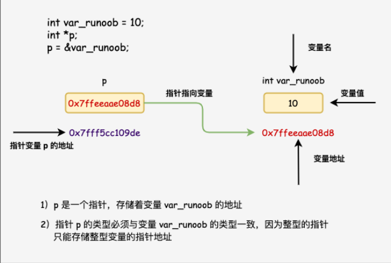
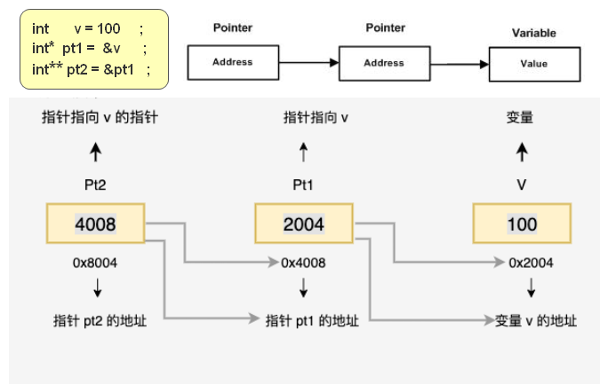

# 指针

## 1.介绍

*    可以通过指针间接访问内存
*    可以通过指针来保存一个地址
*    通常说的指针，就是指的是指针变量

### 理解

```c
#include <stdio.h>
 
int main ()
{
    int var_runoob = 10;
    int* p;              // 定义指针变量
    p = &var_runoob;
 
   printf("var_runoob 变量的地址： %p\n", p);
   return 0;
}
// 下面的理解
	int *p;  // 之后再使用 p ，p 就是一个指针变量
	int a;
	这样 a 和 p 的类型是一样的 ，都是 int 类型
```



## 声明赋值

### 1. 声明赋值

```go
介绍
	指针变量
		用来记录内存地址的
	谨记： 
		// 一个变量声明的时候使用 * 表示指针变量，使用的时候，你再加 * 好就变成取值了
		& 取地址 ； * 取出内存中的值 ，指针(指针变量) 记录内存地址
	话术
		指针的指向 ： 指针变量记录的内存地址
		指针指向的值 ： 指针变量记录的内存地址上保存的值
	注意
		写法 。我这里使用 数据类型* 指针变量
语法
// 先声明后赋值
	// 声明
	数据类型* 指针变量名；
	// 赋值
	指针变量 = &普通变量
	// 修改 指针变量记录(指向)的内存地址中的值
	*指针变量名 = 新值

// 声明的时候赋值
	数据类型* 指针变量名 = &普通变量

例子
	int a = 10;
	// 声明了一个 int 类型的指针，该指针的名称为 a 
	int* p;
	// 取地址符 & , &a 就是记录(得到) a 的内存地址
	// 让指针 p 记录变量 a 的地址 ，
	p = &a;
使用
	通过解引用的方式来找到指针指向的内存
	// 指针 p , * 取值符， *p 意思指向指针 p 指向的值 
	// 修改指针 p 指向的值 ，变为 1000 ，即 a 变成了 1000
	*p = 1000； 


```

### 2.  const 修饰指针

```c++
介绍
  // 不变-const变 ，先来后到
   常量指针 ：  const int* p 
    	// const *  , 所以不能进行（*）取值操作 ，按顺序翻译就行
    	常量不能变 ， const 修饰指针(指针变量) ，指针变量可以变 	
   指针常量 ：  int* const p 
    	// * const 
    	指针(指针变量)不能变 ，const 修饰常量 ，常量可以变
    	
    混合   ：   const 修饰指针又修饰常量
    	const int* const p
    

普通类型  
    int a = 10;
	// 指针变量 p 记录(指向) 变量 a 内存地址
	int* p = &a;
    
常量指针 //const 修饰指针变量
    语法例子
    	const int* p = &a;   
    理解
        const 后跟的是指针 ，所以叫 常量指针
         修饰指针变量， 指针变量中记录的内存地址可以变，但是指向的值不可以变
	特点
        指针的指向可以修改
            // 指针变量记录的内存地址可以修改
            int a = 20;
            p = &b;
        但指针指向的值不可以修改 
            // 指针变量记录的内存地址指向的值，不可以修改，这个值是常量
            *p = 20; // 修改指向的值，是错误的 
指针常量
    语法例子
    	int* const p = &a;
	理解
        const 后跟的是常量
     特点
        指针的指向可以不可以修改
            // 指针变量记录的内存地址不可以修改 ， 这个值是常量
            p = &b;  // 出错
        但指针指向的值可以修改 
            // 指针变量记录的内存地址指向的值，可以修改，
            *p = 20; // 可以

混合
    语法例子
    	const int* p = &a;
	介绍
        指针变量记录的内存地址 和  该内存地址中记录的值，都不可以改变
```


### 2.指针类型

```c++
// 任何数据类型都有指针类型
介绍
    语法中 ： 数据类型* 指针变量名； 
    例子中 ： int* p;
	含义   ：就是声明了一个 int 类型的指针 ，  p 的类型就是 int 类型的指针
```

### 3.指针变量

```c++
介绍
    语法中 ： 数据类型* 指针变量名； 
    例子中 ： int* p;
	含义   ： p 就是指针变量 ，用来记录(指向) 一个内存地址

```

## 内存占用

```c++
大小
    // 占用字节的大小与所指向的值的大小无关， 是固定的
    32  位机器上占用 4 个字节
    64  位机器上占用 8个字节
注意
	// 指针也是一种数据类型 ， 也占用内存
	指针变量占用(内存)	：本身占用一个内存地址
	指针变量记录(指向)  ： 记录(指向)一个内存地址

作用
	一个指针变量可以记录(指向)任何一个值的内存地址
	所指向的值的内存地址在
本质
    所有实际数据类型，对应指针的值的类型都是一样的，都是一个代表内存地址的长的十六进制数。
    不同数据类型的指针之间唯一的不同是，指针所指向的变量或常量的数据类型不同
----------------------------------------------------------
初始值
	 一个指针被定义后没有分配到任何变量时 ，  默认值为 nil。
```

## 操作

### 3.取地址符----->&

```go
含义
	字面含义 ： 获取一个变量的内存地址
	每个变量在运行时，都有一个代表变量在内存位置中的位置的地址
// 获取变量储存值的地址
ptr := &v                   //ptr的类型为*T,*代表指针
fmt.Println("%p",&ptr)      //动词%P取变量的内存地址，指针的值是带有ox十六进制的前缀的一组值，

```

###  4.取值操作符------>(*)

```
含义
	字面含义 ：取值， 拿到变量存储的值
根本意义： 
	操作指针指向的变量 ，获取该变量的值
位置含义
	作为右值时
		意义是取指针的值(地址上有值)     取指向变量的值 
	作为左值时
		表示指针指向的变量 （）         将值设置给指向的变量。
```

## 特殊指针

### 介绍

```c++
空指针和野指针都不是我们申请的空间，因此不要访问
```

### NULL

```c++
介绍
     NULL 指针是一个定义在标准库中的值为零的常量
     如果指针包含空值（零值），则假定它不指向任何东西
注意
    大多数的操作系统上，程序不允许访问地址为 0 的内存，因为该内存是操作系统保留的
    内存地址 0 表明该指针不指向一个可访问的内存位置。
例子
       int  *ptr = NULL;
   	   printf("ptr 的地址是 %p\n", ptr  );  // ptr 的地址是 0x0


```


### 空指针

```c++
介绍
    指针变量指向内存中变量为 0 的空间
    赋为 NULL 值的指针被称为空指针
 
    
语法
    // 变量声明的时候，如果没有确切的地址可以赋值，为指针变量赋一个 NULL 值
    // 良好的编程习惯
    int* p = Null;

判断空指针  
    if(ptr)     /* 如果 p 非空，则完成 */
    if(!ptr)    /* 如果 p 为空，则完成 */

用途
    初始化指针变量
注意
    空指针变量(记录)的内存是不可以访问的
    0 - 255 之间的内存编号是系统占用的，因此不可以访问
    // 就是在 内存编号 0 - 255 的内存空间取值，取不到值
    int* p = Null;
	*p = 100; //出现错误
```


### 野指针

```c++
介绍
    指针变量指向非法的内存空间
	是一种错误，在程序中避免使用（比如越界什么的）
例子
    // p 记录(指向)的内存，是无权访问的 ，访问权限会出现冲突
    int* p = (int *)0x1100;
	cout << p << endl; // 访问野指针出错，
```

### 双指针-new

```c++
new 返回的是一个地址，需要使用指针变量接收
 int* p = new a();

int** p = &new a()
```


## 使用

### 值类型&引用类型

```c++
// 参见函数当中的 参数类型
```

### new

```c++

```


### 指针与数组

```c++
// 数组指针
	// 首地址 ，参看数组
	数组指针 = 数组首地址 = 数组第一行首地址 = 数组第一行第一个元素的地址
    数组第 n 行首地址 = 第 n 行第一个元素首地址
// 指针数组
	int* ptr[arrSize];
	把 ptr 声明为一个数组，由 MAX 个整数指针组成 , 每个元素，都是一个指向 int 值的指针


// 利用指针访问数组
    int arr[3] = {1, 2, 3}
    // 指针变量获取数组地址
	int * p = arr；  // arr 就是数组的首地址，第一个元素的地址
     // 输出 直接是数组的第一个元素
     cout << *p << endl;  
	//  指针偏移 4 个字节 ，输出就是 第 2 个元素
	p++
    cout << *p << endl;  
```

### 指针和函数

```c++
使用
    传递指针给参数
    函数返回指针
类型
    函数指针
    指针函数
    
// 传递指针给参数
    // 参见函数当中的 参数类型
    例子
        使用一个数组的引用类型，当做参数 ， 传递给函数
        注意 ：这样传递的是函数的首地址，是无法进行长度统计的
 
// 函数返回指针
// 函数指针
// 指针函数
```


### 指针的指针

```c++
介绍
    指向指针的指针是一种多级间接寻址的形式，或者说是一个指针链
    个指针包含一个变量的地址。
    当我们定义一个指向指针的指针时，
    	// int** a ;  相当于第二个指针变量是匿名变量 
    	第一个指针(变量)包含了第二个指针(变量)的地址，
    	第二个指针(变量)指向包含实际值的位置
```



## 注意

```c++
1. 声明指针
    int * p;
    int  *p;
	// 我感觉这一种最和语义
	// 指针，就是指的指针变量， 是一个变量 ，类型是一个数据类型的指针
	int* P;

```


# 对比

## 不同

| 指针(指针变量)                                               | 引用                                                         |
| ------------------------------------------------------------ | ------------------------------------------------------------ |
| 存放变量地址的一个变量<br/>在逻辑上是独立的，它可以被改变<br> | 是一个别名<br/>它在逻辑上不是独立的，它的存在具有依附性<br/> |
| ，包括其所指向的地址的改变和其指向的地址中所存放的数据的改变。 | 引用必须在一开始就被初始化，而且其引用的对象在其整个生命周期中是不能被改变的（自始至终只能依附于同一个变量）。 |
| 值传递的方式<br>它所传递的是一个地址值                       |                                                              |
| 一个实体                                                     | 仅是个别名                                                   |
| 可以被改变 -- “见异思迁”                                     | 能在定义时被初始化一次，之后不可变 --“从一而终”              |
| 可以为空                                                     | 不能为空                                                     |
| “sizeof 指针”得到的是指针本身的大小                          | sizeof 引用”得到的是所指向的变量(对象)的大小                 |
| 类型非安全 (引用比指针多了类型检查                           | 类型安全的                                                   |
|                                                              |                                                              |

## 相同

```c++
相同
    都是地址的概念
    经常 用于函数的参数传递
```

## 参数传递

```c++
// 参见函数
```


