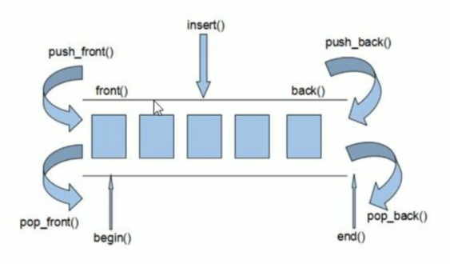

## deque

## 介绍

* 双端数组,(类比双端队列)

* 可以对头端进行删除操作

* 与 vector 区别

    ```c++
    vector 对于头部的插入删除效率比较低， 数据量大 ，效率越低
    deque 相对而言， 对头部插入删除的舒服比 vector 快
    vector 访问元素是的速度比 vector 块， 这和两者的内部实现有关
    ```

    


## 内部原理

```c++
deque 内部有一个中控器， 维护每段缓冲区中的内容 ， 缓冲区中存放真是的数据
中控器维护的是每个缓冲区的地址 ， 使得使用 deque 时像一片连续的内存空间
deque 的迭代器也是支持随机访问的
```

## 文件头

```c++
#include <deque>
```


## 构造函数

```c++
函数原型
    deque<T> deqt; // 默认构造函数
	deque(beg,end);  // 构造函数将 [beg,end] 区间中的元素拷贝给本身
	deque(n,elem);  // 构造函数将 n 个 elem 拷贝给本身
	deque(const deque& deq);  // 拷贝构造函数

例子
    deque<int> d1;
	d1.push_back(3);

	deque<int> d2(d1.begin(), d1.end());


```

## 赋值操作

```c++
介绍
    给 deque 容器进行赋值
 函数原型
    deque& operator=(const deque& vec)  // 重载等号操作符
    assign(beg,end);  // 将 [beg, end] 区间中的数据拷贝给本身
	assign(n, elem);  // 将 n 个 elem 拷贝赋值给本身
例子
    deque<int>v1;
	for (int i=0; i<10; i++) {
        v1.push_back(i);
    }
	deque<int> v2 = v1;
	v2.assign(v1.begin, v1.end())
```

## 大小容量

```c++
j介绍
    对 deque 容器的大小进行操作
    deque 可以无限扩充 ，所以没有容量的概念
 函数原型
    empty();   //判断容器是否为空
	size();  // 返回容器中元素的个数
	resize(int num); // 重指定容器长度中
		// 如果容器边长 ， 则以默认值填充 ， 如果容器变短 ， 末尾超出部分舍去
	resize(int num, elem); // 重新制定容器长度， 如果容器边长 ， 则填充制定元素 elem ,变短舍去末尾
		
例子
    deque<int>v1;
	v1.size();
```

## 插入删除

```c++
函数原型
    
    // 两端插入
    push_back(ele);   // 尾部插入元素 ele
    push_front(ele);   // 头部插入元素 ele
	pop_back();  // 删除最后一个元素
	pop_front();  // 头部最后一个元素

	// 指定位置插入
	insert(const_iterator pos,ele)  // 迭代器指向位置 pos 插入元素 ele
    insert(const_iterator pos, int count, ele); // 迭代器指向位置 pos 插入 cout 个元素 ele
	insert(pos, beg, end);  // 在 pos 位置插入 [beg, end] 区间的数据， 无法返回值


	erase(const_iterator pos); // 删除迭代器指向的元素
	erase(const_iterator start, const_iterator end); // 删除迭代器从 start 到 end 之间的元素

	clear();  // 删除所有元素

例子
    deque<T> v1;
	v1.push_back(10);
	v1.insert(v1.begin(), 20);
```


## 数据存取

```c++
函数原型
    at(int index); // 返回索引 index 所指向的数据
	operator[];  // 返回索引 index 所指的数据
	front(); // 容器中的第一个元素
	back(); // 返回容器中最后一个元素

例子
    deque<T> v1;
	v1.push_back(10);
	v1[0]; // 10
	v1.front(); // 10
```

## 排序

```c++
介绍
    对 deque 容器进行排序
    算法实现的
 函数原型
    #include <algorithm>
    sort(iterator beg, iterator end); // 对 beg 和 end 区间内元素进行排序
例子
    deque<T> v1;
	v1.push_back(10);
	v1.push_back(3);
	sort(v1.begin(), v1.end());
```


