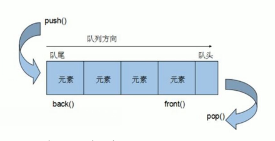

## 介绍

* queue
* 队列是一种先进先出的结构 ， 他有两个口可以被访问
* 一头进数据， 一头出数据




## 遍历

```c++
只允许一端进行新增数据， 另一端移除数据
    只有队头和队尾只能被外界访问，所以队列不允许有遍历行为
```


## 构造函数

```c++
函数原型
	queue<T> que;  // 模板类实现 ， stack 对象的默认构造形式
	queue(const queue& stk);  // 拷贝构造函数

例子
	#include <queue>
    // 使用
    queue<int>s;
```


## 赋值

```c++
 函数原型
  queue& operator(const  queue& que) // 重载等号操作符

例子
    queue<int>v1;
	queue<int> v2 = v1;
```


## 容量大小

```c++
可以判空
    empty()
可以判断大小 ，弹栈出栈的时候记录数据
    size()
```

## 数据存取

```c++
函数原型
	push(elem); // 向d队尾添加元素
	pop();  // 从队头移除第一个元素
	back(); // 返回最后一个元素
	front(); // 返回第一个元素

例子
    queue<T> v1;
	v1.push(10);
	v1.front(); // 10
```


