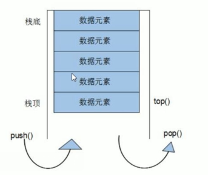

## 介绍

* stack 栈
* 就是数据结构中的栈
* 先进后出 ，只有一个出口
* 栈



## 遍历

```c++
栈不允许有遍历行为
```

## 构造函数

```c++
函数原型
	stack<T> stk;  // 模板类实现 ， stack 对象的默认构造形式
	stack(const stack& stk);  // 拷贝构造函数

例子
	#include <vector>
    // 使用
    stack<int>s;
```


## 赋值

```c++

 函数原型
  stack& operator(const stack& stk) // 重载等号操作符

例子
    stack<int>v1;
	stack<int> v2 = v1;
```


## 容量大小

```c++
可以判空
    empty()
可以判断大小 ，弹栈出栈的时候记录数据
    size()
```

## 数据存取

```c++
函数原型
	push(elem); // 向栈顶添加元素
	pop();  // 从栈顶移除第一个元素
	top();  // 返回栈顶元素

例子
    vctor<T> v1;
	v1.push_back(10);
	v1[0]; // 10
	v1.front(); // 10
```


