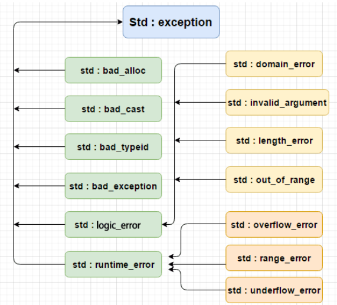

* 有点儿不懂

## 介绍

* 异常是程序在执行期间产生的问题。C++ 异常是指在程序运行时发生的特殊情况

## 关键字

```c++
try、catch、throw
    
try
    try 块中的代码标识将被激活的特定异常
    try 块中放置可能抛出异常的代码，try 块中的代码被称为保护代码
catch
    您想要处理问题的地方，通过异常处理程序捕获异常。catch 关键字用于捕获异常
throw
    当问题出现时，程序会抛出一个异常。这是通过使用 throw 关键字来完成的
```

## 处理

### throw --抛出异常

```c++
使用
    在代码块中的任何地方抛出异常
    throw 语句的操作数可以是任意的表达式
    表达式的结果的类型决定了抛出的异常的类型。
double division(int a, int b) {
    if (b == 0) {
        throw "除数为 0 "；
    }
    return (a/b);
}
```

### 捕获异常 -- catch/try

```c++
介绍
    catch 块跟在 try 块后面，用于捕获异常
    可以指定想要捕捉的异常类型，这是由 catch 关键字后的括号内的异常声明决定的。
        
        
抛出固定类型的错误
	
    // ry 块在不同的情境下会抛出不同的异常
    // 这个时候可以尝试罗列多个 catch 语句，用于捕获不同类型的异常
    try {
       // 保护代码，有错误就抛出异常
    // 捕获一个类型为 ExceptionName 的错误
    }catch( ExceptionName e ) {
      // 处理 ExceptionName 异常的代码
    } catch( ExceptionName eN ) {
   // catch 块
    }

捕获任意类型的错误
    
try {
   // 保护代码
} catch(...) {
  // 能处理任何异常的代码
}

```

### 语法例子

```c++
double division(int a, int b) {
    if ( b == 0 ) {
        throw "除数为 0"
    }
    return (a/b);
}

int main(){
    int x=40, y=0;
    double z=0;
    try {
        z = division(x, y);
        cout z
    // 我们抛出了一个类型为 const char* 的异常，
    // 因此，当捕获该异常时，我们必须在 catch 块中使用 const char*
    } catch (const char *msg) {
        cerr << msg << endl;
    }
    return 0;
}
```


## c++ 标准异常

### 介绍

* C++ 提供了一系列标准的异常，定义在 **<exception>** 中，我们可以在程序中使用这些标准的异常。它们是以父子类层次结构组织起来的，如下所示：

### 文件

```c++
<exception>
```




| 异常                   | 描述                                                         |
| ---------------------- | ------------------------------------------------------------ |
| **std::exception**     | 该异常是所有标准 C++ 异常的父类。                            |
| std::bad_alloc         | 该异常可以通过 **new** 抛出。                                |
| std::bad_cast          | 该异常可以通过 **dynamic_cast** 抛出。                       |
| std::bad_exception     | 这在处理 C++ 程序中无法预期的异常时非常有用。                |
| std::bad_typeid        | 该异常可以通过 **typeid** 抛出。                             |
| **std::logic_error**   | 理论上可以通过读取代码来检测到的异常。                       |
| std::domain_error      | 当使用了一个无效的数学域时，会抛出该异常。                   |
| std::invalid_argument  | 当使用了无效的参数时，会抛出该异常。                         |
| std::length_error      | 当创建了太长的 std::string 时，会抛出该异常。                |
| std::out_of_range      | 该异常可以通过方法抛出，例如 std::vector 和 std::bitset<>::operator[]()。 |
| **std::runtime_error** | 理论上不可以通过读取代码来检测到的异常。                     |
| std::overflow_error    | 当发生数学上溢时，会抛出该异常。                             |
| std::range_error       | 当尝试存储超出范围的值时，会抛出该异常。                     |
| std::underflow_error   | 当发生数学下溢时，会抛出该异常。                             |


## 自定义异常

### exception

```c++
介绍
    通过继承和重载 exception 类来定义新的异常
    
语法例子
    #include <exception>
    Using namespace std;
	struct MyError :public exception {
        // what() 是异常类提供的一个公共方法，
        // 它已被所有子异常类重载。这将返回异常产生的原因。
        const char *what() const throw() {
            return "c++ eception";
        }
    };
	int main() {
        try {
            throw MyError();
        } catch (MyError& e) {
            cout << "myexception catch" ;
            cout << e.what() << std;
        } catch (std::exception &e) {
            
        }
    }
```


